# SfUi — Salesforce CLI Launcher

A Windows desktop tool that wraps the Salesforce CLI (`sf`) with a fast, click-light UI.
Run SOQL, anonymous Apex, debug logs, deploys, free-form `sf` commands and raw REST API calls —
with history/favorites, quick switching between orgs and project folders, one-click tool launcher,
an **Org Info** window for each org, side-by-side comparison of 2–4 orgs, **record backup / restore** with backup-to-backup comparison,
and an **Org Management** window that keeps your orgs in order (default, alias, login, logout) and shows per-org limits and a workflow/flow migration inventory.

> UI languages: **English (default) / 日本語** — switch instantly from the top bar.

## Screenshots

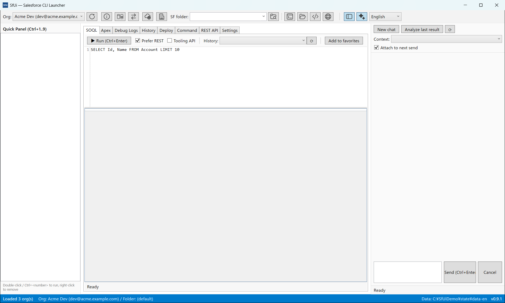
*SOQL workspace — Quick Panel on the left, AI chat panel on the right, icon tool bar with org & folder switching on top*

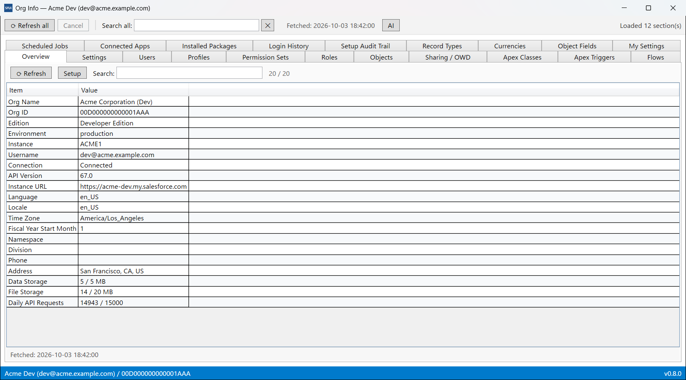
*Org Info — a separate window per org with 20+ tabs, cross-tab search, Setup links and its own AI panel*

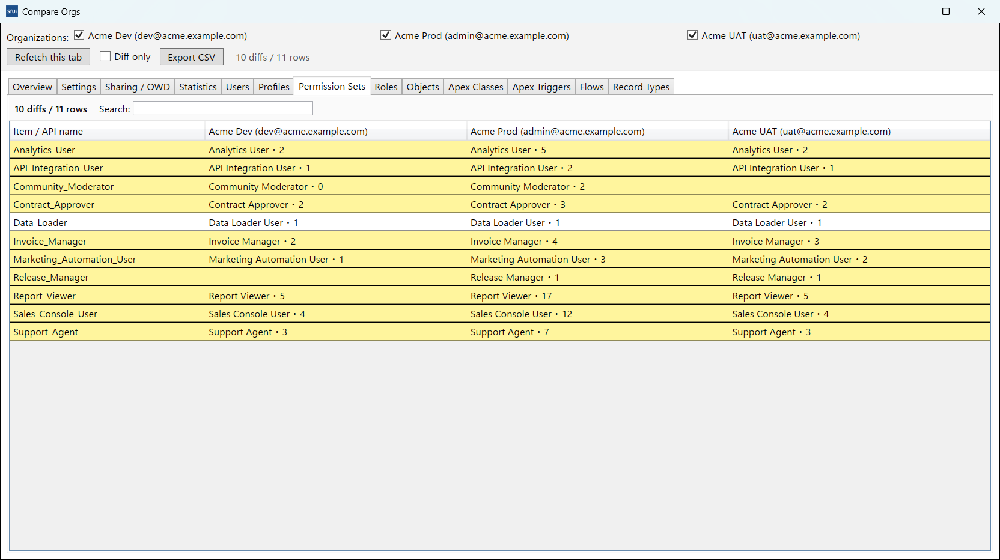
*Compare Orgs — 2–4 orgs side by side; rows that exist in only some orgs (or differ in value) are highlighted in yellow*

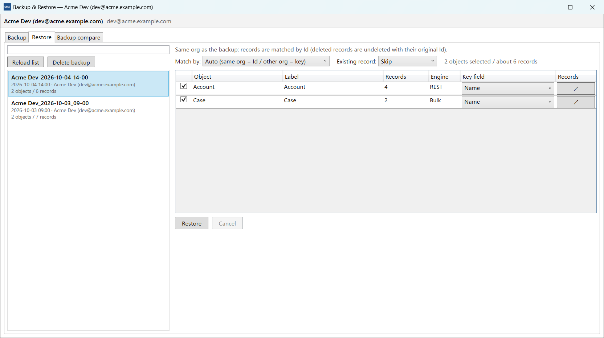
*Backup & Restore — pick a backup and restore objects with Id/key matching; label, description, org info and counts are filled in for you*

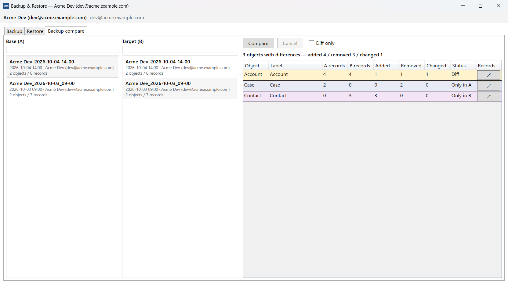
*Backup compare — objects with differences are highlighted by color (diff / only in A / only in B); record-level diffs open in a separate window*

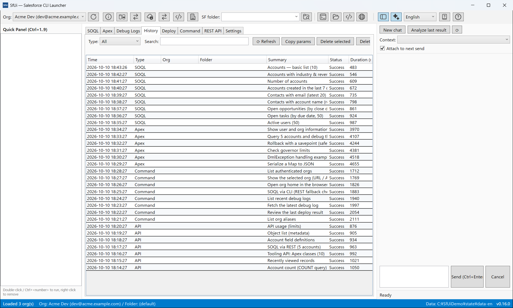
*Every operation is saved in History and can be replayed with a double-click*

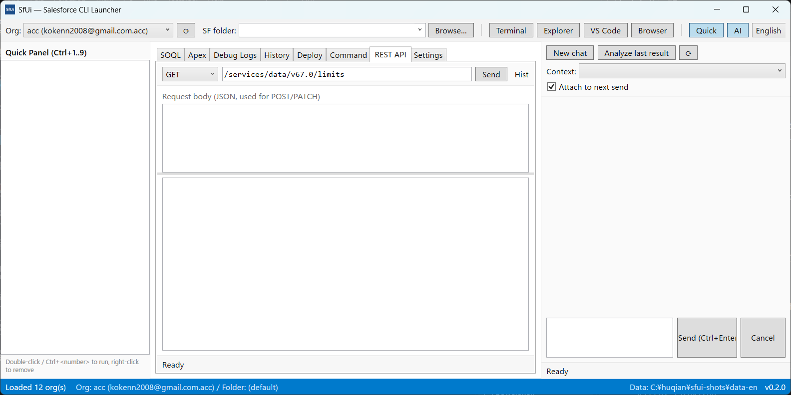
*Generic REST console with pretty-printed responses*

## Features

- **Org & folder switching in one click** — the org combo and SF folder combo are always in the top bar; the last selection is restored on startup.
- **SOQL** — AvalonEdit editor with SQL highlighting, REST-first execution (falls back to `sf data query`, with a Tooling API toggle), results in a sortable grid, CSV/TSV export.
- **Anonymous Apex** — run scripts via `sf apex run`, show compile errors / exceptions / debug logs, open & save `.apex` files, fetch the latest debug log from the org.
- **Debug logs** — list logs (`sf apex list log`), fetch content by id or number, save locally.
- **Deploy** — deploy / validate / quick deploy / report / retrieve with source dir or manifest, test level, wait time, live command preview, and result summaries (auto-fills the job id).
- **Free-form commands** — run any `sf` arguments; dangerous operations (delete/logout/deploy …) ask for confirmation.
- **REST console** — GET/POST/PATCH/DELETE against the org's instance URL using the access token (`sf org display`), with pretty-printed responses and 401 auto-refresh.
- **History** — every operation is recorded per type (org, folder, params, result), searchable, re-runnable by double-click.
- **Favorites & quick panel** — pin SOQL / Apex / commands / REST requests / URLs / folders; run the first nine with `Ctrl+1..9`.
- **AI chat (multi-provider)** — generate SOQL / Apex / sf commands from natural language and analyze execution results; apply generated code to the matching tab with one click. Shown in a right-side panel (toggle with the **AI** button in the top bar). Works out of the box — an evaluation API key for the default DeepSeek endpoint is bundled. Settings → AI offers presets for **OpenAI-compatible APIs** (OpenAI, Anthropic via its OpenAI-compatibility layer, or a local LLM such as Ollama / LM Studio — no key needed there); set your own key in Settings → AI (or via the `SFUI_AI_API_KEY` environment variable).
- **Org Info window** — a separate non-modal window per org (click **Org Info** next to the org combo) with 20+ tabs: overview, org settings (values + setup links), users, profiles, permission sets, roles, objects, sharing/OWD, Apex classes & triggers, flows, scheduled jobs, connected apps, installed packages, login history, setup audit trail, record types, currencies, object fields (lazy-loaded) and your own **My Settings** tabs built from a 55-item catalog. Search across all tabs, refresh per tab or all at once, jump straight to Setup pages. Data is cached locally and fetched only on first open (manual refresh after that), so reopening is instant — and each window has its own AI panel with *Attach current tab data* + quick prompts.
- **Org comparison** — open the **Compare Orgs** window from the top bar and compare 2–4 orgs side by side: org settings, OWD, counts, users, profiles, permission sets, roles, objects, Apex classes/triggers, flows and record types are matched **by API name**, with rows that exist in only some orgs (or differ in value) highlighted. Includes a *Diff only* filter, cache-first loading (shared with the Org Info window — missing sections are fetched automatically) and CSV export.
- **Data Import / Export window** — a separate window (open from **Data I/O** in the top bar, or from the **Data I/O** button on the Objects tab of the Org Info window, which pre-fills the selected object) with two tabs. *Export*: run SOQL directly or build it from field checkboxes, via REST or Bulk API, browse the result grid and save as CSV / JSON / TSV. *Import*: load a CSV (UTF-8 / Shift-JIS auto-detected), auto-map columns to fields (editable, with per-column include toggles), and run Insert / Update / Upsert / Delete via REST (`composite/sobjects`, 200 records per batch) or Bulk API — with a confirmation prompt, live progress and a per-row result grid (export failed rows to CSV). Runs are recorded in History as `data` and re-run by double-click.
- **Access tabs** — the same window also has three access-permission tabs for the selected object. **Object Access**: object permissions of Permission Sets / Permission Set Groups / Profiles (kind, label, API name, custom, Read / Create / Edit / Delete / View All Records / Modify All Records / View All Fields, with row search; PSG rows are the union of their component permission sets). **Field Access**: a field × subject matrix (cells R / E) with kind filters, row search and column search. **Record Access**: pick active users with checkboxes (name search, scrollable) and run any SOQL to fetch target records, then page 200 at a time with search and see per-user **Read / Edit / Delete / Transfer** via `UserRecordAccess`, with links to open each record.
- **Backup & Restore window** — a separate window (open from **Backup & Restore** in the top bar) with three tabs. *Backup*: pick objects from a searchable list with record counts (fetched in the background and cached — refresh anytime); the selection is remembered per org and can be cleared with one button; the label/description are prefilled with `<alias>_yyyy-MM-dd_HH-mm` and the alias, URL, org ID and org type, and the run exports small objects via REST, larger ones via Bulk API (CSV). *Restore*: choose a backup from the searchable list (with delete), pick target objects (record counts, per-object key field, and a **Records** button that opens a detail window with paging, AND search and a leading column to open each record's Salesforce page), then restore. **Same org**: records are matched by Id (existing records are skipped or overwritten, deleted records are undeleted **with their original Id**); **another org**: matched by a key field such as Name. Inserted records get new Ids and lookups to them are remapped automatically. A result grid summarizes created / updated / undeleted / skipped / failed per object.
- **Backup compare tab** — the same window compares two backups: pick a base (A) and a target (B), and every object is matched record by record (by Id; values are normalized across REST JSON and Bulk CSV). Objects with differences are highlighted by color (diff / only in A / only in B / error) with an optional *Diff only* filter, and the ↗ button opens a separate window with the record-level result (kind, Id, name and `Field: A → B` changes; searchable, paged, and with a leading column to open each record's Salesforce page).
- **Org Management window** — a separate window (open from **Org Management** in the top bar) with three tabs. *Orgs*: the authenticated orgs (default ★, alias, username, org ID, type, status, instance URL) with one-click actions — **Set as default**, **Open in browser**, **Add login (web)**, **Logout** (confirmation) and **Set alias** (set an alias on the selected org). *Health*: reads REST `/limits` for the selected org and shows used / max / usage % with a bar (green → red at 80%+), sorted by usage with a name filter. *Migration Inventory*: lists Workflow rules (Tooling API), Process Builder processes and flows (FlowDefinitionView) with kind / name / API name / object / active / subtype / last modified, a per-kind summary and CSV export — handy when planning a workflow/flow migration. Read-only for Health and Inventory, so it is safe to leave open while inspecting several orgs (switch the org in the header combo).
- **Tool launcher** — open Terminal (wt / PowerShell / cmd / WSL), Explorer, VS Code, or the org in a browser. **Home / Setup open with a session URL** (`sf org open --url-only` frontdoor) so no browser login is needed (falls back to the plain URL if the session URL can't be fetched); login page and recent URLs are also available.
- **Keyboard shortcuts** — `Ctrl+Enter` run (SOQL/Apex), `Enter` run (command), `Ctrl+1..9` favorites, `F5` re-run the last operation.
- **Portable** — a `data/` folder (settings, history, logs, results) is created next to the exe; falls back to `%APPDATA%\SfUi` when not writable.

## Requirements

- Windows 10 / 11 (x64)
- **Salesforce CLI (`sf`)** installed and at least one org authenticated (`sf org login web`)
  - The app runs `sf` behind the scenes; default path is `C:\Program Files\sf\bin\sf.cmd` (configurable in Settings, or via the `SFUI_SF_PATH` environment variable)
- Running the released EXE requires **no .NET runtime** (self-contained)

## Getting started

1. Download from the [Releases](../../releases) page:
   - **`SfUi.exe`** — the portable single executable, or
   - **`SfUi-v0.8.0-portable.zip`** — the executable **plus a ready-to-use `data/` folder with 30 sample SOQL / Apex / commands / REST requests already in the history** (just extract and run).
2. Put it in any folder and double-click (no installer).
   - Windows SmartScreen may warn because the binary is unsigned — choose *More info* → *Run anyway*.
3. On first run a `data/` folder is created next to the exe (portable mode).
4. Pick your org in the top bar and start with a tab, or seed the history with sample SOQL / Apex / commands / REST requests via **Settings → Seed sample history**.

## Screens & tabs

| Tab | What it does |
|---|---|
| SOQL | Editor + results grid, CSV export, favorites/history |
| Apex | Anonymous Apex runner with debug log output |
| Debug Logs | List / fetch / save logs from the org |
| History | All operations, searchable and re-runnable |
| Deploy | Deploy / validate / quick / report / retrieve |
| Command | Free-form `sf` arguments with stdout/stderr |
| REST API | Raw REST console (limits, describes, queries, …) |
| Settings | sf & tool paths, history limits, confirm policy, language, sample data |

The left **Quick Panel** shows favorites with number slots; the top bar hosts org/folder selection, **icon-only tool buttons with hover tooltips** (Org Info, Compare Orgs, Data I/O, Backup & Restore, Org Management, folder browse, terminal, Explorer, VS Code, browser, Quick Panel and AI toggles) and the language switch.

The **Org Info** button (next to the org combo) opens a separate non-modal window for the selected org — multiple windows and multiple orgs at once. It contains 20+ tabs (org settings, users, permission sets, objects, OWD, Apex / flows / jobs, login history, …), cross-tab search with jump-to-row, per-tab refresh, lazy-loaded object fields, custom **My Settings** tabs, Setup links, and its own AI panel with *Attach current tab data*.

The **Compare Orgs** button (enabled when 2 or more orgs are available) opens the side-by-side comparison window — 13 categories matched **by API name**, with diff highlighting, a *Diff only* filter, per-tab search and CSV export.

## Where settings and data are stored

The data root is resolved in this order: 1) `--data-dir <path>` / the `SFUI_DATA_DIR` environment variable, 2) the solution root's `data/` when running from source, 3) a portable `data/` folder next to the exe when writable, 4) `%APPDATA%\SfUi` as a fallback (e.g. when placed inside Program Files).

```
data\
├─ settings.json            settings (language, sf path, AI, history limits, confirm policy, backupRestMaxRecords, …)
├─ favorites.json           favorites (Quick Panel)
├─ recent-folders.json      recently used folders
├─ recent-urls.json         recently opened URLs
├─ history\                 execution history per type (soql.json / apex.json / api.json / data.json / …)
├─ results\                 large execution results saved per history entry (.txt / .json)
├─ logs\app-yyyyMMdd.log    application log
├─ tmp\                     temporary files
├─ orginfo\                 Org Info window caches
│   ├─ <org key>.json       per-org tab data
│   ├─ preferences.json     tab visibility preferences
│   └─ compare.json         Compare Orgs state
├─ backup-state.json        remembered backup object selection (per org)
└─ backups\
    ├─ counts.json          record-count cache
    └─ <yyyyMMdd-HHmmss>\   a backup
        ├─ metadata.json    label, description, org info, object list
        └─ <Object>.json / <Object>.csv   REST / Bulk data
```

All JSON files are written atomically (`AtomicJsonFile`: temp file → `File.Replace`) and keep a `*.bak` copy for corruption recovery. Copying the `data/` folder along with the exe moves your settings, history and backups.

## Build from source

```powershell
# Requirements: .NET SDK 9.0+
dotnet build SfUi.sln -c Debug
dotnet test  SfUi.sln

# Produce a self-contained single-file EXE into dist/
dotnet publish src/SfUi.App/SfUi.App.csproj -c Release -r win-x64 `
  --self-contained true -p:PublishSingleFile=true -p:IncludeNativeLibrariesForSelfExtract=true -o dist
```

### Project layout

```
SfUi.sln
├─ src/SfUi.Core    … WPF-free logic (services, stores, localization dictionaries, tests target)
│  ├─ Services      … SfCliRunner, OrgService, SalesforceRestClient, DeployService, ToolLauncherService, …
│  ├─ Storage       … atomic JSON stores (settings / history / favorites / recent)
│  └─ Localization  … UiText dictionaries (en / ja)
├─ src/SfUi.App     … WPF app (MVVM, views, localization markup extension)
└─ tests/SfUi.Tests … xUnit (385 tests: quoting, JSON parsing, stores, services, org info, org compare, data I/O, backups, org management, localization, …)
```

Built with C# / .NET 9 / WPF, CommunityToolkit.Mvvm and AvalonEdit.

---

# SfUi — Salesforce CLI ランチャー（日本語）

Salesforce CLI（`sf`）の操作を Windows デスクトップ UI から行えるツールです。
SOQL・匿名Apex・デバッグログ・デプロイ・自由コマンド・REST API 呼び出しを、履歴とお気に入り付きで
少ないクリックで実行できます。組織とフォルダの切替、外部ツールの起動もワンクリック。
組織情報の閲覧（別ウィンドウ）・複数組織の一括比較・データの入出力（CSV / JSON・REST / Bulk API）・
レコードのバックアップと復元（バックアップ間の比較・レコード単位の差分表示付き）・
組織管理（組織の既定 / エイリアス / ログイン操作と、使用量・移行棚卸しの確認）にも対応しています。

- UI は **英語（既定）/ 日本語** に対応（上部バーのコンボで即時切替）
- **AI チャット（複数プロバイダー対応）**: 自然言語から SOQL / 匿名Apex / sf コマンドを生成、実行結果の分析も可能（右サイドパネル表示・上部バーの「AI」で表示切替。既定の DeepSeek 接続先はすぐ試せるよう評価用キーを同梱。設定 → AI のプリセットから OpenAI / Anthropic（Claude）/ ローカル LLM（Ollama 等、キー不要）など **OpenAI 互換 API** に接続可。自分のキーは 設定 → AI（または環境変数 `SFUI_AI_API_KEY`）で登録）
- **組織情報ウィンドウ**: 選択中組織の設定・ユーザー・権限・項目などを 20 以上のタブで一覧・検索（非モーダルの別ウィンドウ・複数同時可・「組織情報」ボタンから起動）。初回のみ自動取得してローカルにキャッシュし、以降は手動再取得。オブジェクト項目は遅延取得、Setup ページへのリンク、マイ設定（カタログ 55 項目から作るカスタムタブ）、ウィンドウ単位の AI パネル（表示中タブのデータ添付）付き
- **組織比較**: 上部バーの「組織比較」から 2〜4 組織を横並び比較（組織設定・OWD・統計・ユーザー・プロファイル・権限セット・ロール・オブジェクト・Apex クラス/トリガ・フロー・レコードタイプを **API 名で突合**。「片方にのみ存在」「値が異なる」行をハイライトし、差分のみ表示フィルタ・組織情報と共有のキャッシュ優先取得（未取得分は自動取得）・CSV 出力付き）
- **データ入出力**: 上部バーの「データ入出力」、または組織情報ウィンドウのオブジェクトタブの「データ入出力」から（選択中オブジェクトを引き継いで）開く独立ウィンドウ。エクスポート = SOQL 直接入力 / 項目選択ビルダー × REST / Bulk API → 結果グリッド + CSV / JSON / TSV 保存。インポート = CSV 読込（UTF-8 / Shift-JIS 自動判定）→ 自動マッピング（変更・使用可否可）→ 挿入 / 更新 / アップサート / 削除 × REST（composite・200 件/バッチ）/ Bulk API（確認ダイアログ・進捗・行別結果・失敗行 CSV 出力）。履歴「データ」からダブルクリックで再実行可
- **アクセス権限タブ（オブジェクト / 項目 / レコード）**: データ入出力ウィンドウに追加。オブジェクトアクセス = 選択中オブジェクトに対する PS / PSG / プロファイルの権限一覧（種類・ラベル・API 名・カスタム・Read / Create / Edit / Delete / View All Records / Modify All Records / View All Fields。PSG は構成権限セットの和集合）。項目アクセス = 項目 × 権限主体のマトリクス（セル = R / E・種類フィルタ・列絞り込み付き）。両タブとも行の検索（AND・スペース区切り・表示件数付き）に対応。レコードアクセス = 有効ユーザーをチェックボックスで選択（名前検索・3 行スクロール・全選択 / 全解除）し、任意 SOQL で抽出した対象レコード（200 件/ページ・検索付き）のユーザーごとの読取 / 編集 / 削除 / 転送（UserRecordAccess）を表示。リンクからレコードをブラウザーで開ける
- **レコードのバックアップと復元**: 上部バーの「バックアップと復元」から開く独立ウィンドウ。バックアップ = オブジェクト一覧（検索・件数付き。件数はバックグラウンド取得 + キャッシュ、再取得可）から選択（選択は組織ごとに記憶・ワンクリックでクリア可）→ ラベル / 説明（自動入力: `エイリアス_yyyy-MM-dd_HH-mm` / エイリアス・URL・組織 ID・種類）→ 実行（REST / 件数が多い場合は Bulk API・進捗 / キャンセル表示）。復元 = バックアップ選択（検索・削除可）→ オブジェクト選択（件数・キー項目・「レコード」ボタンでレコード詳細ウィンドウ。先頭列の「レコードページを開く」で Salesforce のレコードページをブラウザー表示）→ 照合方式（自動 / Id / キー）× 既存レコードの扱い（スキップ / 上書き）→ 実行。同じ組織は Id で照合（既存 = スキップ / 上書き、削除済み = 元の Id のまま復元、無い = 新規作成 + 参照の張り替え）、別の組織はキー項目（既定 Name）で照合。結果は作成 / 上書き / 復元 / スキップ / 失敗の集計 + エラー表示
- **バックアップ比較タブ**: 同じウィンドウの 3 つ目のタブ。基準 (A) と比較対象 (B) の 2 つのバックアップをオブジェクト単位にレコード突合（Id で照合。REST JSON と Bulk CSV の型差・null ↔ 空・数値/真偽値/日時の表記差は吸収）。差分のあるオブジェクトは行の色でハイライト（差分 = 黄 / A のみ = 青 / B のみ = 紫 / エラー = 赤、「差分のみ」フィルタ付き）し、「↗」でレコード単位の比較結果を別ウィンドウ表示（状態・Id・表示名・`項目: A → B` の変更内容。検索 + ページング + 先頭列の「レコードページを開く」付き）
- **組織管理ウィンドウ**: 上部バーの「組織管理」から開く独立ウィンドウ。組織タブ = 認証済み組織の一覧（既定 ★ / エイリアス / ユーザー名 / 組織 ID / 種別 / 接続状態 / インスタンス URL）とワンクリック操作（**既定に設定**（`sf config set target-org`）/ **ブラウザーで開く** / **ログイン追加（ブラウザー）**（`sf org login web`）/ **ログアウト**（確認付き）/ **エイリアスを設定**（`sf alias set`。実行後は組織一覧を再読み込み）。ヘルス タブ = 選択中組織の REST `/limits` を取得し、使用量 / 上限 / 使用率をバー付きで表示（80% 以上は赤・使用率順 + 名前絞り込み）。移行棚卸し タブ = Workflow ルール（Tooling API） / プロセスビルダー / フロー（FlowDefinitionView）の一覧（種別 / 名前 / API 名 / オブジェクト / 状態 / サブタイプ / 最終更新）+ 種別ごとのサマリー + CSV エクスポート（Workflow → フロー移行の棚卸しに便利）。ヘッダーの組織コンボで切り替えるとヘルスと棚卸しが自動で再取得されます（どちらも読み取り専用）
- **ブラウザボタン**: 組織ホーム / セットアップは `sf org open --url-only` のセッション付き URL（frontdoor）で開くため、ブラウザーでの再ログインは不要です（取得できない場合は通常 URL にフォールバック）
- **アイコン ツールバー**: 上部バーのボタンは Fluent UI System Icons のアイコンのみ（マウスオーバーでラベルと説明をツールチップ表示・AI はオン/オフでアイコン切替）
- 2026-10-04 時点で Phase 0〜16 完了（v0.9.0 / テスト 385 件 / スモーク + UIA E2E 検証済み。AI 接続先の汎用化・組織比較・データ入出力・アクセス権限タブ・レコードのバックアップと復元（比較タブ付き）・組織管理ウィンドウ（組織 / ヘルス / 移行棚卸し）・ブラウザのセッション URL・アイコン ツールバーを含む）

## スクリーンショット

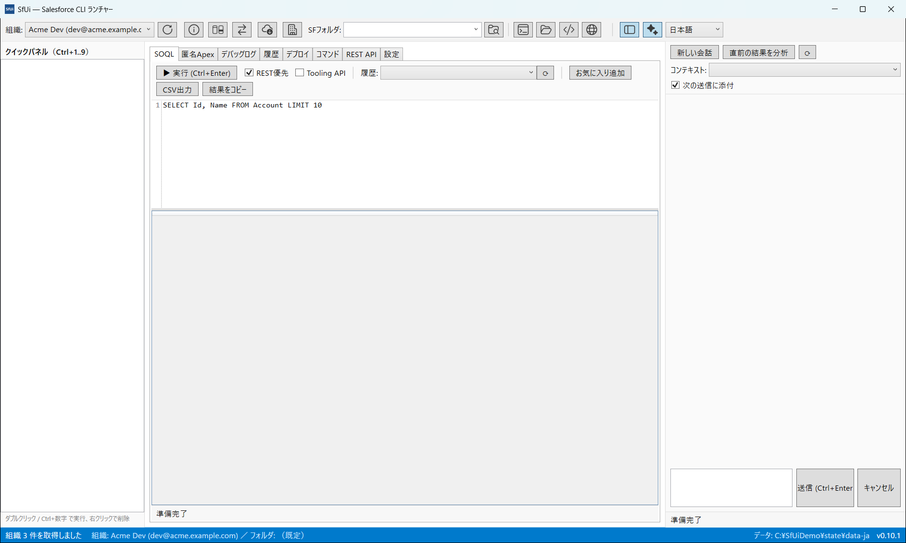
*SOQL ワークスペース — 左: クイックパネル / 右: AI チャット / 上部: アイコン ツールバーと組織・フォルダ切替*

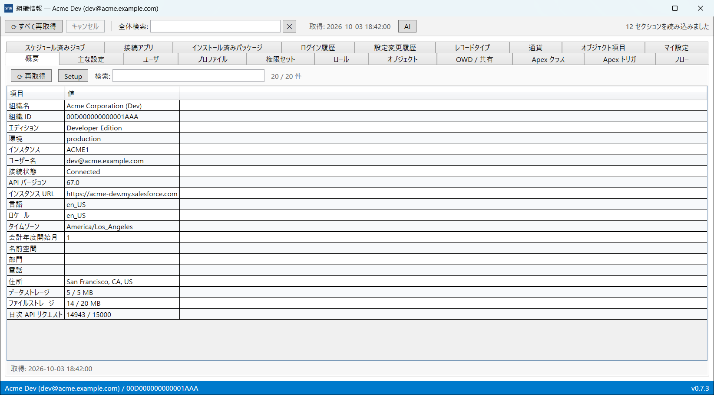
*組織情報 — 組織ごとの別ウィンドウ。20 以上のタブ・全タブ横断検索・Setup リンク・専用 AI パネル*

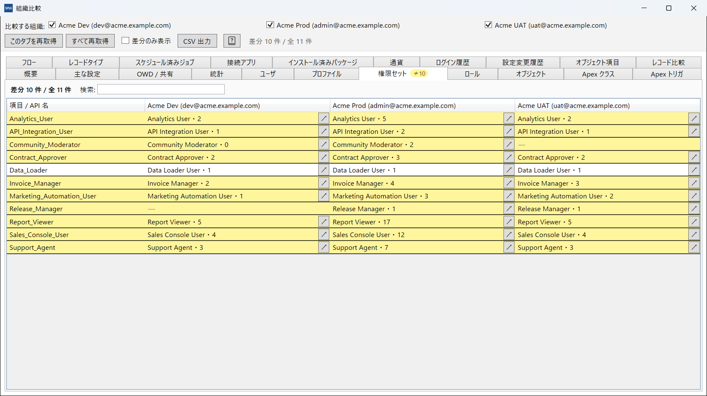
*組織比較 — 2〜4 組織を横並び比較。「片方にのみ存在」「値が異なる」行を黄色でハイライト*


*バックアップと復元 — バックアップを選んで Id / キー照合で復元。ラベル・説明・組織情報・件数は自動で入力されます*


*バックアップ比較 — 差分のあるオブジェクトを色でハイライト（差分 / A のみ / B のみ）。レコード単位の差分は別ウィンドウで表示*

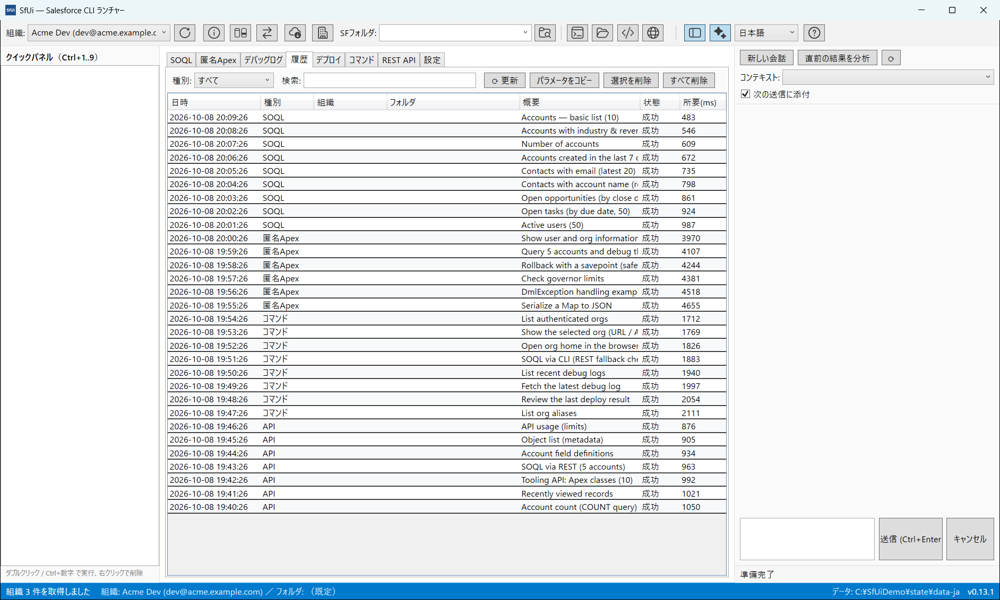
*すべての操作を履歴に保存し、ダブルクリックで再実行*

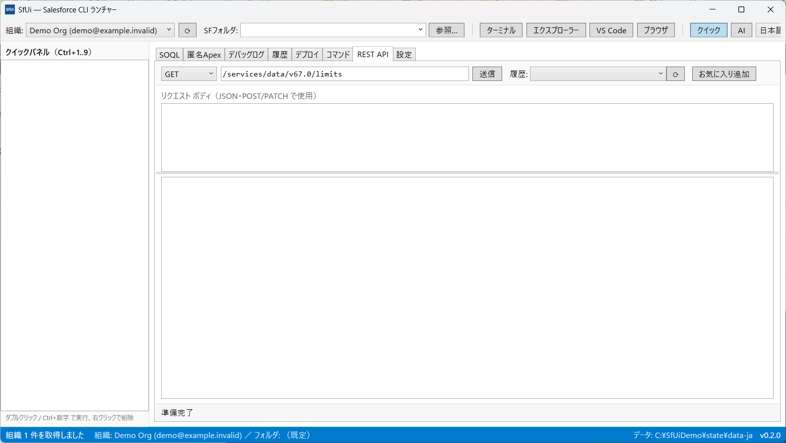
*汎用 REST コンソール（JSON 整形表示）*

## 使い方

1. [Releases](../../releases) からダウンロード
   - **`SfUi.exe`** … 実行ファイル単体（サンプル履歴は設定画面から後で追加可）
   - **`SfUi-v0.8.0-portable.zip`** … exe + サンプル履歴 30 件入りの `data/` フォルダ（解凍してそのまま実行）
2. 任意のフォルダに置いてダブルクリック（インストーラー不要）
   - 署名なしのため SmartScreen の警告が出たら「詳細情報」→「実行」
3. 初回起動時に exe 隣に `data/` フォルダ（設定・履歴・ログ）が作成されます（ポータブル動作）
4. 上部バーで組織を選び、各タブから操作を開始。サンプルの SOQL / Apex / コマンド / REST は
   「設定 → サンプル履歴を投入」で追加できます

## 設定・データの保存場所

データ ルートは次の順で決まります: 1) `--data-dir <パス>` / 環境変数 `SFUI_DATA_DIR`、2) ソースから実行時のソリューションルートの `data/`、3) exe の隣のポータブル `data/`（書き込み可能な場合）、4) 書き込み不可なら `%APPDATA%\SfUi`。

```
data\
├─ settings.json            設定（言語 / sf パス / AI / 履歴上限 / 確認ポリシー / backupRestMaxRecords など）
├─ favorites.json           お気に入り（クイックパネル）
├─ recent-folders.json      最近使ったフォルダ
├─ recent-urls.json         最近開いた URL
├─ history\                 実行履歴（種別ごと: soql.json / apex.json / api.json / data.json …）
├─ results\                 大きい実行結果の保存（履歴エントリ単位の .txt / .json）
├─ logs\app-yyyyMMdd.log    アプリの実行ログ
├─ tmp\                     一時ファイル
├─ orginfo\                 組織情報ウィンドウのキャッシュ
│   ├─ <組織キー>.json      組織ごとのタブ データ
│   ├─ preferences.json     タブ表示設定
│   └─ compare.json         組織比較の状態
├─ backup-state.json        バックアップタブの選択オブジェクト記憶（組織別）
└─ backups\
    ├─ counts.json          オブジェクト件数キャッシュ
    └─ <yyyyMMdd-HHmmss>\   バックアップ本体
        ├─ metadata.json    ラベル・説明・組織情報・オブジェクト一覧
        └─ <Object>.json / <Object>.csv   REST / Bulk の保存データ
```

JSON はすべて原子的書き込み（`AtomicJsonFile`: 一時ファイル → `File.Replace`）で、破損時に備えて `*.bak` を残します。`data/` フォルダごとコピーすれば設定・履歴・バックアップも一緒に移せます。

## 前提条件

- Windows 10 / 11（x64）
- **Salesforce CLI（`sf`）** がインストール済みで、いずれかの組織にログイン済みであること
  - 既定のパスは `C:\Program Files\sf\bin\sf.cmd`（設定画面または環境変数 `SFUI_SF_PATH` で変更可）
- 単一 EXE 版の実行に .NET ランタイムは不要（自己完結）

## 主なショートカット

- `Ctrl+Enter` … SOQL / 匿名Apex を実行
- `Enter` … コマンド実行
- `Ctrl+1..9` … クイックパネルのお気に入りを実行
- `F5` … 直前の操作を再実行

## ビルド

```powershell
dotnet build SfUi.sln -c Debug
dotnet test  SfUi.sln
```
