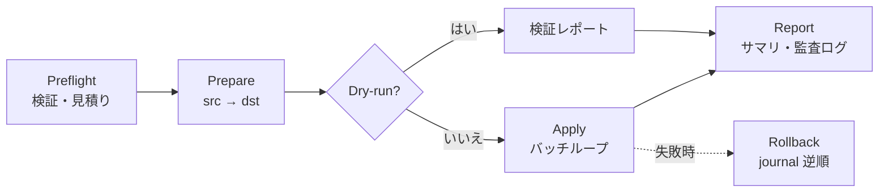

# SfUi ETL 機能 設計書

最終更新: 2026-10-09 / ステータス: **P1 単一ステップ縦串 完了 — エンジン基盤 / 式 / マッピング / CSV・Excel・JSON・XML 入力 / Salesforce・CSV 出力 / 安全 5 機能（dry-run・失敗時ロールバック・手動リストア・成功後巻き戻し、事前バックアップはフック実装済み・UI 接続待ち）/ ETL ウィンドウ（両アプリ・4 領域）。検証: 646 テスト + `--smoke-etl`（オフライン + 実組織 hks4sand1: エラー率停止 → ロールバック → 成功後巻き戻し）+ 両アプリ UIA。フォローアップ: 事前バックアップの UI 接続・非 CSV 入力の実組織スモーク・マルチステップ（2 パス投入）**
対象: WPF (`SfUi.App`) + Avalonia (`SfUi.Avalonia`) の両方

---

## 1. 目的・背景

SfUi は Salesforce の日常操作（SOQL / Apex / ログ / デプロイ）に加え、**バックアップと復元・組織比較・データ入出力**まで提供するようになった。次の大きな要望は「**複数の入力から複数の出力へ、安全に・再開可能に・視覚的に**データを移行する ETL 機能」である。

特に **BCP（業務継続）観点**を最優先とし、「エラー発生時に業務への影響を最小化し、いつでも復元できる」ことを設計の中心に置く。

### ユーザー要望（確定 8 項目）

1. 接続先は、できるだけ多く対応（ファイルもサーバも）
2. BCP を考慮し、エラー発生時の対応・復元をしっかり設計し、業務への影響を最小限にする
3. プロセスやマッピングを視覚的に分かりやすく表現し、編集もスムーズに
4. 複数 Input から複数 Output へのデータ移行（例: 関連のある複数オブジェクト → 関連のある複数オブジェクト）
5. 複数ステップ（例: Step1 で Insert したデータの Id を Step2 で利用）
6. 項目マッピング・型変換・数式・固定値・システム情報（時刻/ユーザー等）・スクリプトによる柔軟な変換
7. 途中結果のローカル DB を 2 段で設ける: **移行元 DB**（移行先スキーマで入力データの整理・確認）、**移行先 DB**（移行元 DB から受けて実ターゲットへ反映）
8. 更新・削除したレコードも復元できる

### 追加要件（設計提案として合意済み）

| 分類 | 内容 |
|---|---|
| 統制と安全装置 | プレフライト（スキーマ検証・実件数・API リミット・既存キー検査）、本番ガード（非 Sandbox の明示確認・削除は既定禁止）、実行前の自動バックアップ（既存 Backup 連携）、排他ロック、dry-run 標準装備 |
| 実行堅牢性 | checkpoint / resume（バッチ単位）、冪等再実行（Upsert + crosswalk）、恒久/一時エラーの分類と自動リトライ（指数バックオフ）、エラー率しきい値での自動停止、部分成功は既定で維持（巻き戻しは明示操作） |
| データ品質 | 参照解決 2 パス（親→子）、突合キー戦略、ロケール / タイムゾーン / 型の変換規定、delta（差分）モード、ストリーミング処理 |
| 検証と証跡 | 移行後の自動検証（件数・サンプル・合計。既存 Compare 機能の流用可）、監査ログ、失敗行のみ再実行 |
| 運用 | ジョブ定義の保存・複製・エクスポート（資格情報は伏せ字）、進捗ダッシュボード、（将来）スケジュール実行 |
| セキュリティ | 資格情報の OS 保護（Windows: DPAPI / macOS: 代替方式）、ログのマスキング |
| 限界の明示 | トリガ / フローによる副作用（メール送信・外部連携等）は巻き戻せない → UI とドキュメントで明示し、検証環境先行・対象限定を推奨フローに |

## 2. 決定事項（2026-10-09）

| 項目 | 決定 |
|---|---|
| 提供範囲 | **WPF + Avalonia 両方**（エンジン共通、UI は 2 アプリ） |
| 接続先 | CSV/TSV・Excel・JSON/XML・Salesforce・SQL Server・PostgreSQL・汎用 ODBC・汎用 REST API（P2 までに全部。SFTP は対象外） |
| 中間 DB | **SQLite**（run ごとに 2 ファイル: 移行元 / 移行先） |
| スクリプト | **組み込み式言語を先行**（C# / JS スクリプトは P4 で検討） |
| 編集 UI | **表形式先行**（ステップ + マッピング グリッド + 自動依存図）→ キャンバスは P4 |
| 安全機能 | dry-run / 実行前自動バックアップ / 失敗時自動ロールバック / 手動復元 / 成功後の任意時点巻き戻し — **すべて初版（P1）対象** |
| データ規模 | **100 万件超を想定** → 全経路ストリーミング・Bulk 2.0・checkpoint/resume 必須 |
| メイン ツールバー | 「データ入出力」ボタンの隣に **ETL ボタン**を追加（ローディング中の一時的な溢れはマージン調整で対応） |

## 3. アーキテクチャ

### 3.1 プロジェクト構成

```
src/SfUi.Etl/                    （新規・net9.0・UI 非依存エンジン）
  Connections/                   … コネクタ実装（CSV / Excel / JSON / XML / REST / Salesforce / ADO.NET）
  Model/                         … ジョブ定義・ステップ・マッピング・接続プロファイル
  Engine/                        … 実行制御（Preflight / Prepare / Apply / Report / Checkpoint / リトライ）
  Staging/                       … SQLite ステージング（移行元 DB / 移行先 DB / crosswalk / journal）
  Expressions/                   … 式言語（DynamicExpresso ラッパー + 関数ライブラリ）
  Security/                      … 資格情報保護（DPAPI / AES）
```

- 依存: `SfUi.Core`（CSV / Salesforce REST / Bulk / Backup / Limits / AtomicJsonFile を再利用）
- 追加 NuGet（P0 で確定・検証済み）: Microsoft.Data.Sqlite 9.0.20 / DynamicExpresso.Core 2.19.6 / ExcelDataReader 3.9.0 / Microsoft.Data.SqlClient 5.2.3 / Npgsql 8.0.9 / System.Data.Odbc 9.0.20 / System.Security.Cryptography.ProtectedData 9.0.20 / System.Text.Encoding.CodePages 9.0.20（ExcelDataReader 利用時は CodePages プロバイダ登録が必須）
- UI: `SfUi.Presentation` に ETL ViewModel 群、WPF / Avalonia に `EtlWindow`（+ 接続マネージャ）

### 3.2 コネクタ レイヤー

```csharp
public interface IDataSource
{
    Task<ConnectionTestResult> TestAsync(CancellationToken ct);
    Task<SourceSchema> DiscoverAsync(CancellationToken ct);
    IAsyncEnumerable<RowBatch> OpenReaderAsync(ReadOptions options, CancellationToken ct); // ストリーミング
}

public interface IDataTarget
{
    Task<ConnectionTestResult> TestAsync(CancellationToken ct);
    Task<TargetSchema> DiscoverAsync(CancellationToken ct);
    TargetCapabilities Capabilities { get; }   // MaxBatchSize / UpsertKeep / DeleteKeep など
    Task BeginLoadAsync(LoadOptions options, CancellationToken ct);
    Task<BatchResult> WriteBatchAsync(IReadOnlyList<Row> batch, CancellationToken ct);
    Task EndLoadAsync(CancellationToken ct);
}
```

| コネクタ | 方向 | フェーズ | 備考 |
|---|---|---|---|
| CSV / TSV | 入出力 | P1 | ストリーミング化・区切り/引用符/エンコード オプション追加（既存 `CsvParser` を拡張） |
| Excel (.xlsx) | 入力 | P1 | ExcelDataReader（読み取り専用・ストリーミング）。※大規模には不向き（1M 行は CSV/DB 推奨のガイド表示） |
| Excel (.xlsx) | 出力 | P2 | 既存 `ExcelExporter` を再利用 |
| JSON / XML | 入力 | P1 | JSON は配列/NDJSON、ネストはドット記法でフラット化。XML は要素→行 |
| Salesforce | 出力 | P1 | Insert/Update/**Upsert**/Delete。既存 `DataImportService`（REST composite 200 件/batch）+ Bulk 2.0（`sf data import bulk`）を再利用 |
| Salesforce | 入力 | P2 | SOQL（REST ページング）+ Bulk export（`sf data export bulk`） |
| REST API | 入力 | P2 | GET + ページング（なし / offset / Link ヘッダー / カーソル）。認証: なし / Bearer / Basic / カスタム ヘッダー |
| ADO.NET 統一（SQL Server / PostgreSQL / ODBC） | 入出力 | P2 | 1 実装で 3 種: `DbProviderFactory` 経由（Microsoft.Data.SqlClient / Npgsql / System.Data.Odbc）。スキーマ探索は `GetSchema` + INFORMATION_SCHEMA |

### 3.3 ステージング（SQLite・2 段構成）

run ごとに `data/etl/runs/<runId>/` へ 2 ファイルを作成する。

**src.sqlite（移行元 DB = 整理・確認の作業台）**

```sql
in_<n>            -- 取込原表（ソース別。全列 TEXT で受けて以降で型変換）
stg_<object>      -- 移行先スキーマに整形済み（確認・修正・dry-run はここで実施）
crosswalk         -- (step_id, target_object, source_key, target_id, status)
                  --   Step1 で作成した Id を Step2 で参照するための対応表
```

**dst.sqlite（移行先 DB = 適用キュー）**

```sql
stg_<object>      -- 適用対象データ + 制御列
                  --   _op (insert/update/upsert/delete), _status (pending/sent/ok/failed/skipped),
                  --   _attempts, _target_id, _error, _journal_id
journal           -- (id, run_id, step_id, object_name, op, target_id, source_key,
                  --  before_json, after_json, applied_at, reverted_at, revert_status)
run_state         -- (step/batch checkpoint, counters, watermarks スナップショット)
```

運用: `PRAGMA journal_mode=WAL` / `synchronous=NORMAL`、バッチ 5,000〜20,000 行/トランザクション、`crosswalk(source_key)`・`journal(run_id)` にインデックス。

### 3.4 エンジン実行フロー



**Preflight チェック項目**

| # | チェック | 失敗時 |
|---|---|---|
| 1 | 全接続のテスト（ソース / ターゲット） | 実行ブロック |
| 2 | スキーマ検証（必須項目・型・最大長） | 実行ブロック（警告のみ継続は設定可） |
| 3 | 対象件数の実測・見積り表示 | しきい値超過で警告 |
| 4 | 突合キーの重複・欠損検査 | 重複は方針選択（スキップ/エラー） |
| 5 | API リミット残量（Salesforce `/limits`、既存機能） | 不足なら実行ブロック |
| 6 | 実行前バックアップの有無（設定により自動取得） | 取得失敗なら確認 |
| 7 | 排他ロック（同一ターゲット + オブジェクト） | 実行ブロック |

**Apply（バッチ ループ）**: キューから未処理バッチを取得 → **before-image 取得**（update/delete 対象の旧値を読み出し）→ journal 記録 → 送信（REST composite / Bulk / SQL バッチ）→ 結果を `_status` / `_target_id` へ反映 → **checkpoint 更新**（バッチ単位）。

**エラー分類と自動処理**

| 分類 | 例 | 処理 |
|---|---|---|
| 一時エラー | 429 / タイムアウト / 接続断 | 指数バックオフで自動リトライ（既定 5 回） |
| 恒久エラー | 検証エラー / 権限不足 / 必須欠落 | 行を failed に記録して続行（後から失敗行のみ再実行） |
| 危険検知 | エラー率 > 5% / 連続 50 件失敗 / 想定超の削除件数 | **自動停止**（既定。しきい値は設定可） |

**resume**: `run_state` の checkpoint から未処理分のみ再開。「失敗行のみ再実行」も同じ仕組みで実現。

**冪等 / マッチ モード**: 作成のみ / Upsert（外部 ID）/ 更新（キー一致）/ 削除。crosswalk を持続することで再実行・Step 間参照・参照張替えを一貫して扱う。

**delta（差分）モード**: ソースにタイムスタンプ列（または SOQL の `LastModifiedDate`）を指定し、前回 watermark 以降のみ抽出。watermark は `data/etl/jobs/<id>.state.json`（ジョブ単位・run 削除に影響されない）。

**2 パス投入**: 親オブジェクト → 子オブジェクトの順で処理し、子の参照項目は `LOOKUP("Account", キー, 値)` で crosswalk から新 Id を解決。

### 3.5 復元（journal / ロールバック / 復元マネージャ）

- journal の before/after イメージから**逆順ロールバック**（子 → 親）を実行
- **自動ロールバック**: Apply 失敗時のオプション（ON/OFF 可）。失敗した場合は未解決行をレポートし手動導線を表示
- **手動復元マネージャ**: run / step / オブジェクト / 期間で絞込み → 変更プレビュー（before → after 一覧）→ 実行。**成功後の任意時点の巻き戻しもここで行う**（journal 保持期間内、既定 90 日）

**Salesforce の復元制約（UI で明示する）**

| 操作 | 復元方法 | 制約 |
|---|---|---|
| Insert | 作成した Id を削除（リサイクル ビンへ） | ハード削除は対象外 |
| Update | 旧値で PATCH | 数式/ロールアップ項目は対象外 |
| Delete | SOAP undelete（**元の Id のまま**復元） | リサイクル ビン 15 日以内のみ。親の削除に巻き込まれた子は復元不可 → バックアップから再作成 |
| すべて | — | トリガ / フローによる副作用（メール等）は巻き戻し不可 |

### 3.6 式言語

- エンジン: **DynamicExpresso**（MIT・インタプリタ・型/メソッド ホワイトリスト可能）を P0 で検証して確定
- 固定値・システム値も式で統一（例: `"固定"`, `NOW()`, `CURRENT_USER()`）

| カテゴリ | 関数（例） |
|---|---|
| 文字列 | `TEXT` `LEFT` `RIGHT` `MID` `LEN` `TRIM` `UPPER` `LOWER` `REPLACE` `CONCAT` `SPLIT` `JOIN` |
| 数値 | `TO_NUMBER` `ROUND` `ABS` `FLOOR` `CEIL` `MIN` `MAX` |
| 日付 | `TO_DATE` `FORMAT_DATE` `ADD_DAYS` `TODAY` `NOW`（タイムゾーン変換含む） |
| 論理 | `IF` `IFNULL` `COALESCE` `ISBLANK`（真偽・空値の判定） |
| システム | `CURRENT_USER()` `CURRENT_ORG()` `CURRENT_PC()` `ROW_NUMBER()` `GUID()` |
| 参照 | `LOOKUP("Object", キー, 値)`（crosswalk 参照）`PREV("field")` `PARENT("field")` |

### 3.7 UI

**ETL ウィンドウ（両アプリ）— 4 領域**

1. **ジョブ エディタ**: ステップ リスト（追加 / 並べ替え / 有効・無効）→ ステップ詳細（入力 / **マッピング グリッド**（ソース列 → ターゲット項目 / 型 / 式 / 必須 / 検証結果）/ 出力設定（オブジェクト・操作・マッチ キー））→ 先頭 100 行のプレビュー → 依存関係図（自動生成・読み取り専用）→ 「検証 (dry-run)」ボタン
2. **実行モニター**: run 一覧 + ステップ/オブジェクト別の進捗（件数 / 成功率 / 速度 / 残時間）、ログ、失敗行の詳細と CSV 出力、「失敗行のみ再実行」、「停止」「再開」「巻き戻し」
3. **復元マネージャ**: §3.5
4. **接続マネージャ**: 接続の一覧 / 作成 / テスト / スキーマ探索（テーブル・列・型、Salesforce はオブジェクト・項目）

**メイン ウィンドウ**: ツールバーの「データ入出力」の隣に ETL ボタンを追加（決定事項）。表形式エディタを先行し、キャンバス編集は P4 で同ウィンドウ内を置き換え。

### 3.8 ストレージとセキュリティ

```
data/etl/
  connections.json        接続プロファイル（秘密フィールドは OS 保護で暗号化）
  jobs/<id>.json          ジョブ定義（AtomicJsonFile。エクスポート時は資格情報参照を伏せ字化）
  jobs/<id>.state.json    delta 用 watermark ほかジョブ状態
  runs/<runId>/           run.json / src.sqlite / dst.sqlite / logs/（失敗行 CSV 等）
```

- 資格情報保護: `ICredentialProtector` — Windows は **DPAPI**（`ProtectedData`、CurrentUser）。macOS は AES-GCM + ローカル鍵ファイル（パーミッション 600）で代替（詳細は P1 で確定）
- journal 保持ポリシー: 既定 90 日（設定可）。成功後の巻き戻し・監査に使用
- ログ / エクスポート / 監査ログに秘密情報を出さない（マスキング）
- 実行結果のサマリは既存 History に `etl` 種別で記録（一貫性）

## 4. フェーズ計画

| Phase | 内容 | 受け入れ基準（動作確認） |
|---|---|---|
| **P0** 技術検証 | SQLite 100 万行 / DynamicExpresso / ストリーミング CSV / ExcelDataReader / ADO プロバイダ / DPAPI / Bulk 実測 | 計測値を §8 に記録し、ライブラリを確定 |
| **P1** エンジン基盤 + 縦串 ★最大の山場 | エンジン（Preflight/DryRun/Apply/checkpoint/リトライ/停止）、staging（src/dst/journal/crosswalk）、式基本セット、CSV/Excel/JSON/XML 入力 → Salesforce 出力（単一ステップ）、安全 5 機能、ETL ウィンドウ（4 領域・接続マネージャ含む） | `--smoke-etl`（実組織: dry-run → 小規模適用 → 自動ロールバック → 成功後巻き戻し）+ 100 万件 CSV の staging 投入 + UIA チェック（両アプリ） |
| **P2** 多段 + DB コネクタ | マルチステップ + crosswalk 本実装、ADO.NET 統一（SQL Server / PostgreSQL / ODBC）、REST 入力、Salesforce 入力、delta モード | 実シナリオ（関連 2 オブジェクトの親子移行）の E2E |
| **P3** 拡張 | 式関数拡充、検証ステップ（既存 Compare 流用）、ジョブ エクスポート / インポート、失敗行再実行の高度化、スケジュール実行の検討 | 移行前後の自動検証レポート |
| **P4** ビジュアル + スクリプト | キャンバス エディタ、スクリプト（C# / JS は選定の上）、追加コネクタ / 出力 | キャンバスでのジョブ編集 |

## 5. 検証方針

- 単体テスト（`SfUi.Etl` の全モジュール。staging / 式 / バッチ計画 / リトライ / ロールバック）
- モック: `ScriptedHandler`（HTTP）、`sf` スタブ（Bulk）、モック Salesforce（`mock-salesforce.ps1` パターン）
- 実組織スモーク: `--smoke-etl`（dry-run → 小規模適用 → 自動ロールバック実測 → 復元マネージャの巻き戻し）
- UIA チェック（WPF / Avalonia）: エディタ・モニター・復元マネージャの主要フロー
- 性能: P0 の 100 万件計測を回帰基準として維持

## 6. リスクと限界（明示）

| リスク | 対応 |
|---|---|
| 自動ロールバックは完全保証できない（カスケード削除の子・トリガ副作用・リサイクル ビン 15 日超） | 「可能な範囲」を UI / レポートで明示 + 手動復元導線 + 実行前バックアップ推奨 |
| Bulk API の 1 ジョブ上限（CSV 約 150MB 等） | 自動分割投入（P2）。上限は Preflight で見積り |
| ODBC はドライバー品質に依存 | 接続テストで警告表示。主要 DB はネイティブ プロバイダを推奨 |
| Excel は大規模に不向き | ソース選択時にガイド表示（1M 行は CSV / DB 推奨） |
| 100 万件超の UI 表示 | 画面はサマリ + ページング表示（全件グリッドは出さない） |
| ツールバー混雑 | マージン調整で対応（決定済み）。溢れが続く場合は Quick パネルへ移動を再検討 |

## 7. 未決事項・将来検討

- スクリプト言語の選定（P4）: C#（Roslyn）vs JavaScript（Jint）
- スケジュール実行（タスク スケジューラ連携等）
- SFTP / クラウド ストレージ（S3 等）コネクタ
- macOS の資格情報保護の最終方式（AES-GCM + 鍵ファイル vs Keychain 連携）

## 8. P0 技術検証（結果）

実施日: 2026-10-09 / 検証スクリプト: `C:\huqian\etl-p0`（リポジトリ外・コンソール スパイク、.NET 9.0.6 / 12 CPUs）

| 検証項目 | 結果 | 判定 |
|---|---|---|
| SQLite 100 万行 | 投入 1,504ms（20k/トランザクション）/ 索引作成 666ms / COUNT 19ms / キー検索 0ms / SUM 56ms / ファイル 48.3MB / WS 53MB | ✅ 採用（Microsoft.Data.Sqlite 9.0.20） |
| ストリーミング CSV（100 万行 読込・プロトタイプ） | 177ms / GC 割当 3MB / 500 万フィールド正確に解析（引用・カンマ・日本語含む） | ✅ 採用（SfUi.Etl へ移植） |
| DynamicExpresso（関数・日付・日本語・性能） | サンプル式 OK（LEFT/IF/日付フォーマット）/ 200,000 回 = 367ms（約 545,000 evals/s） | ✅ 採用（2.19.6。1 行 5 式で 100 万行 ≈ 10 秒弱、許容） |
| ExcelDataReader（読み取り） | OpenXml 生成 1,000 行を 44ms で読取 | ✅ 採用（3.9.0。CodePages 登録が必須） |
| ADO.NET プロバイダ | SqlClient 5.2.3 / Npgsql 8.0.9 / Odbc 9.0.20 のロード確認（実接続はユーザー環境で検証） | ✅ 採用 |
| DPAPI（暗号化ラウンドトリップ） | 成功（246 バイト暗号文） | ✅ 採用（Windows 限定 → `PlatformInfo` ガード必須。macOS は AES 方式） |
| Bulk 2.0（実組織・小規模） | P1 の `--smoke-etl` で実施（保留） | — |

補足: 100 万行 CSV の生成は 342ms / 59.7MB。SQLite は「100 万件超」想定でも性能上の問題なし（WAL + バッチ トランザクション + 索引で実用十分）。
