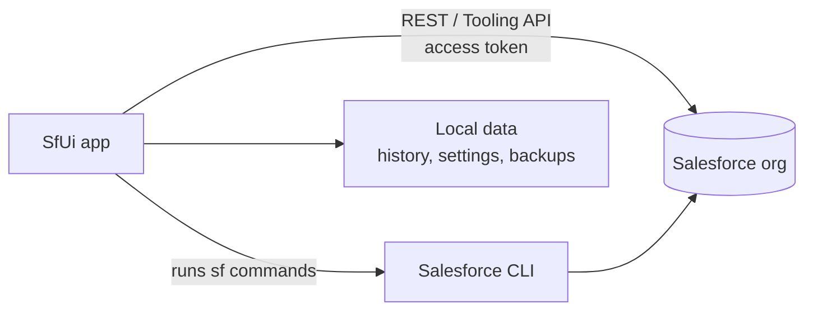
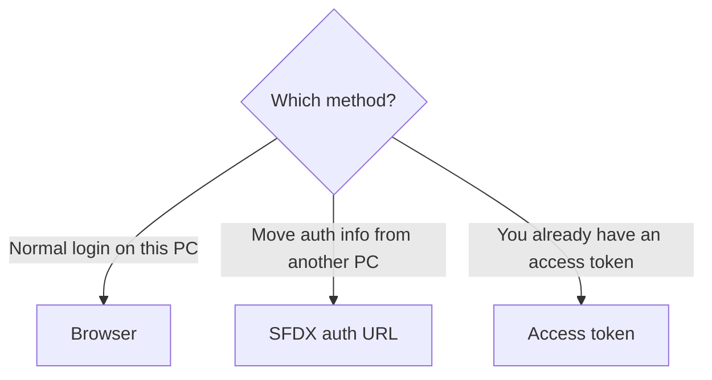
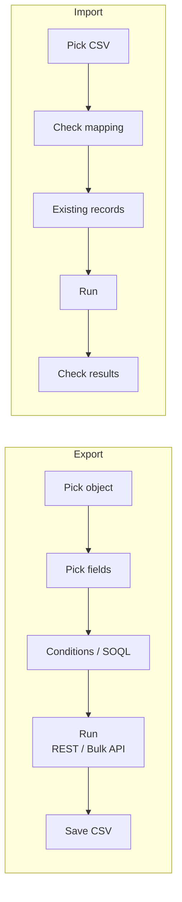
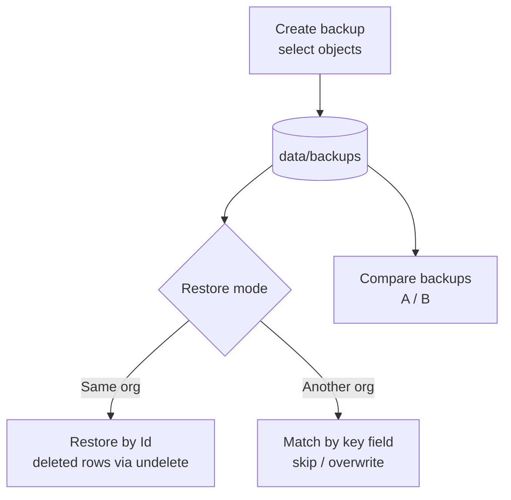
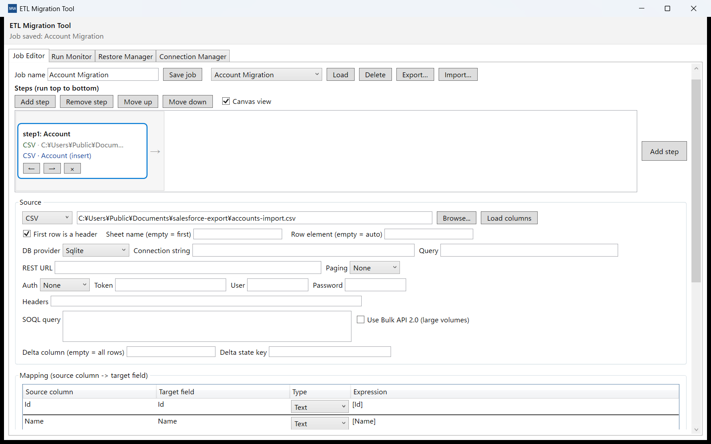
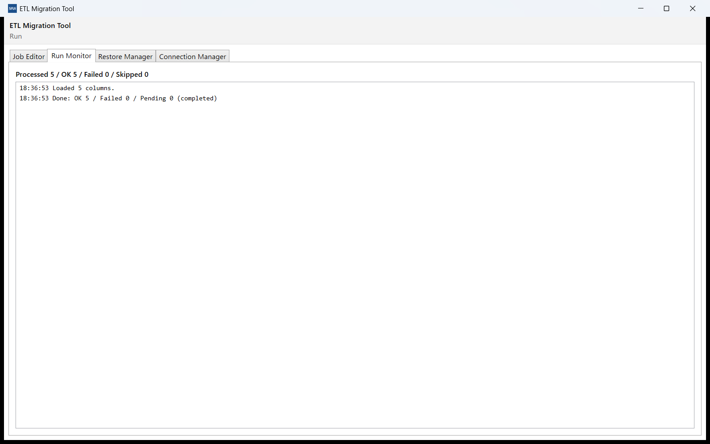
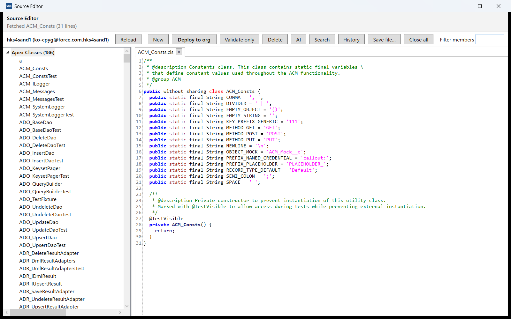
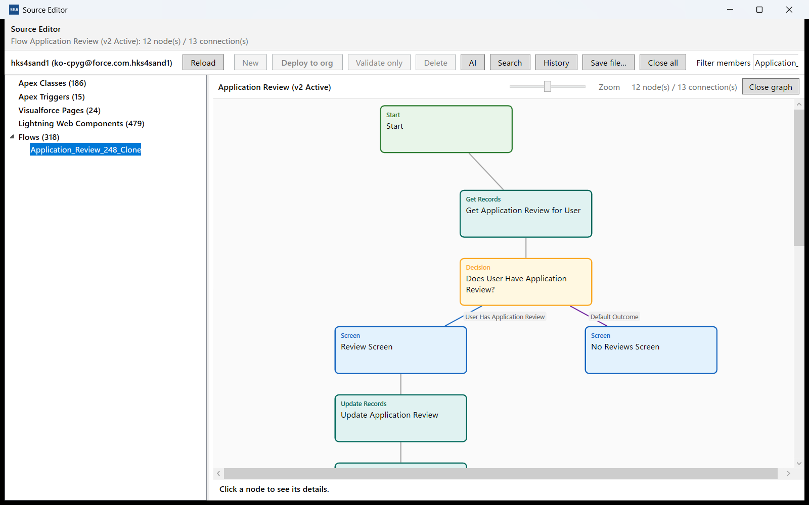

# SfUi User Manual (English)

Applies to: SfUi v0.16.1 (Windows / macOS)  
Last updated: 2026-10-10 / Status: third edition (ETL and Source editor)  
This file is the shared source for the in-app manual and the GitHub-hosted manual (Japanese / Simplified Chinese / Korean versions: `ja.md` / `zh.md` / `ko.md`).

---

## Contents

1. [Introduction](#1-introduction)
2. [Installation & initial setup](#2-installation--initial-setup)
3. [The basics of the UI](#3-the-basics-of-the-ui)
4. [Query, develop, run](#4-query-develop-run)
5. [History](#5-history)
6. [Org management](#6-org-management)
7. [Org Info](#7-org-info)
8. [Data I/O](#8-data-io)
9. [Backup & Restore](#9-backup--restore)
10. [Compare orgs](#10-compare-orgs)
11. [AI assistant](#11-ai-assistant)
12. [Quick panel & favorites](#12-quick-panel--favorites)
13. [Settings reference](#13-settings-reference)
14. [ETL (data migration)](#14-etl-data-migration)
15. [Source editor](#15-source-editor)
16. [Troubleshooting / FAQ](#16-troubleshooting--faq)
17. [Appendix (shortcuts, storage, privacy)](#17-appendix-shortcuts-storage-privacy)

---

## 1. Introduction

### 1.1 What is SfUi?

SfUi is a desktop GUI (Windows / macOS) for everyday Salesforce CLI (`sf`) operations. It obtains the access token of the selected org and calls the REST / Tooling APIs directly, so actions such as SOQL queries and backups run fast.



Key features:

- **Query & develop**: SOQL (builder / direct input), anonymous Apex, debug log viewing and analysis
- **Org management**: org list, connection tests, login/logout, governor limits, migration inventory
- **Org Info**: 20+ sections (users, profiles, objects, flows, …) with search and document export
- **Data I/O**: object-level export / import (CSV, mapping) and access inspection
- **Backup & Restore**: object-level backups, restore by Id or key field, backup-to-backup compare
- **Compare orgs**: side-by-side comparison of up to 8 orgs (including object fields and record-level diffs)
- **ETL (data migration)**: move data between files, databases, REST APIs and Salesforce; steps & mappings, delta mode, preflight verification and rollback
- **Source editor**: browse / edit Apex, triggers, Visualforce, LWC and Flow metadata, deploy to the org, Flow graph, autocompletion and AI assistance
- **AI assistant**: generation and one-click apply of SOQL / Apex suggestions
- **Productivity**: favorites (Ctrl+1..9), history replay, terminal / Explorer / VS Code / browser launch

All data is stored locally (in the configured data folder) and no telemetry is sent. Only when you use the AI chat is your input sent to the configured AI service.

### 1.2 Requirements

| Item | Details |
|---|---|
| OS | Windows 10 1809+ / Windows 11, macOS 11+ (Apple Silicon) |
| Required | Salesforce CLI (`sf`) installed, with at least one org authorized via `sf org login` |
| Distribution | Microsoft Store (MSIX) / portable exe / macOS app zip |
| Network | Needed for org operations. Browsing this manual and local history work offline |

### 1.3 Terminology

- **Org**: the Salesforce environment you connect to, referred to by its alias or username.
- **target-org**: the org that `sf` commands run against; linked to the "Org" selector in the top bar.
- **SF folder**: the working folder for `sf` commands (e.g. the project you deploy).
- **Data folder**: where history, settings and backups are stored (openable from Settings).

---

## 2. Installation & initial setup

### 2.1 Install (Windows)

1. **From the Microsoft Store**: search for "SfUi" and install (updates automatically).
2. **From the MSIX file**: download `SfUi-<ver>-x64.msix` and `.cer` from the release page, then
   1. Double-click the `.cer` → "Install Certificate" → store location "Local Machine" → place it in "Trusted People" (administrator rights required).
   2. Double-click the `.msix` to install.
3. **Portable**: just put `SfUi.exe` in any folder and run it (no installation required).

### 2.2 Install (macOS)

Unzip `SfUi-<ver>-osx-arm64.zip` from the release page and move `SfUi.app` to Applications. If Gatekeeper warns on first launch, right-click `SfUi.app` in Finder → "Open", or run:

```
xattr -dr com.apple.quarantine /Applications/SfUi.app
```

### 2.3 First launch (Welcome window)

On the first launch a Welcome window appears.


- Switch the UI language (English / 日本語 / 简体中文 / 한국어)
- Salesforce CLI detection result. If it is missing, SfUi links to the official installer page and shows the npm command (`npm install --global @salesforce/cli`)
- Feature tour
- "Get started" opens the main window; "Open settings" jumps to the Settings tab
- Check "Don't show this again" to stop showing it (you can re-open it from Settings)

### 2.4 Prepare the Salesforce CLI (sf)

SfUi calls the `sf` command to fetch org information and to deploy.

1. Install the Salesforce CLI (official installer or npm).
2. Run `sf org login web` in a terminal and sign in with the browser.
3. Start SfUi — the org appears in the top bar.

If `sf` lives in a non-standard location, set its full path under "sf path" in the Settings tab (auto-detected when empty).

### 2.5 Registering orgs (3 methods)

Open Org Management → "Register org..." panel. Use this flow to pick a method:



| Method | Use case | Input |
|---|---|---|
| Browser | Normal login | Instance URL (optional; required for sandboxes etc.) |
| SFDX auth URL | Move authorized info from another machine | `force://…` URL, or the JSON from `sf org display --verbose --json` |
| Access token | Connect with an existing token | Instance URL (required) + access token |

Specify an alias (optional) and "Set as default org", then press "Register".

### 2.6 Where data is stored

History, settings, backups and logs are all stored in the local data folder. The current location is shown in the Settings tab ("Data folder"); press "Open data folder" to open it in Explorer/Finder. You can also point SfUi to another folder with the `--data-dir` command-line option (useful for separate profiles).

---

## 3. The basics of the UI


### 3.1 Top bar

| Element | Description |
|---|---|
| Org | The org used for operations (`--target-org`). "Reload orgs" refreshes the list |
| SF folder | Working folder for deploy etc. Pick from history or use "Browse…" |
| Language | Switch the UI language (instant) |
| Buttons | Org Info / Compare / Data I/O / Backup & Restore / ETL / Source Editor / Org Management / Terminal / Explorer / VS Code / Browser / Quick / AI / About |

The Terminal, Explorer, VS Code and Browser buttons support **right-click menus** (e.g. Terminal → Windows Terminal / PowerShell / Command Prompt / WSL; Browser → Org home / Setup / Login / Enter URL).

### 3.2 Tabs

| Tab | Content | Chapter |
|---|---|---|
| SOQL | Build, run and export SOQL results | 4.1 |
| Apex | Run anonymous Apex and fetch logs | 4.2 |
| Debug Logs | List, fetch, save and analyze org logs | 4.3 |
| History | Search, copy, delete and replay history | 5 |
| Deploy | Deploy / validate metadata | 4.4 |
| Command | Run arbitrary `sf` commands | 4.5 |
| REST API | REST API console | 4.6 |
| Settings | Configuration | 13 |

### 3.3 Side panels (Quick / AI)

- **Quick** (left): your favorites. **Ctrl+1..9** runs the 1st–9th entry instantly; double-click also runs.
- **AI** (right): AI chat that can use the current tab, history and favorites as context (see chapter 11).

### 3.4 Child windows

Child windows (Org Info, Compare, Data I/O, Backup & Restore, Org Management, …) are **non-modal**. You can open several at once and switch freely with the main window (they also appear in the taskbar). Closing the main window closes everything.

### 3.5 Common shortcuts

| Key | Action |
|---|---|
| Ctrl+Enter | Run (SOQL / Apex / send AI message) |
| Enter | Run (Command tab, selected favorite, Org Info search) |
| Ctrl+1..9 | Run a favorite |
| Ctrl+Space | SOQL / Apex completion |
| Double-click | Replay history / open row details (backup records, etc.) |

### 3.6 Help (top-right of every window)

The help icon (📖) at the right end of every window's top bar opens the user manual on GitHub in your browser, in the **current UI language**, scrolled to **the chapter for that window**.

| Window | Chapter opened (English UI) |
|---|---|
| Main window | 3. The basics of the UI |
| Welcome screen | 2. Installation & initial setup |
| Org Info | 7. Org Info (Object Fields tab → 7.1) |
| Compare Orgs / record diff detail | 10. Compare orgs |
| Data I/O | 8. Data I/O |
| Backup & Restore (records / compare) | 9. Backup & Restore (9.2 / 9.3) |
| Org Management | 6. Org management |
| Debug log analyzer | 4.3 Debug logs and analysis |

The manual is available in four languages (English / 日本語 / 简体中文 / 한국어); switching the UI language also switches the language of the page opened from Help. The About window (the **?** button in the top bar) also links to the manual's first page in the current language.

---

## 4. Query, develop, run

### 4.1 Running SOQL


1. Select an org in the top bar.
2. Type a query in the SOQL tab (Ctrl+Space completes).
3. Press **Ctrl+Enter** (or the Run button). Results appear in the grid; row count and elapsed time are shown in the status bar.
4. REST is used first, falling back to the CLI when necessary.

- **Builder**: compose object, fields, conditions, order and LIMIT in the GUI and run.
- **CSV export**: save the result grid as CSV (UTF-8 with BOM; opens directly in Excel).
- **History**: every query is recorded and can be recalled from the history combo.
- Tick "Tooling API" to run via the Tooling API (needed for metadata objects).


### 4.2 Running anonymous Apex


1. Enter code in the Apex tab (templates are available).
2. Press **Ctrl+Enter** to run. `System.debug` output is fetched and shown on the right.
3. Results (compile errors / output / debug log) are recorded in History.

- You can save/copy the log and reload previous code.
- **System.debug only**: turn on the toolbar checkbox to show only System.debug(...) output (USER_DEBUG lines) in the log area.

### 4.3 Debug logs and analysis


1. Press "Fetch" in the Debug Logs tab to list the org's logs.
2. Select a row and press "Fetch" (view) or "Save" (to a file).
3. "Open .log…" loads a local log file.

Press "Analyze" on a fetched or local log to open the analyzer window.


- **Summary**: total time, events, SOQL count / rows, DML count / rows, callouts, exceptions
- **Tree**: nested execution structure (time and rows per method); expand slow nodes to find the cause
- **Events**: full event list (category filter, keyword search, detail on selection)
- **Limits**: governor limit usage, sorted by usage percentage
- **CSV export**: export the summary / limits / slowest nodes / events as CSV

Up to 20,000 events are displayed (larger logs show counts only). Analysis is local — no API consumption.

### 4.4 Deploy


- Choose the SF folder (project), the operation (deploy / validate, etc.) and the test level, then run.
- Results are recorded in History and can be re-run from the history combo.

### 4.5 Command


- Type any `sf` command and run it (Enter or the Run button).
- View stdout / stderr, add to favorites, or re-run from the history combo.
- CLI telemetry is disabled (`SF_DISABLE_TELEMETRY`) for these executions.

### 4.6 REST API console


- Choose a method (GET / POST / PATCH / DELETE, …) plus path and body to call the REST API directly.
- Responses are pretty-printed and recorded in History.

---

## 5. History


The History tab records SOQL / Apex / Command / REST / Deploy / Org / Data I/O operations automatically.

- **Filter**: type filter + full-text search
- **Replay**: double-click a row to load it back into the corresponding tab
- **Copy params**: copy the SOQL / Apex / command body of the selected row
- **Delete**: delete the selected rows (**Ctrl/Shift-click to select several and delete in bulk**), or "Delete all"
- The history limit is configurable (default 2,000 per type). Large results are stored as separate files under `results/` (default: over 64 KB)

---

## 6. Org management

Open it from the top bar ("Org Management"). It has three tabs.

### 6.1 Orgs tab


The grid shows the default mark (★), alias, username, org ID, type, status, connection result, tag, note, last backup and instance URL.

**Toolbar actions**:

| Button | Description | With multiple rows selected |
|---|---|---|
| Reload orgs | Refresh the list | - |
| Set as default | Change target-org | Shows **"Select only one org for this operation"** |
| Open in browser | Open the org in a browser | Opens **every selected org** in sequence |
| Add login (web) | Browser login (`sf org login web`) | - |
| Logout | `sf org logout` | **Logs out of all selected orgs** (confirmation with count) |
| Test connection | Read-only REST check | Tests **all selected orgs** in sequence (progress, cancel, OK/NG summary) |
| Test all orgs | Tests every registered org | - |
| Set alias | `sf alias set` | Single selection only |
| Save tag / note | Stored locally (never written to the org) | Single selection only |

- Multi-select with **Ctrl-click / Shift-click** (range).
- Bulk actions run **sequentially** and can be cancelled while running.
- New registrations use the "Register org..." panel (see 2.5).

### 6.2 Health tab


Lists the org's governor limits (API requests, storage, …). Rows are sorted by usage percentage with usage bars and a filter.

### 6.3 Migration inventory tab


Lists workflow rules / Process Builder / flows.

- Type filter, "active only", name search
- Summary (total, per type, active count)
- The per-row "Setup" button opens the component's Setup page in a browser
- "Export CSV" saves the list

---

## 7. Org Info


Open it from the top bar ("Org Info"). It shows the org's configuration in 20+ sections (Overview / Main settings / Users / Profiles / Objects / Page layouts / Flows / Currency / Login history / Setup audit trail, …).

- **Global search**: search rows across all sections and jump to the matching section.
- **Links**: some rows expose ↗ links to Setup or record pages.
- **Refresh**: each section can be refreshed (the local cache is shown first).
- **My settings**: pickers for frequently used settings.
- **Custom tabs**: group the sections you care about into your own tabs.

### 7.1 Object Fields tab and "Find field usage"

- Pick an object to list its fields (label / API name / type / formula, …).
- Select a field row and press "Find field usage" to search **where the field is used**:


  - Sources: Apex (classes / triggers), flows, validation rules, page layouts, formula fields, field permissions (read / edit)
  - Results are grouped by source; double-click a row to open the component in Salesforce
  - If a source fails to load, a warning is shown and the other results are still displayed

### 7.2 Document export


The "Export" tab writes the org's definitions to **Excel (multi-sheet) + per-sheet CSV**.

- Targets: object definitions / field definitions / page layouts / list views / flow documents
- Select multiple objects (filter, custom-only, select-all)
- Progress, cancel, partial-failure warnings and "Open folder" after completion

---

## 8. Data I/O


Open it from the top bar ("Data I/O"). Pick an object to export / import / inspect access.



### 8.1 Export

1. Pick an object (fields are loaded).
2. Select the fields to output (select all / search).
3. Set conditions (builder for conditions, order and limit, or type SOQL directly).
4. Press "Run". Results appear in the grid and can be saved as CSV / JSON / TSV.
5. Choose the engine: REST or Bulk API (Bulk is recommended for large volumes).

### 8.2 Import

1. Pick a CSV file (UTF-8, preferably without BOM).
2. Choose the external ID field to match on (used for update / upsert).
3. Check the column-to-field mapping (auto-mapped; adjust manually if needed).
4. Choose how to treat existing records (create-new / overwrite / skip, …).
5. Press "Run". Success / failure / skipped counts and the elapsed time are shown, with details for failed rows.

### 8.3 Access tabs

- **Object Access**: permissions per assignee (profiles / permission sets)
- **Field Access**: field × assignee matrix (read / edit) — editable and savable directly from the matrix
- **Record Access**: pick users and inspect per-record access (read / edit / delete, …) with paging

---

## 9. Backup & Restore


Open it from the top bar ("Backup & Restore"). Three tabs:



### 9.1 Backup tab

1. Check the objects to back up (with search and record counts).
2. Review the label / description (auto-filled with org + timestamp).
3. Press "Run". Per-object progress and results are shown.
4. The per-object limit (default 2,000 records) applies — narrow the selection if needed.

### 9.2 Restore tab

1. Pick a backup in the left list (you can **select several and delete them in bulk**; a confirmation with the count appears).
2. Select the objects to restore (a key field can be chosen per row).
3. Choose the match mode:
   - **Auto**: Id for the same org, key field for another org
   - **Id**: deleted records are undeleted via SOAP **keeping their original Id**
   - **Key field**: match by the given field (choose skip / overwrite for existing records)
4. Press "Run". Per-object results (processed / succeeded / failed) are shown.

### 9.3 Compare tab


Pick two backups (A / B) and compare. Objects with differences are color-coded (added / removed / changed / error) and per-object record diffs (added / removed / changed) are available. The record windows let you inspect values, search, page, and open the record in Salesforce (↗).

---

## 10. Compare orgs


Open it from the top bar ("Compare"). Compare up to **8 orgs** side by side.

- Category tabs (Overview / Org / Users / Profiles / Objects / … / **Object fields** / **Record compare**)
- Rows with differences are highlighted; tabs show diff-count badges
- Cell ↗ links open the corresponding record / Setup page
- **Object fields**: add an object to diff its fields (type, label, formula, …)
- **Record compare**: choose object, match key and fields to diff record by record (limit configurable)


- Double-click a row to open the "Record details" window with per-field values per org
- "Refresh all" reloads everything

---

## 11. AI assistant

Use the "AI" panel on the right (see the screenshot in [The basics of the UI](#3-the-basics-of-the-ui)).

### 11.1 Setup

Configure endpoint / model / API key under "AI" in the Settings tab.

- Default is DeepSeek (a bundled trial key is available; **it has usage limits and may stop without notice** — your own key is recommended for continued use)
- OpenAI / Anthropic / any OpenAI-compatible endpoint is supported
- The API key is stored locally, obfuscated (`enc1:`), or can be provided via the `SFUI_AI_API_KEY` environment variable

### 11.2 Usage

1. Open the relevant tab (SOQL / Apex / REST, …) and select an org if needed.
2. Type a request in the AI panel and press **Ctrl+Enter** (e.g. "Write a SOQL query for opportunities with their accounts").
3. Suggested code can be applied to the target tab with the Apply button.
4. Running is always done by you — the AI never executes automatically.

- With "Ask AI after run" enabled, SOQL results automatically produce follow-up suggestions (e.g. three next queries).
- The AI can reference the current tab, history and favorites as context.
- Answers follow the UI language.
- Authentication or quota errors appear in the status bar (your own key usually fixes them).

---

## 12. Quick panel & favorites

- "Add to favorites" in each tab registers the current query / code / command / REST request.
- **Ctrl+1..9** runs the corresponding favorite; double-click (or Enter) also runs it.
- Right-click to remove (with confirmation).
- URLs and folders can also be favorites (opened in the browser / Explorer).

---

## 13. Settings reference


| Item | Description | Default |
|---|---|---|
| sf path | Full path to the `sf` executable; empty = auto-detect | Auto |
| Terminal | Terminal executable (e.g. Windows Terminal) | Auto |
| VS Code | VS Code CLI (`code`) path | Auto |
| History limit | Entries kept per type | 2,000 |
| Result threshold | Results larger than this are stored under `results/` | 64 KB |
| Confirm policy | Dangerous only (default) / Always / Never | Dangerous only |
| AI (endpoint / model / API key) | AI chat connection | DeepSeek |
| Open data folder | Opens the storage folder | - |
| Seed sample history | Adds common templates (duplicates skipped) | - |
| Show welcome | Re-opens the first-run guide | - |

- Changes apply immediately (no restart needed for the sf path, etc.).

---

## 14. ETL (data migration)

Open it with "ETL" in the top bar. It migrates data between files, databases, REST APIs and Salesforce, with a strong focus on BCP (business continuity): preflight checks, restore on failure and job management all live in this one window. The window has four tabs: Job Editor / Run Monitor / Restore Manager / Connection Manager.



### 14.1 Job Editor

- **Steps**: executed top to bottom. Switch between the canvas view (default) and the table view; use the ← → × buttons on a node to reorder or remove it, and "Add step" on the right to add one. The selected step's settings appear in the detail pane below.
- **Source**: CSV / TSV / Excel / JSON / XML / Database (SQL Server / PostgreSQL / ODBC) / REST API / Salesforce (SOQL, Bulk API 2.0). For CSV you can treat the first row as a header; REST supports a URL, paging and authentication (Bearer / Basic / custom headers); databases take a provider, connection string and query.
- **Mappings**: define source column → target field mappings in a grid, with a type (text / number / date, …) and an expression. Expressions can use 56 built-in functions (string, numeric, date, logical, system values, lookups, Salesforce Id conversion). The function hint stays visible below the mapping grid.
- **Target**: Salesforce (insert / update / upsert / delete), CSV or a database. For Salesforce, specify the object, operation, match key and error-rate threshold.
- **Delta mode**: with a delta column and delta state key, only changes since the previous run are migrated (for SOQL sources the condition is pushed down into the WHERE clause).
- **Multi-step linking**: Ids created by an earlier step are recorded in a local crosswalk and can be referenced as match keys by later steps (e.g. parent → child migrations).
- **Job management**: Save job / Load / Delete / Export… / Import…. Exported files never contain credentials.

### 14.2 Running and monitoring

Before a run, SfUi performs a preflight (schema validation, row counts, API limits, existing-key checks) and an automatic backup. Applying to a non-sandbox org asks for explicit confirmation, and delete operations are disabled by default. "Validate (dry-run)" checks everything without applying.



- **Run Monitor**: processed / success / failed / skipped counts and a log. Drill into failed rows or export them to CSV, re-run only the failed rows, and stop or resume a run.
- **Robustness**: transient errors are retried automatically with exponential backoff, and the run stops automatically once the error rate passes the threshold. Batch-level checkpoints let you resume after an interruption.
- **Verification**: after a run, counts, sample values and numeric totals are compared automatically ("Verify after run", or press "Verify" manually). The report is saved as verification.json.
- Run summaries are recorded in the History tab with the "ETL" type.

### 14.3 Restore (rollback)

Every applied change is recorded in a per-run journal (before / after images) and can be rolled back in reverse order (children → parents).

- **Automatic rollback**: an option for failed applies (on / off). Unresolved rows are reported together with a link to manual recovery.
- **Restore Manager**: pick a run → "Load journal" → review the changes → "Revert this step/object" or "Revert the whole run". **Reverting a successful run at any later point** also works here (within the journal retention, 90 days by default).
- **Salesforce restore constraints** (also shown in the UI):

| Operation | How it is restored | Constraints |
|---|---|---|
| Insert | Created Ids are deleted (to the recycle bin) | Hard deletes are out of scope |
| Update | PATCHed back to the old values | Formula / roll-up fields are out of scope |
| Delete | SOAP undelete (same Id) | Only within the 15-day recycle bin |
| Everything | - | Side effects of triggers / flows (emails, callouts, …) cannot be undone |

### 14.4 Connection Manager

List, create and test connection profiles and explore schemas (database tables / columns / types, Salesforce objects / fields). Credentials are encrypted with OS protection (Windows: DPAPI) and never appear in logs or exports.

### 14.5 Where ETL data lives

- `data\etl\connections.json` … connection profiles (secret fields encrypted)
- `data\etl\jobs\` … job definitions and state (delta watermarks, …)
- `data\etl\runs\<runId>\` … per-run run.json / src.sqlite (source DB) / dst.sqlite (target DB) / logs

---

## 15. Source editor

Open it with "Source Editor" in the top bar. It lets you browse and edit org metadata source (Apex classes, Apex triggers, Visualforce pages, Lightning Web Components, Flows) in a VS Code-like editor and deploy changes back to the org. Reads use the Tooling REST API; writes (deploys) use the `sf` CLI.



### 15.1 Browsing

- The explorer on the left shows a tree per kind (with counts). The "Filter members" box filters by partial name.
- Selecting a member opens a tab with line numbers and syntax highlighting. LWC bundles open their js / html / css / meta files together.
- "Reload" refreshes the list and the sources.

### 15.2 Editing and deploying

- Edits are saved automatically as a local draft; close the window or the app and continue later.
- **Pending-change highlight**: differences against the baseline (the last content that matched the org) are coloured (modified = yellow, added = green, removed = ▲ in the gutter).
- **"Deploy to org" (Ctrl+S)**: deploys via the `sf` CLI. With no changes it does nothing. On success the highlights clear and a snapshot is added to the local history.
- **"Validate only"**: a `deploy --dry-run` to check syntax and deployability.
- **Deploy errors**: the status shows the error count; click a row in the error list to jump to the line and column.
- **"New"**: create a class / trigger / Visualforce page / LWC from a template (the API name is validated).
- **"Delete"**: removes the member from the org (with a confirmation; the local history is cleared too).
- **"Save file…"**: writes the current file to disk. Close tabs with ×, Ctrl+W or "Close all".

### 15.3 Autocompletion

- Apex: the same candidates as the anonymous Apex tab (System, classes, sObjects, fields, SOQL snippets) appear while typing; pick a chip to insert it at the caret.
- LWC (JavaScript / HTML / CSS) and Visualforce: keyword and tag candidates.

### 15.4 Flow graph

Selecting a Flow member shows a node / connection graph instead of code.



- Nodes are colour-coded by type (start / decision / screen / record operations / loops / actions, …) and connections are labelled (branch names, …).
- Click a node to see its details at the bottom. The zoom slider scales the graph; "Close graph" returns to the tab view.

### 15.5 AI, search and local history

- **AI**: open the panel with "AI" in the toolbar. Use the quick prompts (explain / suggest improvements / fix errors) and "attach current tab data" (the file being edited); "Apply to editor" inserts a suggested snippet at the caret.
- **Search**: by default searches the whole org (Apex / triggers / VF / LWC); switch to "Open files only" with the checkbox. Up to 200 hits, cancellable while running. Clicking a result opens the file if needed and jumps to the line.
- **History**: every successful deploy stores a local snapshot (up to 20 versions). Selecting one shows the diff line count against the current file; "Load" restores it into the editor and "Redeploy" pushes it back to the org (a one-click rollback). "Clear" deletes the history.

### 15.6 Where Source Editor data lives

- `data\source-editor\work\` … temporary project used for deploys
- `data\source-editor\<orgKey>\<kind>\<member>\` … baseline (last content matching the org) / working (current draft) / history.json (local history)

---

## 16. Troubleshooting / FAQ

| Symptom | Remedy |
|---|---|
| The org list is empty | Run `sf org login web` in a terminal, then press "Reload orgs" in the top bar |
| "sf not found" is shown | Install the Salesforce CLI and set "sf path" in Settings, or press "Re-check" |
| Connection test fails | The session may have expired — log in again from Org Management → "Add login (web)" |
| Deploy and other tools feel slow | Network / API limits — wait or narrow the scope |
| The MSIX will not install | Install the bundled `.cer` into "Trusted People" first (2.1) |
| The macOS app will not open | First-run Gatekeeper prompt — right-click → "Open" (2.2) |
| The AI returns errors | Check the key and quota; the bundled trial key can stop (11.1) |
| Move data to another PC | Copy the data folder, or use `--data-dir` with a shared folder |
| Something is wrong | Inspect `logs\app-<date>.log` in the data folder and attach it to a GitHub issue |

---

## 17. Appendix (shortcuts, storage, privacy)

### 17.1 Shortcuts

| Key | Action |
|---|---|
| Ctrl+Enter | Run (SOQL / Apex / send AI message) |
| Enter | Run (Command, Quick panel, Org Info search) |
| Ctrl+1..9 | Run a favorite |
| Ctrl+Space | SOQL / Apex completion |
| Double-click | Replay history / open row details |

### 17.2 Where data lives (inside the data folder)

| File / folder | Content |
|---|---|
| `settings.json` | Settings (API key obfuscated) |
| `history\*.json` | Operation history (per type) |
| `results\` | Large execution results |
| `favorites.json` | Favorites |
| `org-manage.json` | Org tags / notes |
| `backups\` | Backup payloads and metadata |
| `orginfo\` | Org Info cache |
| `etl\` | ETL connection profiles, job definitions and run data (run / journal) |
| `source-editor\` | Source editor drafts (baseline / working) and local history |
| `logs\` | Application logs |

### 17.3 Privacy & security

- Everything is stored locally; no telemetry is sent (`SF_DISABLE_TELEMETRY` is set for `sf`).
- Only when you use the AI chat is your input sent to the configured AI service.
- API keys are obfuscated, not encrypted — be careful on shared PCs.

### 17.4 Links

- GitHub: https://github.com/huqian2016/SfUi
- Issues: https://github.com/huqian2016/SfUi/issues
- Privacy policy: https://github.com/huqian2016/SfUi/blob/main/PRIVACY.md
- License: MIT License (© HKS Tech K.K.)
- SfUi is an independent tool, not affiliated with Salesforce, Inc.
