# SfUi ユーザーマニュアル（日本語）

対象: SfUi v0.16.1（Windows / macOS）  
最終更新: 2026-10-10 / ステータス: 第 3 版（ETL・ソース エディタ対応）  
このファイルは「アプリ内蔵マニュアル」と「GitHub 公開版マニュアル」の共通原稿です（英語・中国語・韓国語版: `en.md` / `zh.md` / `ko.md`）。

---

## 目次

1. [はじめに](#1-はじめに)
2. [インストールと初期設定](#2-インストールと初期設定)
3. [画面の基本](#3-画面の基本)
4. [クエリ・開発・実行](#4-クエリ開発実行)
5. [履歴](#5-履歴)
6. [組織管理](#6-組織管理)
7. [組織情報（Org Info）](#7-組織情報org-info)
8. [データ入出力](#8-データ入出力)
9. [バックアップと復元](#9-バックアップと復元)
10. [組織比較](#10-組織比較)
11. [AI アシスタント](#11-ai-アシスタント)
12. [クイックパネルとお気に入り](#12-クイックパネルとお気に入り)
13. [設定リファレンス](#13-設定リファレンス)
14. [ETL（データ移行）](#14-etlデータ移行)
15. [ソース エディタ](#15-ソース-エディタ)
16. [トラブルシューティング / FAQ](#16-トラブルシューティング--faq)
17. [付録（ショートカット・保存場所・プライバシー）](#17-付録ショートカット保存場所プライバシー)

---

## 1. はじめに

### 1.1 SfUi とは

SfUi は、Salesforce CLI（`sf` コマンド）の日常操作を Windows / macOS のデスクトップ GUI から行えるようにするツールです。認証済み組織のアクセストークンを利用して REST / Tooling API を直接呼び出すため、SOQL 実行やバックアップなどの操作が高速です。

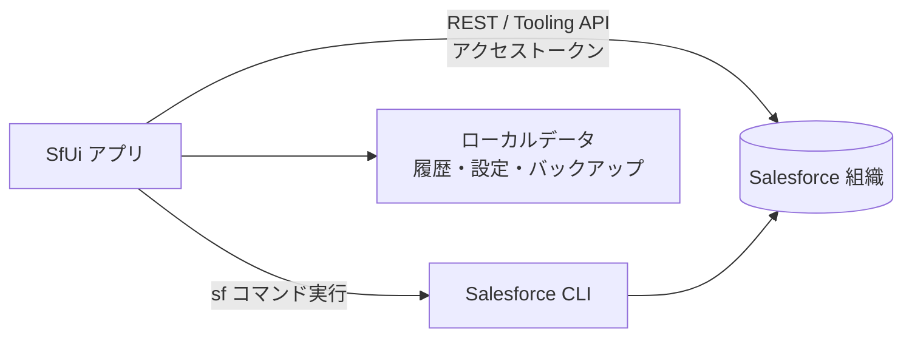
```mermaid
flowchart LR
    A[SfUi アプリ] -->|sf コマンド実行| B[Salesforce CLI]
    A -->|REST / Tooling API<br/>アクセストークン| C[(Salesforce 組織)]
    B --> C
    A --> D[ローカルデータ<br/>履歴・設定・バックアップ]
```

主な機能:

- **クエリと開発**: SOQL（ビルダー / 直接入力）、匿名 Apex、デバッグログの閲覧と解析
- **組織管理**: 組織一覧・疎通テスト・ログイン/ログアウト・ガバナ制限の確認・移行棚卸し
- **組織情報**: 20 以上のセクション（ユーザー、プロファイル、オブジェクト、フローなど）の一括表示・検索・文書エクスポート
- **データ入出力**: オブジェクト単位のエクスポート / インポート（CSV・マッピング）とアクセス権の確認
- **バックアップと復元**: オブジェクト単位のバックアップ、Id / キー項目での復元、バックアップ同士の比較
- **組織比較**: 最大 8 組織をカテゴリ別に横並び比較（オブジェクト項目・レコード単位の比較を含む）
- **ETL（データ移行）**: ファイル・データベース・REST・Salesforce 間のデータ移行。ステップとマッピング、差分（delta）移行、実行前検証、失敗時の復元（ロールバック）
- **ソース エディタ**: Apex・トリガー・Visualforce・LWC・フロー メタデータの閲覧と編集、組織への反映、フロー グラフ、入力補完、AI 支援
- **AI アシスタント**: SOQL / Apex などの生成と提案の適用
- **作業効率化**: お気に入り（Ctrl+1..9）、履歴の再実行、ターミナル / エクスプローラー / VS Code / ブラウザー連携

すべてのデータはローカル（設定したデータフォルダー）に保存され、テレメトリは送信しません。AI チャットを利用したときのみ、入力内容が選択中の AI サービスへ送信されます。

### 1.2 動作環境

| 項目 | 内容 |
|---|---|
| OS | Windows 10 1809 以降 / Windows 11、macOS 11 以降（Apple Silicon） |
| 必須 | Salesforce CLI（`sf`）がインストールされ、`sf org login` 済みの組織があること |
| 配布形態 | Microsoft Store（MSIX）/ ポータブル exe / macOS アプリ zip |
| ネットワーク | 組織への操作に必要。マニュアル閲覧や履歴管理はオフラインでも可能 |

### 1.3 用語

- **組織（Org）**: 接続先の Salesforce 環境。エイリアス名またはユーザー名で指定します。
- **target-org**: `sf` コマンドが対象にする組織。SfUi では上部バーの「組織」が連動します。
- **SF フォルダー**: `sf` コマンドの作業フォルダー（デプロイ対象のプロジェクトなど）。
- **データフォルダー**: 履歴・設定・バックアップの保存先（設定画面から開けます）。

---

## 2. インストールと初期設定

### 2.1 インストール（Windows）

1. **Microsoft Store から**: ストアで「SfUi」を検索してインストールします（自動更新されます）。
2. **MSIX ファイルから**: リリースページの `SfUi-<ver>-x64.msix` と `.cer` をダウンロードし、
   1. `.cer` をダブルクリック → 「証明書のインストール」→ 保存場所に「ローカル コンピューター」→ 証明書ストアに「信頼されたユーザー」を指定してインストールします（管理者権限が必要です）。
   2. `.msix` をダブルクリックしてインストールします。
3. **ポータブル版**: `SfUi.exe` を任意のフォルダーに置いて実行するだけです（インストール不要）。

### 2.2 インストール（macOS）

リリースページの `SfUi-<ver>-osx-arm64.zip` を展開して `SfUi.app` をアプリケーションフォルダーへ移動します。初回起動時に Gatekeeper の警告が出る場合は、Finder で `SfUi.app` を右クリック →「開く」を選ぶか、ターミナルで次を実行してください。

```
xattr -dr com.apple.quarantine /Applications/SfUi.app
```

### 2.3 初回起動（ようこそ画面）

初回起動時は「ようこそ」画面が表示されます。

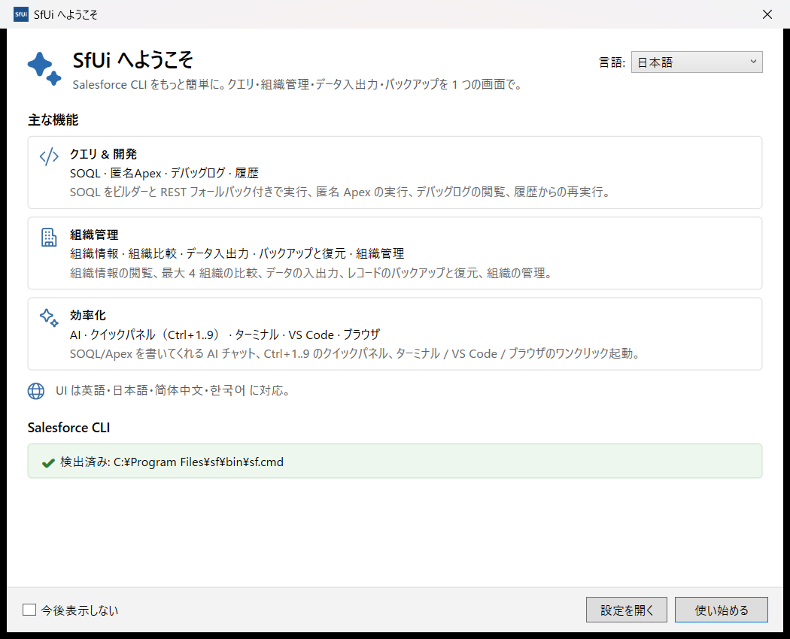

- 表示言語の切替（日本語 / English / 简体中文 / 한국어）
- Salesforce CLI の検出結果。見つからない場合は公式インストーラーページへのリンクと、npm でのインストール方法（`npm install --global @salesforce/cli`）を案内します
- 主要機能の紹介
- 「使い始める」でメイン画面へ、「設定を開く」で設定タブへ移動
- 「次回から表示しない」をチェックすると以降は表示されません（設定タブの「ようこそ画面を表示」で再表示できます）

### 2.4 Salesforce CLI（sf）の準備

SfUi は `sf` コマンドを呼び出して組織情報の取得やデプロイを行います。

1. Salesforce CLI をインストールします（公式インストーラーまたは npm）。
2. ターミナルで `sf org login web` を実行し、ブラウザーでログインします。
3. SfUi を起動すると上部バーの組織一覧に表示されます。

`sf` が標準と異なる場所にある場合は、設定タブの「sf パス」で実行ファイルを指定できます（未指定時は自動検出）。

### 2.5 組織の登録（3 つの方法）

組織管理ウィンドウ →「組織を登録…」パネルから登録できます。どの方法を選ぶかは次のフローで判断してください。

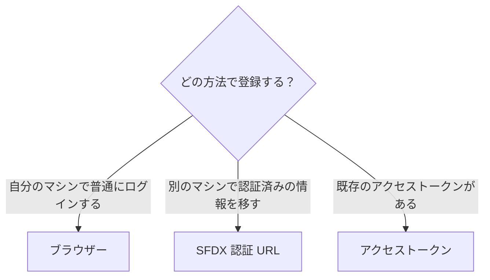
```mermaid
flowchart TD
    Q{どの方法で登録する？} -->|自分のマシンで普通にログインする| W[ブラウザー]
    Q -->|別のマシンで認証済みの情報を移す| S[SFDX 認証 URL]
    Q -->|既存のアクセストークンがある| T[アクセストークン]
```

| 方法 | 用途 | 入力 |
|---|---|---|
| ブラウザー | 通常のログイン | インスタンス URL（任意。Sandbox 等は指定） |
| SFDX 認証 URL | 別マシンで認証済みの情報を移す | `force://…` の URL、または `sf org display --verbose --json` の出力 JSON |
| アクセストークン | 既存トークンで接続 | インスタンス URL（必須）+ アクセストークン |

エイリアス（任意）と「既定の組織に設定」を指定して「登録」を実行します。

### 2.6 データの保存場所

履歴・設定・バックアップ・ログはすべてローカルのデータフォルダーに保存されます。既定の場所は設定タブの「データフォルダー」に表示され、「データフォルダーを開く」ボタンで直接開けます。`--data-dir` 起動オプションで別フォルダーを指定することもできます（複数プロファイルの使い分けなど）。

---

## 3. 画面の基本

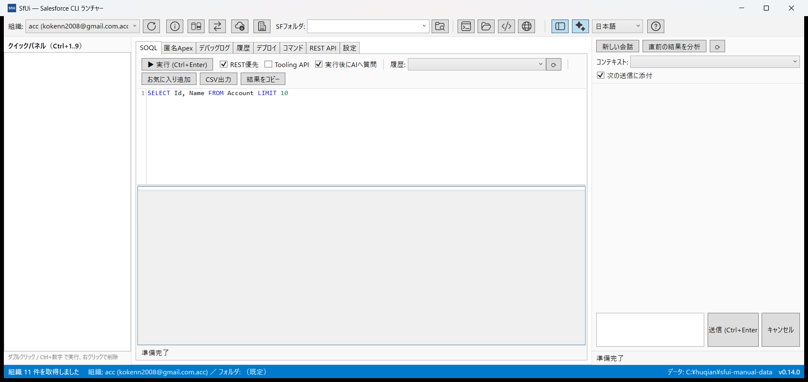

### 3.1 上部バー

| 要素 | 説明 |
|---|---|
| 組織 | 操作対象の組織（`--target-org`）。「組織を再読み込み」で最新化 |
| SF フォルダー | デプロイ等の作業フォルダー。履歴から選択または「参照…」で指定 |
| 言語 | UI 言語の切替（即時反映） |
| ボタン群 | 組織情報 / 比較 / データ入出力 / バックアップと復元 / ETL 移行 / ソース エディタ / 組織管理 / ターミナル / エクスプローラー / VS Code / ブラウザー / Quick / AI / About |

ターミナル・エクスプローラー・VS Code・ブラウザーの各ボタンは、**右クリックで種類を選択**できます（例: ターミナル → Windows Terminal / PowerShell / コマンドプロンプト / WSL、ブラウザー → 組織ホーム / 設定 / ログイン / URL 入力）。

### 3.2 タブ

| タブ | 内容 | 章 |
|---|---|---|
| SOQL | SOQL の作成・実行・結果表示・CSV 出力 | 4.1 |
| 匿名Apex | 匿名 Apex の実行とログ取得 | 4.2 |
| デバッグログ | 組織のログ一覧・取得・保存・解析 | 4.3 |
| 履歴 | 実行履歴の検索・コピー・削除・再実行 | 5 |
| デプロイ | メタデータのデプロイ / 検証 | 4.4 |
| コマンド | 任意の `sf` コマンド実行 | 4.5 |
| REST API | REST API コンソール | 4.6 |
| 設定 | 各種設定 | 13 |

### 3.3 右パネル（Quick / AI）

- **Quick**（左側）: お気に入りの一覧。**Ctrl+1..9** で 1〜9 番目を即実行、ダブルクリックでも実行できます。
- **AI**（右側）: AI チャット。現在のタブの内容や履歴をコンテキストとして質問できます（詳細は「11. AI アシスタント」）。

### 3.4 子ウィンドウの扱い

組織情報・比較・データ入出力・バックアップ・組織管理などの子ウィンドウは**非モーダル**です。同時に複数開くことができ、メインウィンドウと自由に切り替えられます（タスクバーにも個別に表示されます）。メインウィンドウを閉じるとすべてのウィンドウが閉じます。

### 3.5 よく使うショートカット

| キー | 動作 |
|---|---|
| Ctrl+Enter | 実行（SOQL / Apex / AI 送信など） |
| Enter | 実行（コマンド、選択中のお気に入り、組織情報の検索） |
| Ctrl+1..9 | クイックパネルの 1〜9 番目を実行 |
| Ctrl+Space | SOQL / Apex の入力補完 |
| ダブルクリック | 履歴の再実行、グリッド行の詳細（バックアップ記録など） |

### 3.6 ヘルプ（各ウィンドウ右上）

各ウィンドウの上部バー右端にあるヘルプ アイコン（📖）をクリックすると、**現在の UI 言語**に対応したユーザーマニュアル（GitHub）が既定のブラウザーで開き、**そのウィンドウに該当する章**までスクロールします。

| ウィンドウ | 開く章の例（日本語 UI） |
|---|---|
| メイン ウィンドウ | 3. 画面の基本 |
| ようこそ画面 | 2. インストールと初期設定 |
| 組織情報 | 7. 組織情報（オブジェクト項目タブは 7.1） |
| 組織比較 / レコード差分詳細 | 10. 組織比較 |
| データ入出力 | 8. データ入出力 |
| バックアップと復元（レコード / 比較） | 9. バックアップと復元（9.2 / 9.3） |
| 組織管理 | 6. 組織管理 |
| デバッグログ解析 | 4.3 デバッグログと解析 |

マニュアルは 4 言語（日本語 / English / 简体中文 / 한국어）で用意されており、UI 言語を切り替えるとヘルプで開くページもその言語に切り替わります。また、上部バーの「?」から開く About ウィンドウにも、その言語のマニュアル先頭ページへのリンクがあります。

---

## 4. クエリ・開発・実行

### 4.1 SOQL の実行

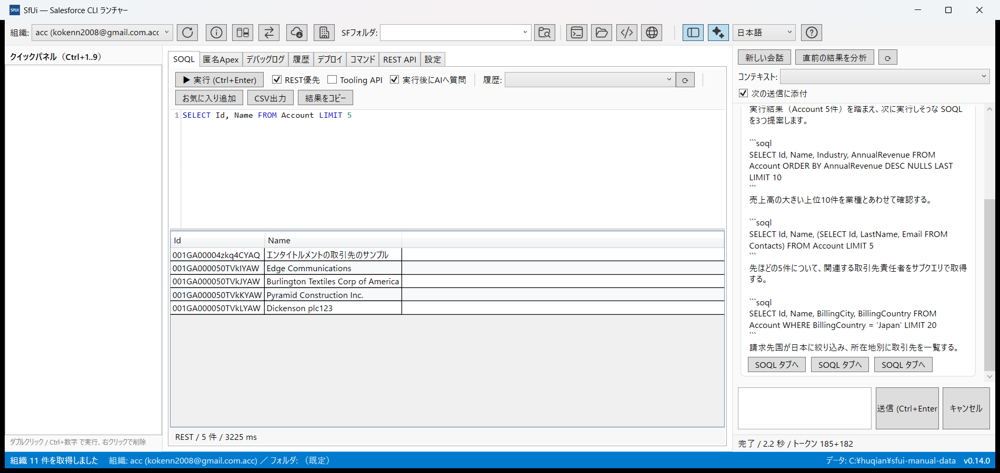

1. 上部バーで組織を選択します。
2. SOQL タブでクエリを入力します（Ctrl+Space で補完）。
3. **Ctrl+Enter**（または実行ボタン）で実行します。結果はグリッドに表示され、行数と実行時間がステータスに表示されます。
4. 実行は REST API が優先され、必要に応じて CLI にフォールバックします。

- **ビルダー**: オブジェクト・項目・条件・並び順・LIMIT を GUI で組み立ててから実行できます。
- **CSV 出力**: 結果グリッドの「CSV 出力」ボタンで保存できます（UTF-8 BOM 付き、Excel でそのまま開けます）。
- **履歴**: 実行したクエリは履歴に自動記録され、履歴コンボから呼び出せます。
- 「Tooling API」チェックを付けると Tooling API 経由で実行します（メタデータ系のオブジェクトに使用）。

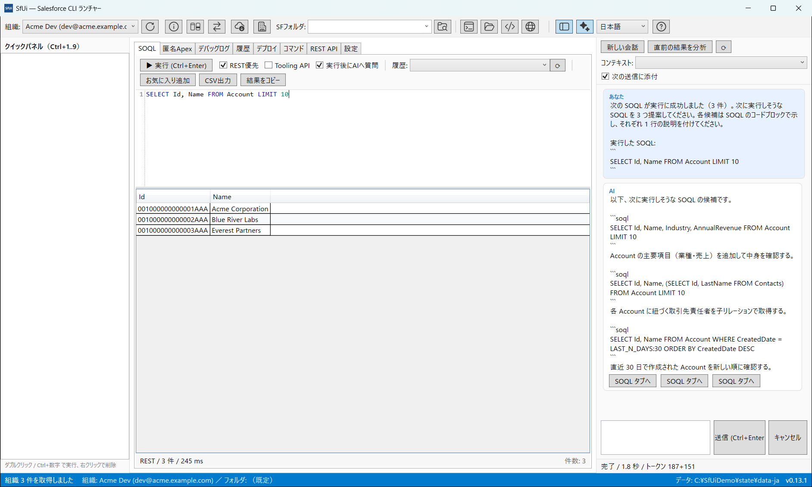

### 4.2 匿名 Apex の実行

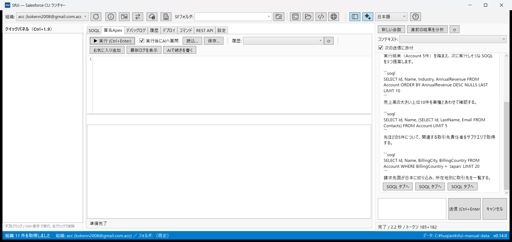

1. 匿名Apex タブでコードを入力します（テンプレートの挿入が利用できます）。
2. **Ctrl+Enter** で実行します。`System.debug` の出力がログとして取得され、右側に表示されます。
3. 実行結果（コンパイルエラー / 実行結果 / デバッグログ）は履歴に記録されます。

- ログの保存・コピー、過去のコードの読み込みができます。
- **System.debug のみ表示**: ツールバーのチェックをオンにすると、ログ領域に System.debug(...) の出力（USER_DEBUG 行）だけを表示します。

### 4.3 デバッグログと解析

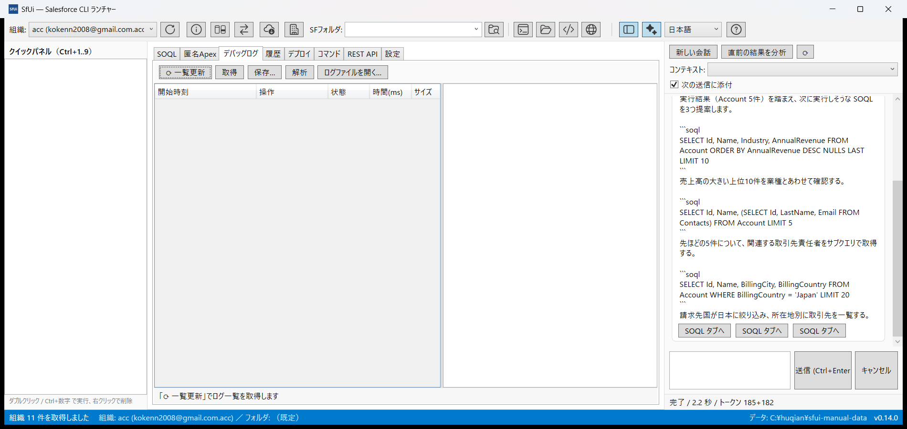

1. デバッグログ タブで「取得」を押すと、対象組織のログ一覧が表示されます。
2. 行を選択して「取得」（内容の表示）または「保存」（ファイルへ）を実行します。
3. 「.log を開く…」でローカルのログファイルを読み込めます。

取り込んだログ（またはローカル .log）を「解析」すると、解析ウィンドウが開きます。

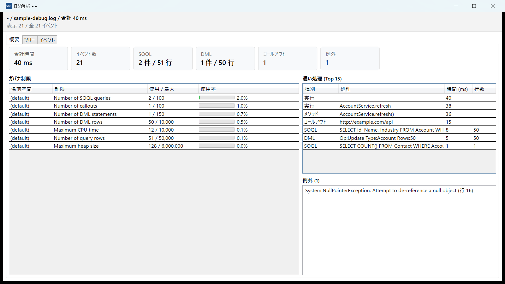

- **概要**: 合計時間、イベント数、SOQL 回数 / 取得行数、DML 回数 / 行数、コールアウト、例外数
- **ツリー**: 実行の入れ子構造（メソッド単位の時間と行数の内訳）。遅いノードを展開して原因を特定できます
- **イベント**: 全イベントの一覧（カテゴリーフィルター、キーワード検索、行選択で詳細表示）
- **制限値**: ガバナ制限の使用状況（使用率が高い順に表示）
- **CSV 出力**: 解析結果（サマリ / 制限値 / 遅い処理 / イベント）を CSV に保存できます

表示は最大 20,000 イベントまでです（超過分は件数のみ表示）。解析はローカルで行われるため、大きなログでも API 消費はありません。

### 4.4 デプロイ

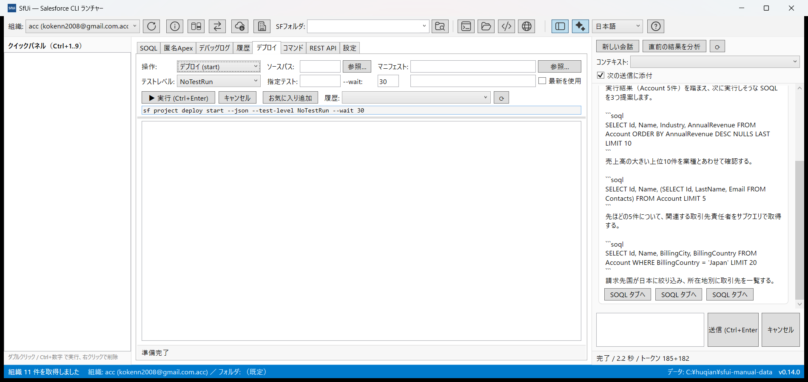

- SF フォルダー（プロジェクト）を選択し、操作（デプロイ / 検証など）とテストレベルを指定して実行します。
- 実行結果は履歴に記録され、履歴コンボから再実行できます。

### 4.5 コマンド

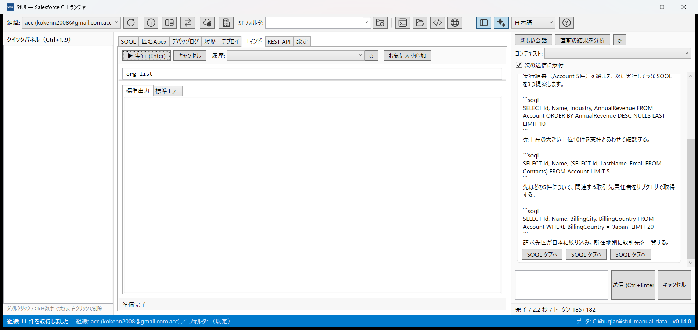

- 任意の `sf` コマンドをそのまま入力して実行できます（Enter または実行ボタン）。
- 標準出力 / 標準エラーの表示、「お気に入りに追加」、履歴からの再実行ができます。
- CLI テレメトリは無効化（`SF_DISABLE_TELEMETRY`）されて実行されます。

### 4.6 REST API コンソール

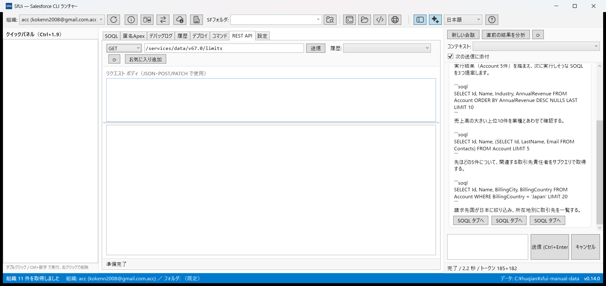

- メソッド（GET / POST / PATCH / DELETE など）+ パス + ボディを指定して REST API を直接呼び出します。
- レスポンスは整形（JSON プリティ）して表示され、履歴に記録されます。

---

## 5. 履歴

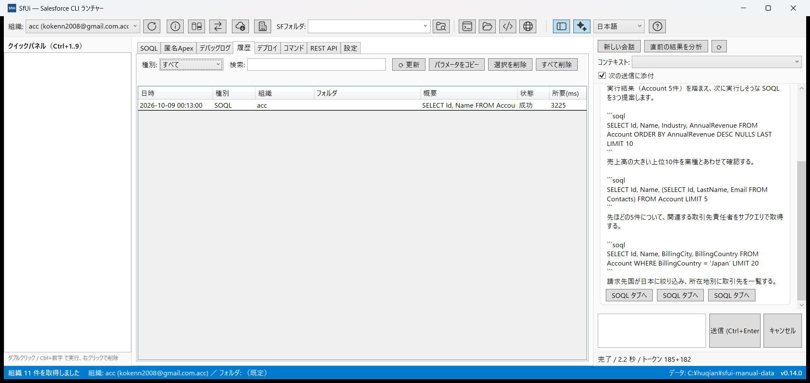

履歴タブには SOQL / Apex / コマンド / REST API / デプロイ / 組織操作 / データ入出力が自動記録されます。

- **絞り込み**: 種別フィルター + 全文検索
- **再実行**: 行のダブルクリックで、その操作を対応タブに読み込んで再実行できます
- **パラメータのコピー**: 選択行の SOQL / Apex / コマンド本文をクリップボードへコピー
- **削除**: 選択行の削除（**Ctrl+クリック / Shift+クリックで複数選択して一括削除**できます）、「すべて削除」
- 履歴の上限は設定で変更できます（既定 2,000 件 / 種別）。大きな実行結果は `results/` フォルダーに別ファイルで保存されます（既定 64KB 超）

---

## 6. 組織管理

上部バーの「組織管理」で開きます。3 つのタブがあります。

### 6.1 組織タブ

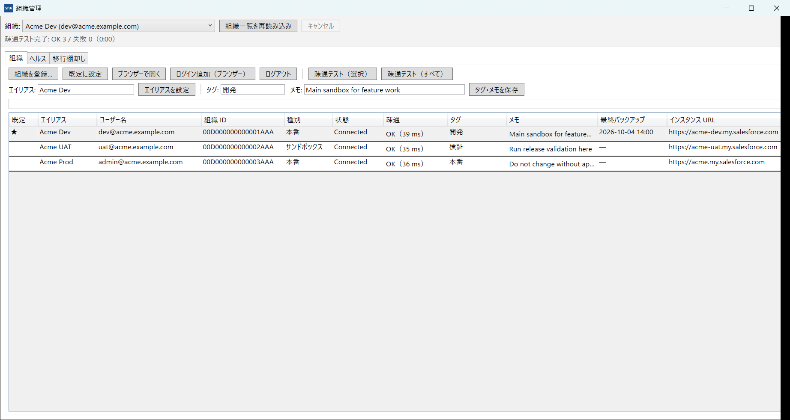

組織一覧には、既定マーク（★）、別名、ユーザー名、Org ID、種別、接続状態、疎通結果、タグ、メモ、最終バックアップ、インスタンス URL が表示されます。

**操作（ツールバー）**:

| ボタン | 内容 | 複数選択時 |
|---|---|---|
| 組織を再読み込み | 一覧を最新化 | - |
| 既定に設定 | target-org を変更 | **1 つだけ選択してください**（複数選択時はメッセージ） |
| ブラウザーで開く | 組織をブラウザーで開く | **選択したすべての組織**を順に開きます |
| ログインを追加 | ブラウザーでログイン（`sf org login web`） | - |
| ログアウト | `sf org logout` | **選択したすべての組織から一括ログアウト**（件数入り確認） |
| 疎通テスト | REST で接続確認（読み取り専用） | **選択したすべての組織**を順にテスト（進捗・キャンセル・OK/NG サマリ） |
| 全組織テスト | 登録済みの全組織を順にテスト | - |
| エイリアスを設定 | `sf alias set` | 1 つだけ選択時のみ |
| タグ・メモを保存 | ローカルへ保存（組織には書き込みません） | 1 つだけ選択時のみ |

- 複数選択は **Ctrl+クリック / Shift+クリック**（範囲）で行います。
- 一括操作は**順次実行**されます。実行中は「キャンセル」で中断できます。
- 新規登録は「組織を登録…」パネルから（2.5 参照）。

### 6.2 ヘルスタブ

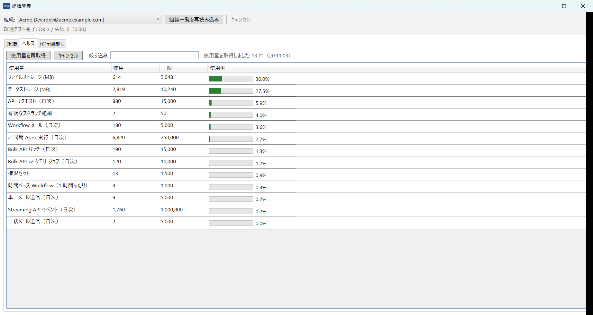

対象組織のガバナ制限（API リクエスト数、ストレージなど）を一覧表示します。使用率は降順で並び、使用率バーで残量を確認できます（フィルター付き）。

### 6.3 移行棚卸しタブ

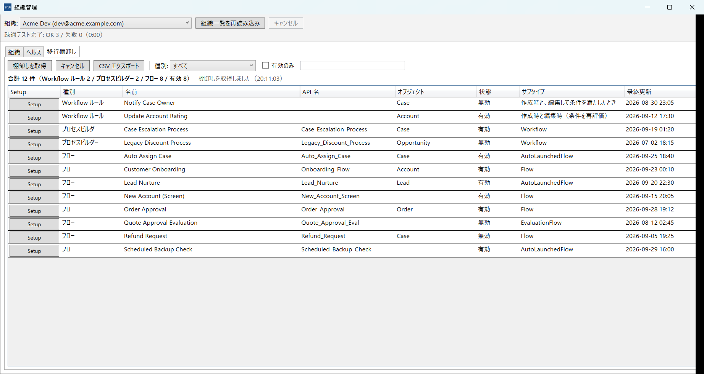

ワークフロールール / Process Builder / フローを一覧化します。

- 種別フィルター、「アクティブのみ」表示、名前検索
- サマリ（合計・種別内訳・アクティブ数）
- 行ごとの「Setup」ボタンで該当コンポーネントの Setup ページをブラウザーで開けます
- 「CSV 出力」で一覧を保存できます

---

## 7. 組織情報（Org Info）

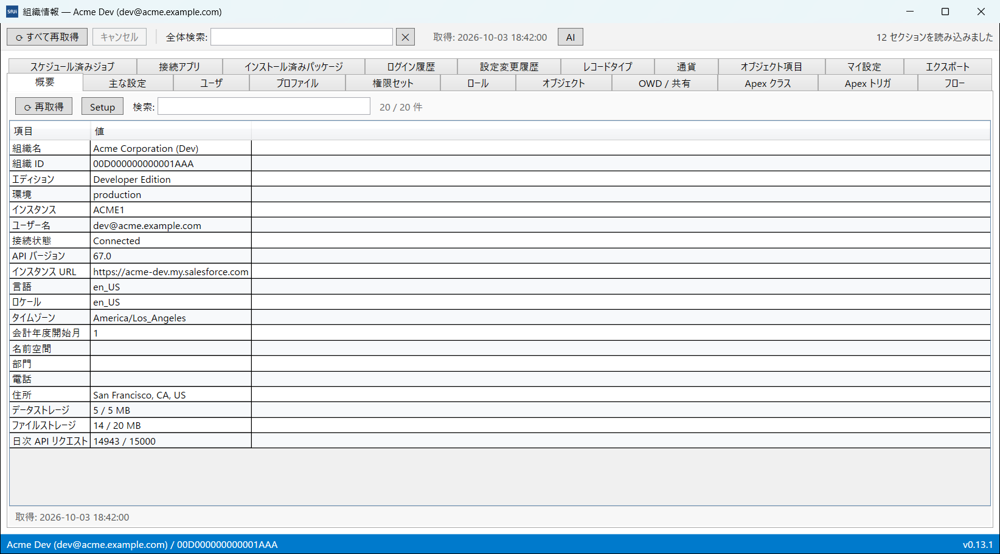

上部バーの「組織情報」で開きます。対象組織の設定情報を 20 以上のセクション（概要 / 主な設定 / ユーザー / プロファイル / オブジェクト / 画面レイアウト / フロー / 通貨 / ログイン履歴 / 設定変更履歴など）で一覧表示します。

- **グローバル検索**: 全セクションからキーワードで行を検索し、該当セクションへジャンプできます。
- **リンク**: 行によっては Setup ページやレコードページへの ↗ リンクが表示されます。
- **セクションの再取得**: 各セクションの「再取得」で最新化します（初回はキャッシュを表示）。
- **マイ設定**: よく使う設定のピッカー（項目の選択・並べ替え）。
- **カスタムタブ**: よく参照するセクションを自分用のタブとしてまとめられます。

### 7.1 オブジェクト項目タブと「使用箇所を検索」

- オブジェクトを選ぶと項目一覧（ラベル / API 名 / 型 / 数式など）を表示します。
- 項目行を選択して「使用箇所を検索」を押すと、**その項目がどこで使われているか**を横断検索できます。

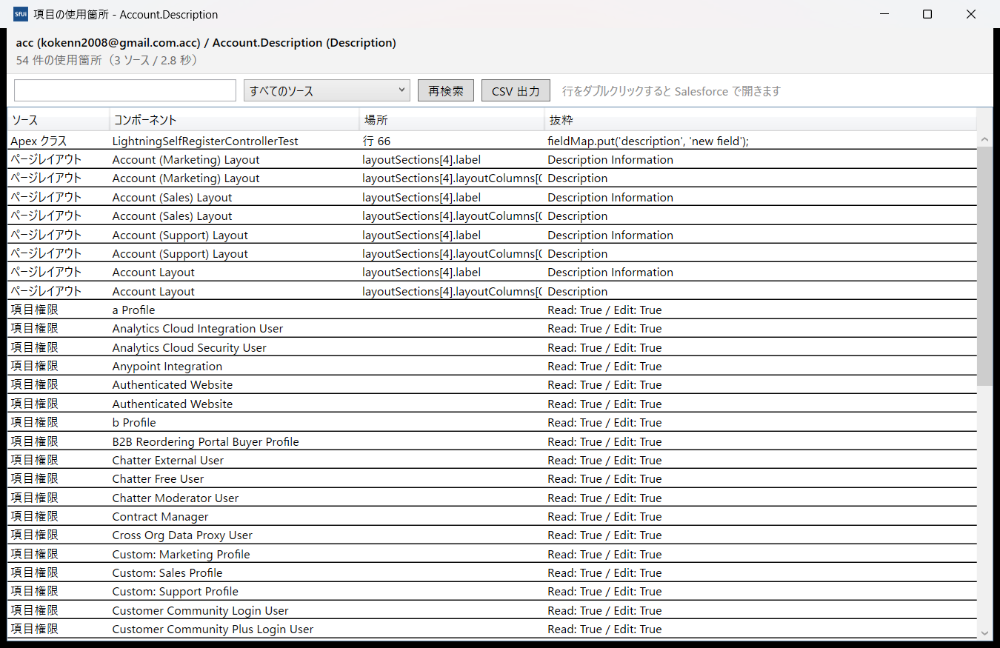

  - 検索対象: Apex（クラス・トリガー）、フロー、入力規則、画面レイアウト、数式項目、権限（参照 / 編集）
  - 結果はソース別に表示され、行をダブルクリックすると該当コンポーネントを Salesforce で開けます
  - 一部ソースの取得に失敗した場合は警告として表示され、他の結果は表示されます

### 7.2 文書エクスポート

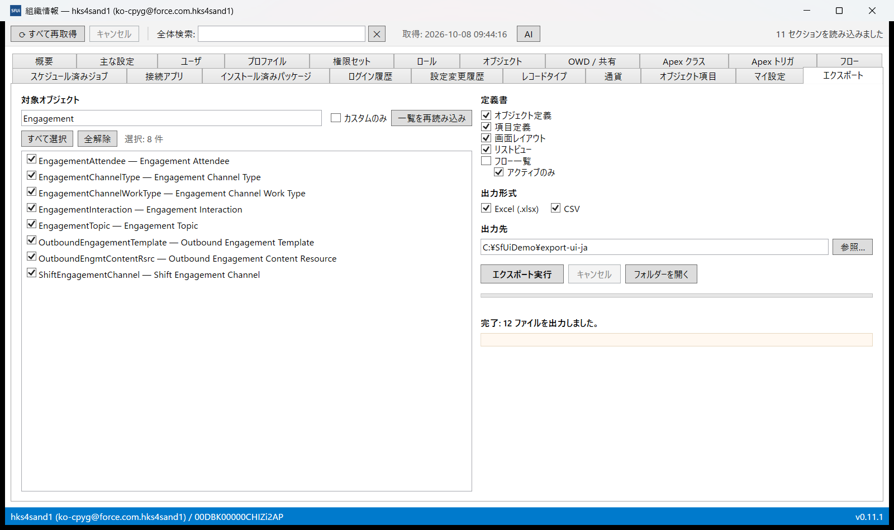

「エクスポート」タブでは、組織の定義情報を**Excel（複数シート）+ シート別 CSV** に出力できます。

- 対象: オブジェクト定義 / 項目定義 / 画面レイアウト / リストビュー / フロー定義書
- オブジェクトは複数選択（絞り込み・カスタムのみ・全選択）できます
- 進捗表示とキャンセル、部分失敗時の警告、完了後の「フォルダーを開く」に対応

---

## 8. データ入出力

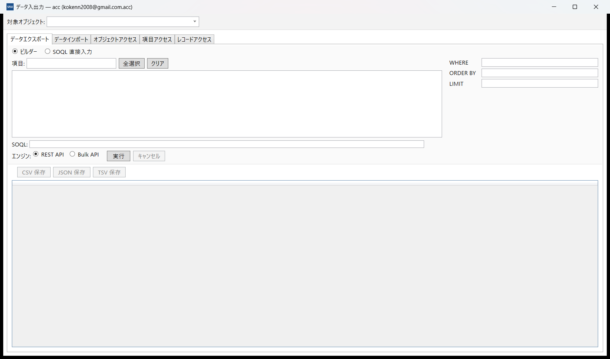

上部バーの「データ入出力」で開きます。オブジェクトを選択して、エクスポート / インポート / アクセス確認を行います。

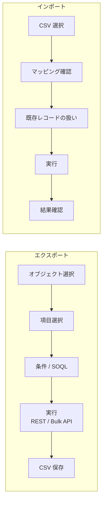
```mermaid
flowchart LR
    subgraph EXP[エクスポート]
      E1[オブジェクト選択] --> E2[項目選択] --> E3[条件 / SOQL] --> E4[実行<br/>REST / Bulk API] --> E5[CSV 保存]
    end
    subgraph IMP[インポート]
      I1[CSV 選択] --> I2[マッピング確認] --> I3[既存レコードの扱い] --> I4[実行] --> I5[結果確認]
    end
```

### 8.1 エクスポート

1. オブジェクトを選択します（項目の読み込み）。
2. 出力する項目を選択します（全選択 / 検索 / 全項目）。
3. 条件を指定します（ビルダーで条件・並び順・上限、または直接 SOQL を入力）。
4. 「実行」で取得します。結果はグリッドに表示され、CSV / JSON / TSV に保存できます。
5. エンジンは REST / Bulk API から選択できます（大量データは Bulk 推奨）。

### 8.2 インポート

1. CSV ファイルを選択します（UTF-8。BOM なし推奨）。
2. 突合用の外部 ID 項目を選択します（更新 / Upsert に使用）。
3. 列と項目のマッピングを確認します（自動マッピング＋手動調整）。
4. 既存レコードの扱い（作成のみ / 上書き / スキップなど）を選択します。
5. 「実行」で取り込みます。成功 / 失敗 / スキップ件数と所要時間が表示され、失敗行の詳細を確認できます。

### 8.3 アクセス（3 タブ）

- **オブジェクトアクセス**: 選択オブジェクトの権限を主体（プロファイル / 権限セット）別に一覧表示
- **項目アクセス**: 項目 × 主体のマトリクス表示（参照 / 編集）。マトリクスから直接編集（チェック変更）して保存できます
- **レコードアクセス**: 対象ユーザーを選択し、表示項目とページングでレコード単位のアクセス（参照 / 編集 / 削除など）を確認できます

---

## 9. バックアップと復元

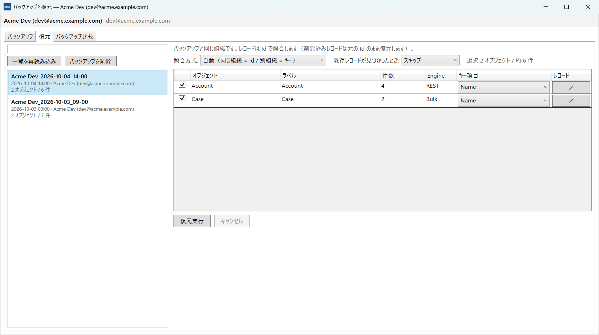

上部バーの「バックアップと復元」で開きます。3 つのタブがあります。

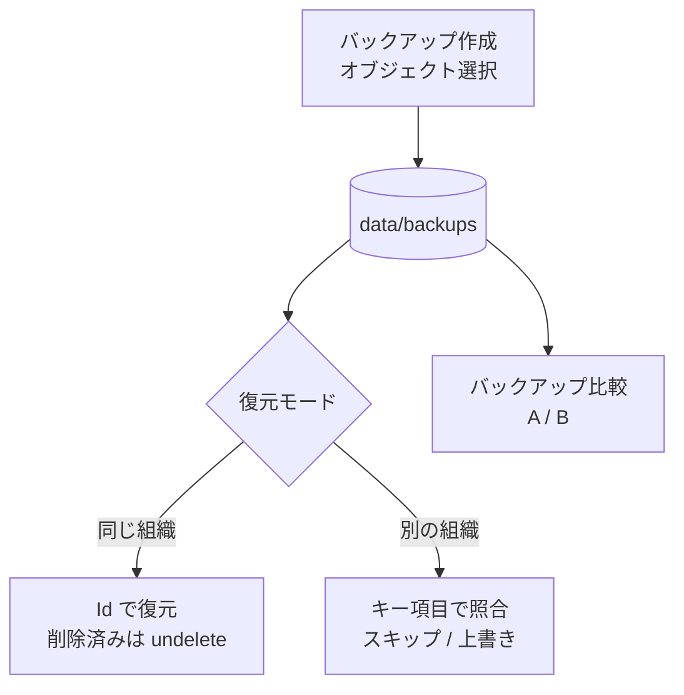
```mermaid
flowchart TD
    B1[バックアップ作成<br/>オブジェクト選択] --> B2[(data/backups)]
    B2 --> R1{復元モード}
    R1 -->|同じ組織| R2[Id で復元<br/>削除済みは undelete]
    R1 -->|別の組織| R3[キー項目で照合<br/>スキップ / 上書き]
    B2 --> C1[バックアップ比較<br/>A / B]
```

### 9.1 バックアップタブ

1. 対象オブジェクトをチェックで選択します（検索・件数表示付き）。
2. ラベル / 説明を確認します（組織名 + 日時で自動入力）。
3. 「実行」でバックアップします。オブジェクトごとの進捗と結果が表示されます。
4. 取得上限は設定（既定 2,000 件/オブジェクト）以内です。それ以上は対象を絞ってください。

### 9.2 復元タブ

1. 左の一覧からバックアップを選択します（**複数選択して「削除」で一括削除**も可能です。件数入りの確認が出ます）。
2. 復元するオブジェクトを選択します（行ごとにキー項目を指定できます）。
3. マッチモードを選択します:
   - **自動**: 同じ組織なら Id、別の組織ならキー項目で照合
   - **Id**: 削除済みレコードは SOAP undelete で**元の Id のまま**復元
   - **キー項目**: 指定項目の値で照合（既存はスキップ / 上書きを選択）
4. 「実行」で復元します。オブジェクト別の結果（処理数 / 成功 / 失敗）が表示されます。

### 9.3 比較タブ

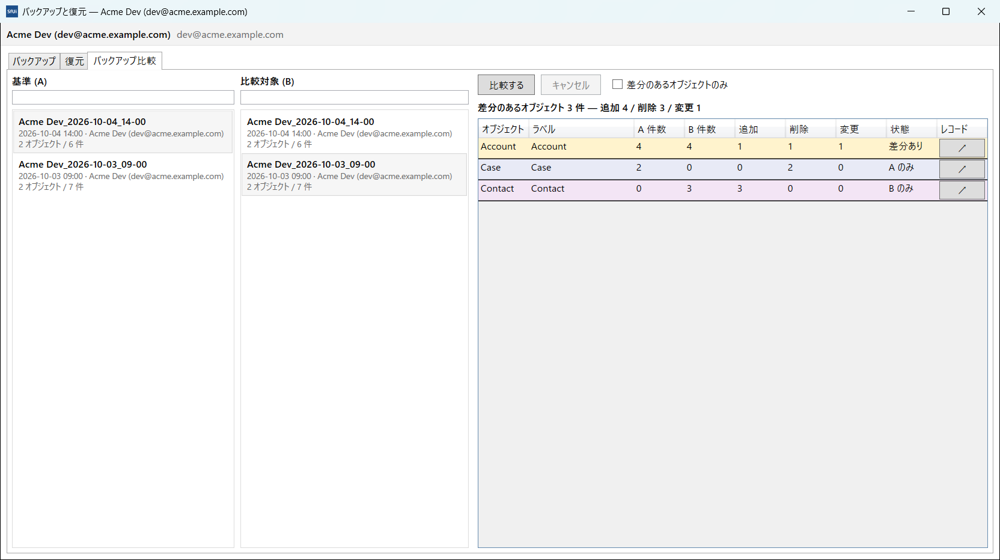

2 つのバックアップ（A / B）を選択して「比較」を実行します。差分のあるオブジェクトは色分け表示（追加 / 削除 / 変更 / エラー）され、オブジェクトごとのレコード差分（追加 / 削除 / 変更）を確認できます。バックアップ記録ウィンドウでは、レコードの内容確認・検索・ページング・Salesforce レコードページを開く（↗）が行えます。

---

## 10. 組織比較

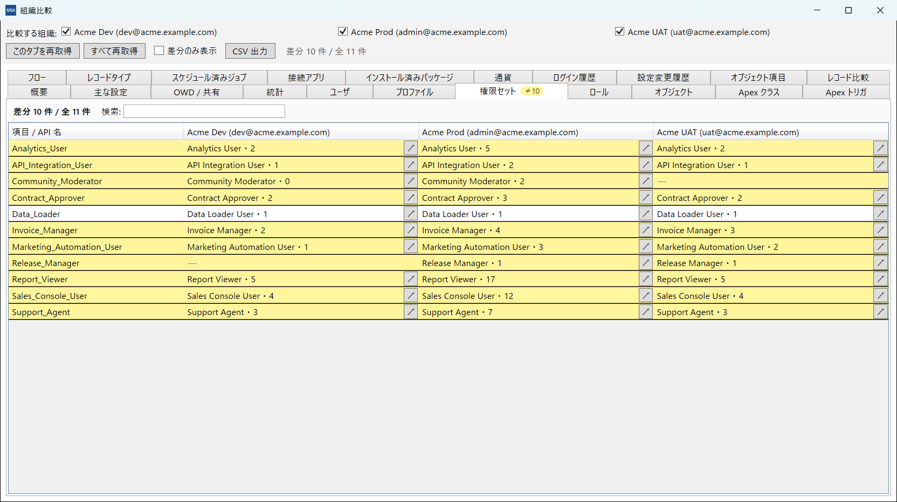

上部バーの「比較」で開きます。最大 **8 組織**を横並びで比較します。

- カテゴリタブ（概要 / 組織 / ユーザー / プロファイル / オブジェクト / … / **オブジェクト項目** / **レコード比較**）を切り替えて比較します
- 差分のある行はハイライトされ、タブには差分件数のバッジが表示されます
- セルの ↗ から、対応する組織の該当レコード / Setup ページを開けます
- **オブジェクト項目**: 対象オブジェクトを追加すると、項目ごとの差分（型・ラベル・数式など）を比較できます
- **レコード比較**: オブジェクト・照合キー・比較項目を指定して、レコード単位で差分を表示します（件数上限は設定可能）

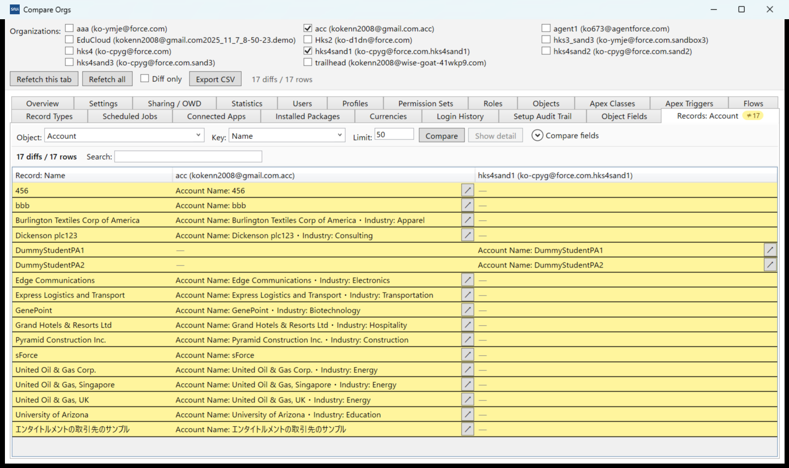

- 行をダブルクリックすると「レコード差分詳細」ウィンドウが開き、項目ごとの値を組織別に確認できます
- 「すべて再取得」で全データを最新化できます

---

## 11. AI アシスタント

右パネルの「AI」で利用します（画面例: [メイン画面](#3-画面の基本) の右側）。

### 11.1 設定

設定タブの「AI」で、エンドポイント / モデル / API キーを設定します。

- 既定は DeepSeek（組み込みの試用キーあり。**利用制限があり、予告なく停止する場合があります**。継続利用にはご自身のキーを推奨）
- OpenAI / Anthropic / OpenAI 互換のカスタムエンドポイントに対応
- API キーはローカルの設定ファイルに難読化（`enc1:`）して保存されます。環境変数 `SFUI_AI_API_KEY` でも指定できます

### 11.2 使い方

1. 対象のタブ（SOQL / Apex / REST など）を開き、必要なら組織を選択します。
2. AI パネルに質問や依頼を入力し、**Ctrl+Enter** で送信します（例:「商談項目をもとに SOQL を書いて」）。
3. 提案されたコードは「適用」ボタンで該当タブへ反映できます。
4. 実行ボタンはユーザー自身が押します（AI が自動実行することはありません）。

- 「実行後にAIへ質問」を有効にすると、クエリ実行後に結果を踏まえた提案（例: 次の SOQL 3 案）を自動で受け取れます。
- 会話のコンテキストには現在のタブの内容・履歴・お気に入りを参照できます。
- UI 言語に応じた言語で回答します。
- 認証エラーや利用上限に達した場合は、状態バーにメッセージが表示されます（自分のキーを設定すると改善します）。

---

## 12. クイックパネルとお気に入り

- 各タブの「お気に入りに追加」で、現在のクエリ / コード / コマンド / REST リクエストを登録できます。
- クイックパネルの項目は **Ctrl+1..9** で即実行、ダブルクリック（または Enter）でも実行できます。
- 右クリックから削除できます（確認あり）。
- URL・フォルダーもお気に入りにできます（ブラウザー / エクスプローラーで開きます）。

---

## 13. 設定リファレンス

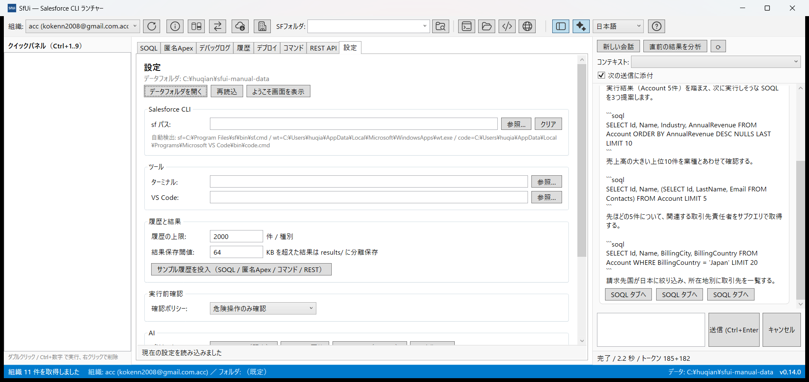

| 項目 | 説明 | 既定値 |
|---|---|---|
| sf パス | `sf` 実行ファイルのフルパス。空欄で自動検出 | 自動 |
| ターミナル | ターミナル実行ファイル（例: Windows Terminal） | 自動 |
| VS Code | VS Code CLI（`code`）のパス | 自動 |
| 履歴の上限 | 履歴の保持件数（種別ごと） | 2,000 |
| 結果保存閾値 | 結果を本体に埋め込む閾値。超えると `results/` に保存 | 64 KB |
| 確認ポリシー | 危険操作のみ確認（既定）/ 常に確認 / 確認しない | 危険操作のみ |
| AI（エンドポイント / モデル / API キー） | AI チャットの接続設定 | DeepSeek |
| データフォルダーを開く | 保存先フォルダーを開く | - |
| サンプル履歴を投入 | よく使うテンプレートを履歴に追加（重複はスキップ） | - |
| ようこそ画面を表示 | 初回案内を再度表示 | - |

- 保存後は即時反映されます（sf パス等は再起動不要）。

---

## 14. ETL（データ移行）

上部バーの「ETL 移行」で開きます。ファイル・データベース・REST API・Salesforce の間でデータを移行する ETL ツールです。BCP（業務継続）を重視し、実行前の検証・失敗時の復元・ジョブの管理までを 1 つのウィンドウで行えます。ウィンドウは「ジョブ エディタ / 実行モニター / 復元マネージャー / 接続マネージャー」の 4 つのタブで構成されます。

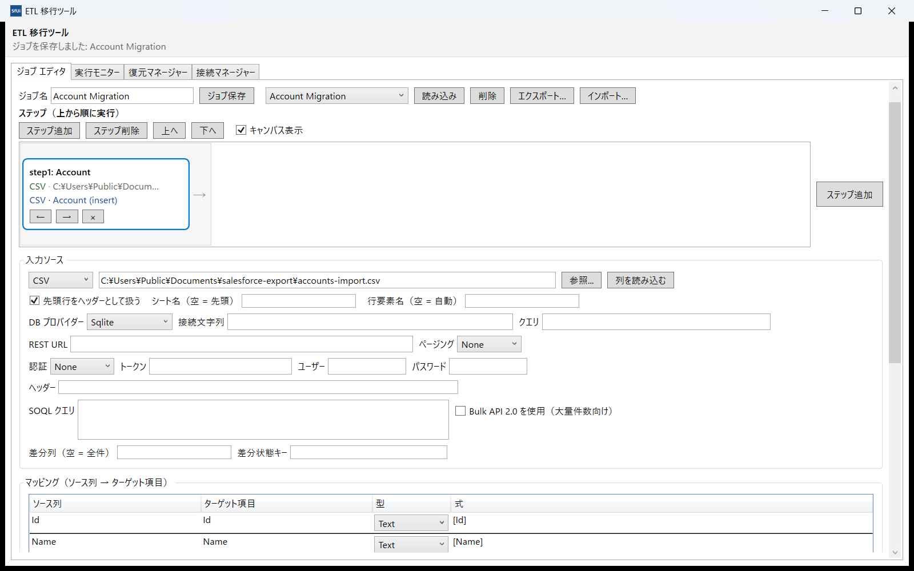

### 14.1 ジョブ エディタ

- **ステップ**: 上から順に実行されます。「キャンバス表示」（既定）と表形式を切り替えられ、ノードの ← → × で並べ替え・削除、右端の「ステップ追加」で追加できます。選択中のステップの設定が下部の詳細ペインに表示されます。
- **入力ソース**: CSV / TSV / Excel / JSON / XML / データベース（SQL Server / PostgreSQL / ODBC）/ REST API / Salesforce（SOQL・Bulk API 2.0）。CSV は「先頭行をヘッダーとして扱う」、REST は URL・ページング・認証（Bearer / Basic / カスタム ヘッダー）、データベースはプロバイダー・接続文字列・クエリを指定します。
- **マッピング**: ソース列 → ターゲット項目の対応を表で定義します。型（テキスト / 数値 / 日付など）と式による変換ができ、式では 56 種の関数（文字列・数値・日付・論理・システム値・参照・Salesforce Id 変換）を利用できます。関数のヒントはマッピング グリッドの下に常時表示されます。
- **出力先**: Salesforce（挿入 / 更新 / Upsert / 削除）、CSV、データベースを選択できます。Salesforce の場合はオブジェクト・操作・照合キー・エラー率しきい値を指定します。
- **差分（delta）モード**: 差分列と差分状態キーを指定すると、前回実行以降の増分のみを移行できます（SOQL 入力では差分条件が WHERE 句にプッシュダウンされます）。
- **複数ステップの連携**: 1 つ目のステップで作成した Id はローカルの対応表（crosswalk）に記録され、2 つ目以降のステップの照合キーとして参照できます（親 → 子の関連移行など）。
- **ジョブの管理**: 「ジョブ保存」「読み込み」「削除」「エクスポート…」「インポート…」。エクスポート ファイルには資格情報が含まれません。

### 14.2 実行とモニター

実行前に Preflight（スキーマ検証・実件数・API リミット・既存キー検査）が行われます。非 Sandbox 組織への適用では明示確認が表示され、削除操作は既定で禁止されています。「検証 (dry-run)」で組織に適用せずに確認できます。

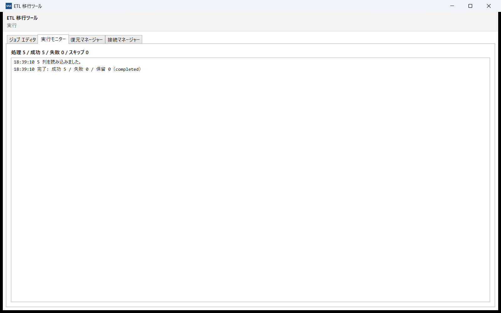

- **実行モニター**: 処理 / 成功 / 失敗 / スキップの件数とログを表示します。失敗行の詳細と CSV 出力、「失敗行のみ再実行」、「停止」「再開」に対応します。
- **堅牢性**: 一時エラーは指数バックオフで自動リトライし、エラー率がしきい値を超えると自動停止します。バッチ単位の checkpoint / resume により、中断後も再開できます。
- **検証**: 実行後に件数・サンプル値・数値合計を自動で照合します（「実行後に検証」オプション、または「検証」ボタンで手動実行）。結果は検証レポートとして保存されます。
- 実行サマリは履歴タブに「ETL」種別で記録されます。

### 14.3 復元（ロールバック）

適用した変更は実行ごとの journal（before / after イメージ）に記録され、逆順（子 → 親）でロールバックできます。

- **自動ロールバック**: 適用失敗時のオプション（ON / OFF 可）。失敗した場合は未解決行がレポートされ、手動の復元導線が表示されます。
- **復元マネージャー**: 実行（run）一覧 →「journal を読込」→ 変更内容の確認 →「このステップ/オブジェクトを巻き戻し」「実行全体を巻き戻し」。**成功後の任意時点の巻き戻し**もここで行えます（journal 保持期間内、既定 90 日）。
- **Salesforce の復元制約**（実行前に UI でも明示されます）:

| 操作 | 復元方法 | 制約 |
|---|---|---|
| 挿入 | 作成した Id を削除（リサイクル ビンへ） | ハード削除は対象外 |
| 更新 | 旧値で PATCH | 数式・ロールアップ項目は対象外 |
| 削除 | SOAP undelete（元の Id のまま復元） | リサイクル ビン 15 日以内のみ |
| すべて | - | トリガ / フローによる副作用（メール送信・外部連携など）は巻き戻せません |

### 14.4 接続マネージャー

接続プロファイルの一覧・作成・接続テスト・スキーマ探索（データベースのテーブル / 列・型、Salesforce のオブジェクト / 項目）を行います。資格情報は OS 保護（Windows: DPAPI）で暗号化して保存され、ログやエクスポートには出力されません。

### 14.5 データの保存場所

- `data\etl\connections.json` … 接続プロファイル（秘密フィールドは暗号化）
- `data\etl\jobs\` … ジョブ定義と状態（差分の watermark など）
- `data\etl\runs\<runId>\` … 実行ごとの run.json / src.sqlite（移行元 DB）/ dst.sqlite（移行先 DB）/ logs

---

## 15. ソース エディタ

上部バーの「ソース エディタ」で開きます。組織のメタデータ ソース（Apex クラス / Apex トリガー / Visualforce ページ / Lightning Web コンポーネント / フロー）を VS Code ライクなエディタで閲覧・編集し、組織へ簡単に反映できるウィンドウです。読み取りは Tooling REST、書き込み（反映）は `sf` CLI の deploy を使用します。

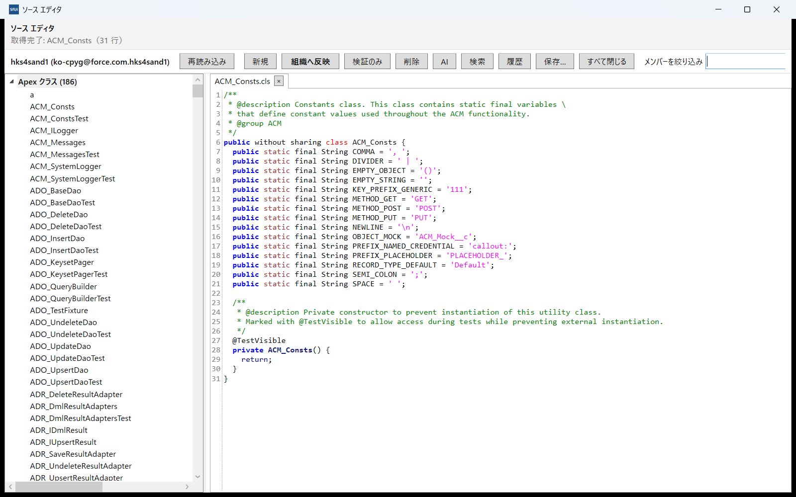

### 15.1 閲覧

- 左のエクスプローラーに種類ごとのツリー（件数付き）が表示されます。「メンバーを絞り込み」ボックスで名前の部分一致フィルターができます。
- メンバーを選ぶとタブが開き、行番号付き・シンタックス ハイライト付きでソースが表示されます。LWC は js / html / css / meta をまとめて開きます。
- 「再読み込み」で一覧とソースを最新化します。

### 15.2 編集と反映

- 編集内容は**自動保存**（下書き）されます。ウィンドウやアプリを閉じても、次回続きから編集できます。
- **未反映行のハイライト**: 最後に組織と一致していた内容（baseline）との差分が色分けされます（変更 = 黄 / 追加 = 緑 / 削除 = ガターの ▲）。
- **「組織へ反映」（Ctrl+S）**: 変更を `sf` CLI でデプロイします。修正が無い場合は何もしません。反映に成功すると未反映ハイライトが消え、履歴にスナップショットが残ります。
- **「検証のみ」**: deploy の dry-run で構文とデプロイ可否を確認します。
- **反映エラー**: ステータスに件数が表示され、エラー一覧の行をクリックすると**該当行・列へジャンプ**します。
- **「新規」**: クラス / トリガー / Visualforce / LWC のテンプレートから作成します（API 名の検証つき）。
- **「削除」**: 組織からメンバーを削除します（確認あり。対応するローカル履歴も消去されます）。
- **「保存…」**: 現在のファイルをローカルへ書き出します。タブは「×」で個別に閉じるか、Ctrl+W /「すべて閉じる」で閉じます。

### 15.3 入力補完

- Apex: 匿名Apex タブと同じ候補（System / クラス / sObject / 項目 / SOQL スニペット）が表示され、チップを選ぶとカーソル位置に挿入されます。
- LWC（JavaScript / HTML / CSS）と Visualforce: キーワードとタグの候補が表示されます。

### 15.4 フロー グラフ

フロー メンバーを選ぶと、コードではなく**ノード / 接続のグラフ**が表示されます。

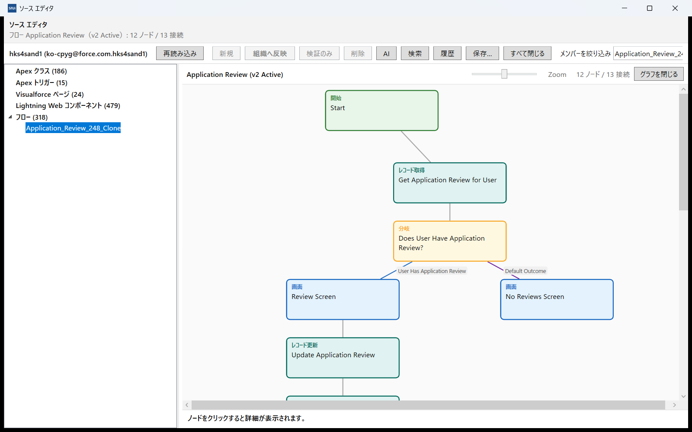

- ノードは種類ごとに色分けされます（start / decision / screen / レコード操作 / ループ / アクションなど）。接続線にはラベル（分岐名など）が表示されます。
- ノードをクリックすると詳細が下部に表示されます。ズーム スライダーで拡大縮小でき、「グラフを閉じる」でタブ表示へ戻ります。

### 15.5 AI 支援・検索・ローカル履歴

- **AI**: ツールバーの「AI」でパネルを開きます。クイック プロンプト（説明 / 改善提案 / エラー修正など）と「現在のタブのデータを添付」（編集中のファイル）が使え、提案コードの「エディタへ適用」でカーソル位置へ挿入できます。
- **検索**: 既定では組織全体（Apex / トリガー / VF / LWC）を横断検索します（最大 200 件。「開いているファイルのみ」に切替可、実行中は「中止」可）。結果をクリックすると、未オープンのファイルは自動で開いて行へジャンプします。
- **履歴**: 反映に成功するたびにローカルへスナップショットが保存されます（最大 20 版）。一覧から選ぶと現在との差分行数が表示され、「読み込み」でエディタへ戻し、「再反映」でその版を組織へ反映（巻き戻し）できます。「消去」で履歴を削除します。

### 15.6 データの保存場所

- `data\source-editor\work\` … 反映用の一時プロジェクト
- `data\source-editor\<orgKey>\<種類>\<メンバー>\` … baseline（最後に一致した内容）/ working（編集中の内容）/ history.json（ローカル履歴）

---

## 16. トラブルシューティング / FAQ

| 症状 | 対処 |
|---|---|
| 組織一覧が空 | ターミナルで `sf org login web` を実行してログインし、上部バーの「組織を再読み込み」を押します |
| sf が見つからないと表示される | Salesforce CLI をインストールし、設定の「sf パス」で指定するか、「再チェック」を実行します |
| 疎通テストが NG になる | セッション切れの可能性があります。組織管理で「ログインを追加」から再ログインしてください |
| 一部のツール（デプロイ等）が遅い | ネットワーク / API 制限の影響です。時間を置くか対象を絞ってください |
| MSIX がインストールできない | 付属の `.cer` を先に「信頼されたユーザー」へインストールしてください（2.1） |
| macOS でアプリが開けない | Gatekeeper の初回確認です。右クリック →「開く」（2.2） |
| AI がエラーになる | キー設定と利用上限を確認してください。組み込み試用キーは停止することがあります（11.1） |
| データを別の PC に移したい | データフォルダーをコピーするか、`--data-dir` で共有フォルダーを指定します |
| 動作に問題がある | データフォルダーの `logs\app-<日付>.log` を確認し、GitHub Issues へ添付してください |

---

## 17. 付録（ショートカット・保存場所・プライバシー）

### 17.1 ショートカット一覧

| キー | 動作 |
|---|---|
| Ctrl+Enter | 実行（SOQL / Apex / AI 送信） |
| Enter | 実行（コマンド、クイックパネル、組織情報の検索） |
| Ctrl+1..9 | お気に入りを実行 |
| Ctrl+Space | SOQL / Apex の入力補完 |
| ダブルクリック | 履歴の再実行 / 行の詳細表示 |

### 17.2 データ保存場所（データフォルダー内）

| ファイル / フォルダー | 内容 |
|---|---|
| `settings.json` | 設定（API キーは難読化） |
| `history\*.json` | 操作履歴（種別ごと） |
| `results\` | 大きい実行結果 |
| `favorites.json` | お気に入り |
| `org-manage.json` | 組織のタグ / メモ |
| `backups\` | バックアップ本体とメタデータ |
| `orginfo\` | 組織情報のキャッシュ |
| `etl\` | ETL の接続プロファイル・ジョブ定義・実行データ（run / journal） |
| `source-editor\` | ソース エディタの下書き（baseline / working）とローカル履歴 |
| `logs\` | アプリの動作ログ |

### 17.3 プライバシーとセキュリティ

- 操作データはすべてローカルに保存されます。テレメトリは送信しません（`sf` 実行時は `SF_DISABLE_TELEMETRY` を設定します）。
- AI チャットを利用したときのみ、入力内容が設定した AI サービスへ送信されます。
- API キーは設定ファイルに難読化して保存されます（暗号化ではありません。共用 PC ではご注意ください）。

### 17.4 リンク

- GitHub: https://github.com/huqian2016/SfUi
- Issues（不具合報告）: https://github.com/huqian2016/SfUi/issues
- プライバシーポリシー: https://github.com/huqian2016/SfUi/blob/main/PRIVACY.md
- ライセンス: MIT License（© HKSテック株式会社）
- SfUi は Salesforce, Inc. とは無関係の非公式ツールです。
