# SfUi 사용자 설명서（한국어）

적용 버전: SfUi v0.14.0 (Windows / macOS)  
최종 업데이트: 2026-10-08 / 상태: 초판 초안  
이 문서는 「앱 내장 매뉴얼」과 「GitHub 공개 매뉴얼」의 공통 원고입니다 (日本語 / English / 简体中文: `ja.md` / `en.md` / `zh.md`).  
**이 설명서의 스크린샷은 영어 UI이지만, 기능과 화면 구성은 모든 언어에서 동일합니다.**

---

## 목차

1. [소개](#1-소개)
2. [설치와 초기 설정](#2-설치와-초기-설정)
3. [화면 기본](#3-화면-기본)
4. [쿼리・개발・실행](#4-쿼리개발실행)
5. [히스토리](#5-히스토리)
6. [조직 관리](#6-조직-관리)
7. [조직 정보 (Org Info)](#7-조직-정보-org-info)
8. [데이터 입출력](#8-데이터-입출력)
9. [백업과 복원](#9-백업과-복원)
10. [조직 비교](#10-조직-비교)
11. [AI 어시스턴트](#11-ai-어시스턴트)
12. [퀵 패널과 즐겨찾기](#12-퀵-패널과-즐겨찾기)
13. [설정 레퍼런스](#13-설정-레퍼런스)
14. [문제 해결 / FAQ](#14-문제-해결--faq)
15. [부록 (단축키, 데이터 위치, 프라이버시)](#15-부록-단축키-데이터-위치-프라이버시)

---

## 1. 소개

### 1.1 SfUi란

SfUi는 Salesforce CLI(`sf`)의 일상 작업을 Windows / macOS 데스크톱 GUI에서 수행할 수 있게 해 주는 도구입니다. 인증된 조직의 액세스 토큰으로 REST / Tooling API를 직접 호출하므로 SOQL 실행이나 백업 같은 작업이 빠릅니다.

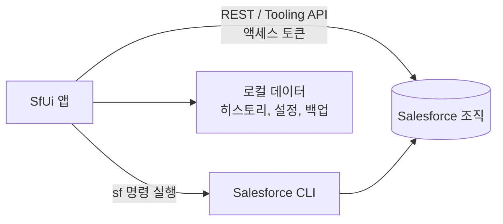
```mermaid
flowchart LR
    A[SfUi 앱] -->|sf 명령 실행| B[Salesforce CLI]
    A -->|REST / Tooling API<br/>액세스 토큰| C[(Salesforce 조직)]
    B --> C
    A --> D[로컬 데이터<br/>히스토리, 설정, 백업]
```

주요 기능:

- **쿼리와 개발**: SOQL(빌더 / 직접 입력), 익명 Apex, 디버그 로그 열람과 분석
- **조직 관리**: 조직 목록, 연결 테스트, 로그인/로그아웃, 거버너 한도, 마이그레이션 인벤토리
- **조직 정보**: 20개 이상 섹션(사용자, 프로필, 오브젝트, 플로우 등) 일괄 표시・검색・문서 내보내기
- **데이터 입출력**: 오브젝트 단위 내보내기 / 가져오기(CSV, 매핑)와 접근 권한 확인
- **백업과 복원**: 오브젝트 단위 백업, Id / 키 필드로 복원, 백업 간 비교
- **조직 비교**: 최대 8개 조직 나란히 비교(오브젝트 필드 및 레코드 단위 비교 포함)
- **AI 어시스턴트**: SOQL / Apex 생성과 제안 원클릭 적용
- **생산성**: 즐겨찾기(Ctrl+1..9), 히스토리 재실행, 터미널 / 탐색기 / VS Code / 브라우저 연동

모든 데이터는 로컬(설정한 데이터 폴더)에 저장되며 텔레메트리를 보내지 않습니다. AI 채팅을 사용할 때만 입력 내용이 설정된 AI 서비스로 전송됩니다.

### 1.2 동작 환경

| 항목 | 내용 |
|---|---|
| OS | Windows 10 1809 이상 / Windows 11, macOS 11 이상(Apple Silicon) |
| 필수 | Salesforce CLI(`sf`) 설치, `sf org login`으로 인증된 조직 1개 이상 |
| 배포 형태 | Microsoft Store(MSIX) / 포터블 exe / macOS 앱 zip |
| 네트워크 | 조직 작업에 필요. 매뉴얼 열람과 로컬 히스토리 관리는 오프라인에서도 가능 |

### 1.3 용어

- **조직(Org)**: 연결 대상 Salesforce 환경. 별칭 또는 사용자 이름으로 지정합니다.
- **target-org**: `sf` 명령의 대상 조직. 상단 바의 「조직」과 연동됩니다.
- **SF 폴더**: `sf` 명령의 작업 폴더(배포 대상 프로젝트 등).
- **데이터 폴더**: 히스토리・설정・백업 저장 위치(설정 화면에서 열 수 있음).

---

## 2. 설치와 초기 설정

### 2.1 설치(Windows)

1. **Microsoft Store**: 스토어에서 「SfUi」를 검색해 설치합니다(자동 업데이트).
2. **MSIX 파일**: 릴리스 페이지에서 `SfUi-<ver>-x64.msix`와 `.cer`를 내려받아
   1. `.cer`을 두 번 클릭 → 「인증서 설치」→ 저장 위치 「로컬 컴퓨터」→ 「신뢰할 수 있는 사용자」에 설치(관리자 권한 필요).
   2. `.msix`를 두 번 클릭해 설치합니다.
3. **포터블 버전**: `SfUi.exe`를 아무 폴더에 두고 실행만 하면 됩니다(설치 불필요).

### 2.2 설치(macOS)

릴리스 페이지의 `SfUi-<ver>-osx-arm64.zip`을 압축 해제하고 `SfUi.app`을 「응용 프로그램」으로 이동합니다. 첫 실행 시 Gatekeeper 경고가 나오면 Finder에서 `SfUi.app`을 오른쪽 클릭 → 「열기」를 선택하거나 터미널에서 다음을 실행하세요.

```
xattr -dr com.apple.quarantine /Applications/SfUi.app
```

### 2.3 첫 실행(환영 화면)

첫 실행 시 환영 화면이 표시됩니다.

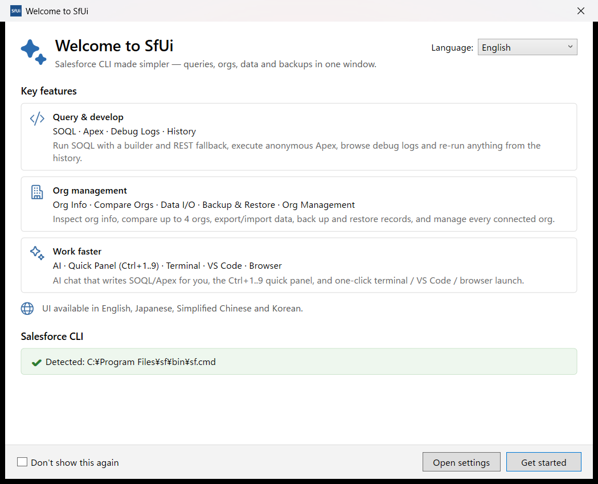

- UI 언어 전환(English / 日本語 / 简体中文 / 한국어)
- Salesforce CLI 감지 결과. 없는 경우 공식 설치 페이지 링크와 npm 설치 명령(`npm install --global @salesforce/cli`)을 안내합니다
- 주요 기능 소개
- 「시작하기」로 메인 화면 이동, 「설정 열기」로 설정 탭 이동
- 「다시 표시하지 않음」을 체크하면 이후 표시되지 않습니다(설정 탭에서 다시 표시 가능)

### 2.4 Salesforce CLI(sf) 준비

SfUi는 `sf` 명령을 호출해 조직 정보를 가져오고 배포를 수행합니다.

1. Salesforce CLI를 설치합니다(공식 설치 프로그램 또는 npm).
2. 터미널에서 `sf org login web`을 실행하고 브라우저로 로그인합니다.
3. SfUi를 시작하면 상단 바 조직 목록에 표시됩니다.

`sf`가 표준 위치에 없다면 설정 탭의 「sf 경로」에서 실행 파일을 지정할 수 있습니다(비워 두면 자동 감지).

### 2.5 조직 등록(3가지 방법)

조직 관리 창의 「조직 등록…」 패널에서 등록합니다. 방법 선택은 다음 흐름을 참고하세요.

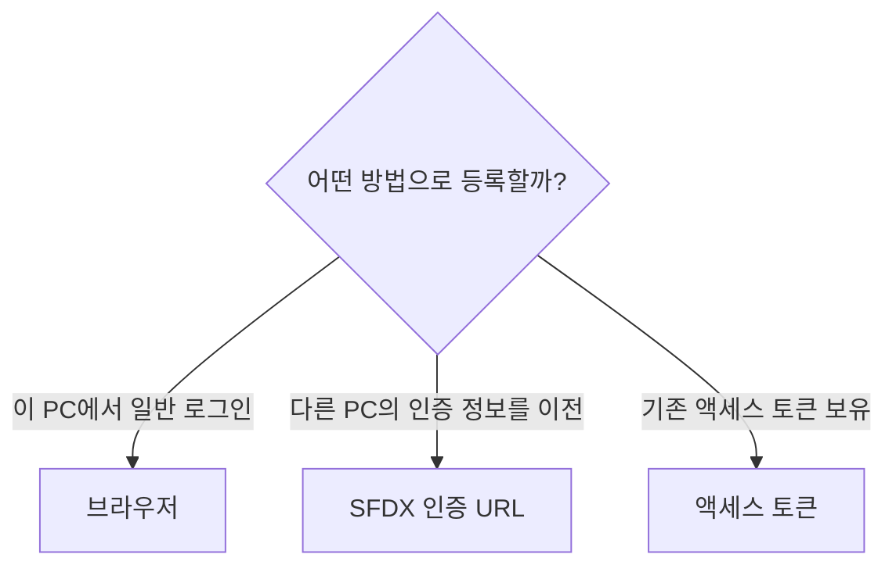
```mermaid
flowchart TD
    Q{어떤 방법으로 등록할까?} -->|이 PC에서 일반 로그인| W[브라우저]
    Q -->|다른 PC의 인증 정보를 이전| S[SFDX 인증 URL]
    Q -->|기존 액세스 토큰 보유| T[액세스 토큰]
```

| 방법 | 용도 | 입력 |
|---|---|---|
| 브라우저 | 일반 로그인 | 인스턴스 URL(선택. Sandbox 등은 지정) |
| SFDX 인증 URL | 다른 머신의 인증 정보 이전 | `force://…` URL 또는 `sf org display --verbose --json` 출력 JSON |
| 액세스 토큰 | 기존 토큰으로 연결 | 인스턴스 URL(필수) + 액세스 토큰 |

별칭(선택)과 「기본 조직으로 설정」을 지정하고 「등록」을 실행합니다.

### 2.6 데이터 저장 위치

히스토리・설정・백업・로그는 모두 로컬 데이터 폴더에 저장됩니다. 현재 위치는 설정 탭의 「데이터 폴더」에 표시되며 「데이터 폴더 열기」 버튼으로 바로 열 수 있습니다. `--data-dir` 시작 옵션으로 다른 폴더를 지정할 수도 있습니다(프로필 분리 등).

---

## 3. 화면 기본

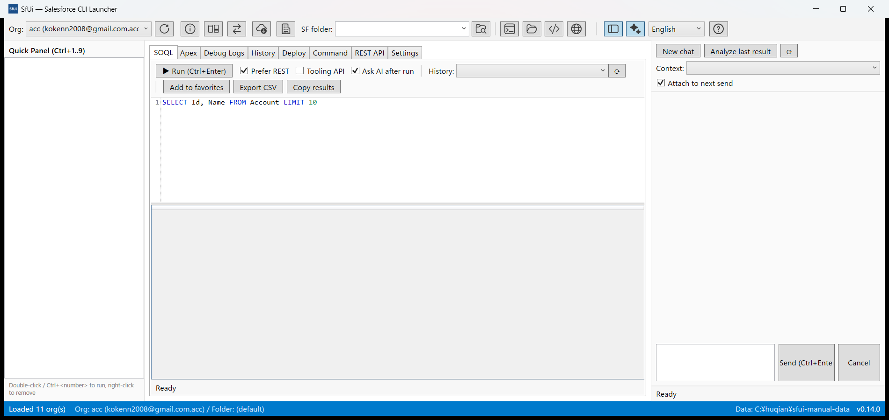

### 3.1 상단 바

| 요소 | 설명 |
|---|---|
| 조직 | 작업 대상 조직(`--target-org`). 「조직 다시 로드」로 최신화 |
| SF 폴더 | 배포 등의 작업 폴더. 히스토리에서 선택하거나 「찾아보기…」로 지정 |
| 언어 | UI 언어 전환(즉시 반영) |
| 버튼 | 조직 정보 / 비교 / 데이터 입출력 / 백업과 복원 / 조직 관리 / 터미널 / 탐색기 / VS Code / 브라우저 / Quick / AI / About |

터미널・탐색기・VS Code・브라우저 버튼은 **오른쪽 클릭으로 종류를 선택**할 수 있습니다(예: 터미널 → Windows Terminal / PowerShell / 명령 프롬프트 / WSL, 브라우저 → 조직 홈 / 설정 / 로그인 / URL 입력).

### 3.2 탭

| 탭 | 내용 | 장 |
|---|---|---|
| SOQL | SOQL 작성・실행・결과 표시・CSV 출력 | 4.1 |
| Apex | 익명 Apex 실행과 로그 가져오기 | 4.2 |
| 디버그 로그 | 조직 로그 목록・가져오기・저장・분석 | 4.3 |
| 히스토리 | 실행 기록 검색・복사・삭제・재실행 | 5 |
| 배포 | 메타데이터 배포 / 검증 | 4.4 |
| 명령 | 임의의 `sf` 명령 실행 | 4.5 |
| REST API | REST API 콘솔 | 4.6 |
| 설정 | 각종 설정 | 13 |

### 3.3 사이드 패널(Quick / AI)

- **Quick**(왼쪽): 즐겨찾기 목록. **Ctrl+1..9**로 1~9번째 항목을 즉시 실행, 더블 클릭으로도 실행됩니다.
- **AI**(오른쪽): AI 채팅. 현재 탭・히스토리・즐겨찾기를 컨텍스트로 질문할 수 있습니다(자세한 내용은 11장).

### 3.4 자식 창

조직 정보・비교・데이터 입출력・백업과 복원・조직 관리 등의 자식 창은 **비모달**입니다. 동시에 여러 개를 열고 메인 창과 자유롭게 전환할 수 있습니다(작업 표시줄에도 개별 표시). 메인 창을 닫으면 모든 창이 닫힙니다.

### 3.5 자주 쓰는 단축키

| 키 | 동작 |
|---|---|
| Ctrl+Enter | 실행(SOQL / Apex / AI 전송) |
| Enter | 실행(명령, 선택한 즐겨찾기, 조직 정보 검색) |
| Ctrl+1..9 | 즐겨찾기 실행 |
| Ctrl+Space | SOQL / Apex 자동 완성 |
| 더블 클릭 | 히스토리 재실행 / 행 상세(백업 기록 등) |

### 3.6 도움말(각 창 오른쪽 위)

모든 창의 상단 바 오른쪽 끝에 있는 도움말 아이콘(📖)을 클릭하면 현재 UI 언어에 해당하는 사용자 매뉴얼(GitHub)이 기본 브라우저에서 열리고, 그 창에 해당하는 장으로 이동합니다.

| 창 | 열리는 장(한국어 UI) |
|---|---|
| 메인 창 | 3. 화면 기본 |
| 환영 화면 | 2. 설치와 초기 설정 |
| 조직 정보 | 7. 조직 정보(오브젝트 필드 탭 → 7.1) |
| 조직 비교 / 레코드 차이 상세 | 10. 조직 비교 |
| 데이터 입출력 | 8. 데이터 입출력 |
| 백업과 복원(레코드 / 비교) | 9. 백업과 복원(9.2 / 9.3) |
| 조직 관리 | 6. 조직 관리 |
| 디버그 로그 분석 | 4.3 디버그 로그와 분석 |

매뉴얼은 4개 언어(日本語 / English / 简体中文 / 한국어)로 제공되며, UI 언어를 바꾸면 도움말로 열리는 페이지도 그 언어로 바뀝니다.

---

## 4. 쿼리・개발・실행

### 4.1 SOQL 실행

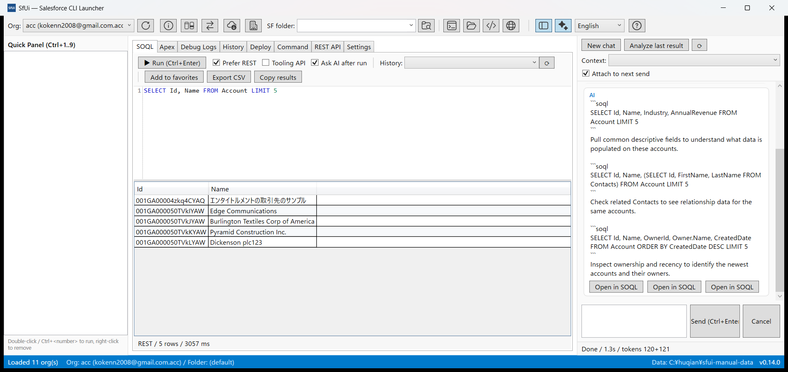

1. 상단 바에서 조직을 선택합니다.
2. SOQL 탭에서 쿼리를 입력합니다(Ctrl+Space로 자동 완성).
3. **Ctrl+Enter**(또는 실행 버튼)로 실행합니다. 결과는 그리드에 표시되고 행 수와 소요 시간이 상태 바에 나타납니다.
4. REST가 우선 사용되고 필요하면 CLI로 폴백합니다.

- **빌더**: 오브젝트・필드・조건・정렬・LIMIT를 GUI로 구성해 실행할 수 있습니다.
- **CSV 출력**: 결과 그리드를 CSV로 저장합니다(UTF-8 BOM 포함, Excel에서 바로 열림).
- **히스토리**: 실행한 쿼리는 자동 기록되어 히스토리 콤보에서 불러올 수 있습니다.
- 「Tooling API」를 체크하면 Tooling API로 실행합니다(메타데이터 오브젝트에 사용).

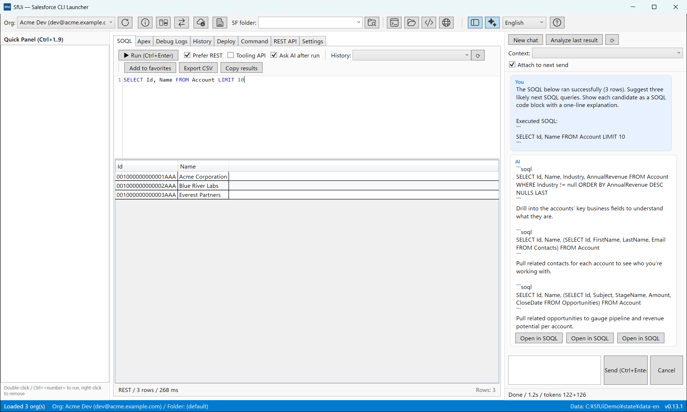

### 4.2 익명 Apex 실행

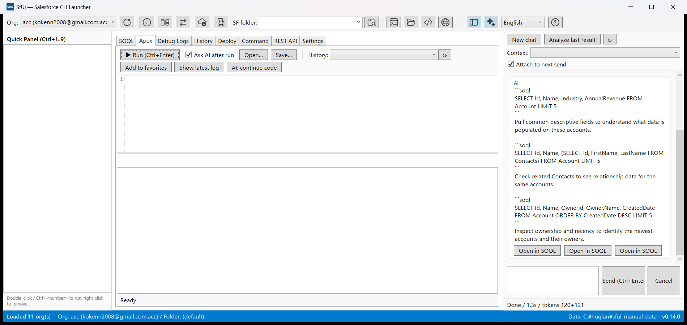

1. Apex 탭에서 코드를 입력합니다(템플릿 삽입 가능).
2. **Ctrl+Enter**로 실행합니다. `System.debug` 출력이 로그로 수집되어 오른쪽에 표시됩니다.
3. 실행 결과(컴파일 오류 / 출력 / 디버그 로그)는 히스토리에 기록됩니다.

- 로그 저장・복사, 이전 코드 다시 불러오기를 지원합니다.

### 4.3 디버그 로그와 분석

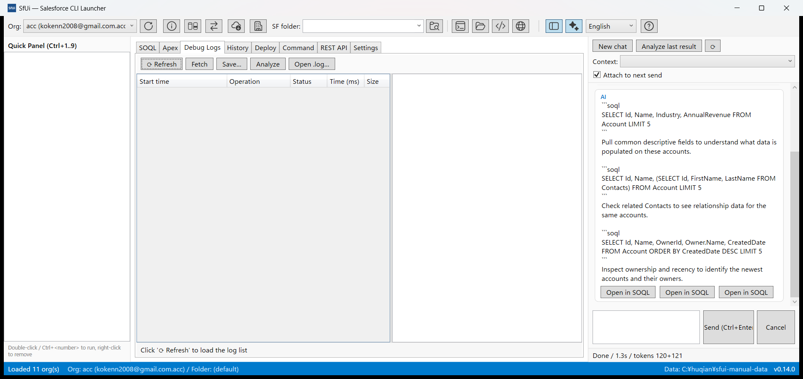

1. 디버그 로그 탭에서 「가져오기」를 누르면 조직의 로그 목록이 표시됩니다.
2. 행을 선택해 「가져오기」(내용 보기) 또는 「저장」(파일로)을 실행합니다.
3. 「.log 열기…」로 로컬 로그 파일을 읽을 수 있습니다.

가져온 로그(또는 로컬 .log)를 「분석」하면 분석 창이 열립니다.

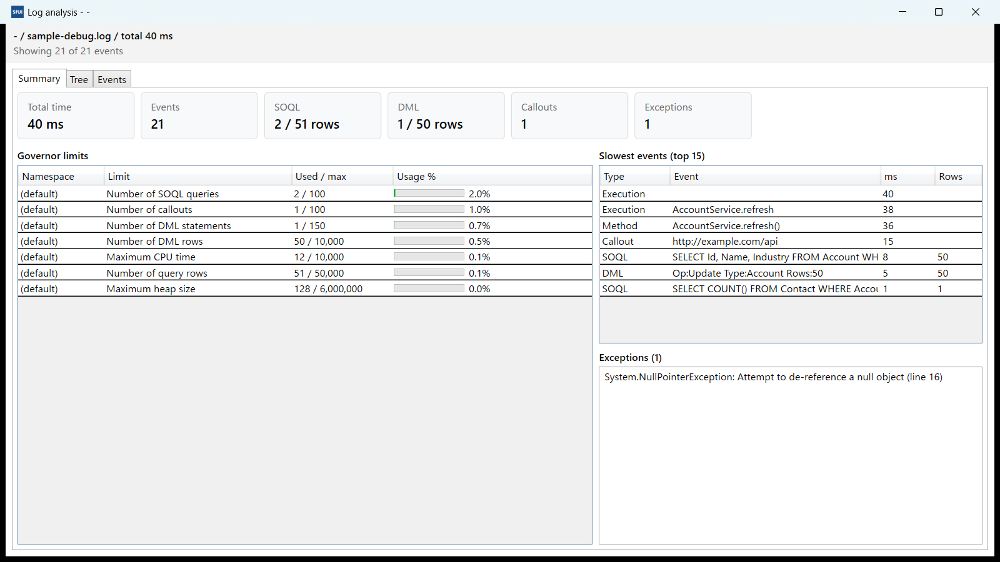

- **요약**: 총 시간, 이벤트 수, SOQL 횟수 / 행 수, DML 횟수 / 행 수, 콜아웃, 예외 수
- **트리**: 중첩 실행 구조(메서드별 시간과 행 수). 느린 노드를 펼쳐 원인을 찾습니다
- **이벤트**: 전체 이벤트 목록(카테고리 필터, 키워드 검색, 선택 시 상세)
- **한도**: 거버너 한도 사용량(사용률 내림차순)
- **CSV 출력**: 요약 / 한도 / 느린 처리 / 이벤트를 CSV로 저장할 수 있습니다

최대 20,000개 이벤트까지 표시됩니다(초과분은 개수만 표시). 분석은 로컬에서 수행되므로 API를 소비하지 않습니다.

### 4.4 배포

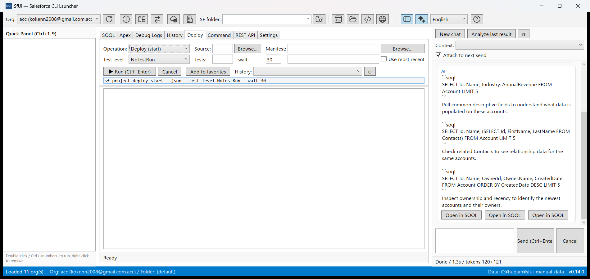

- SF 폴더(프로젝트)를 선택하고 작업(배포 / 검증 등)과 테스트 레벨을 지정해 실행합니다.
- 결과는 히스토리에 기록되며 히스토리 콤보에서 재실행할 수 있습니다.

### 4.5 명령

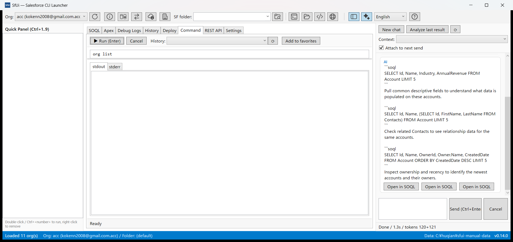

- 임의의 `sf` 명령을 그대로 입력해 실행합니다(Enter 또는 실행 버튼).
- 표준 출력 / 표준 오류 보기, 「즐겨찾기에 추가」, 히스토리 재실행이 가능합니다.
- 실행 시 CLI 텔레메트리가 비활성화됩니다(`SF_DISABLE_TELEMETRY`).

### 4.6 REST API 콘솔

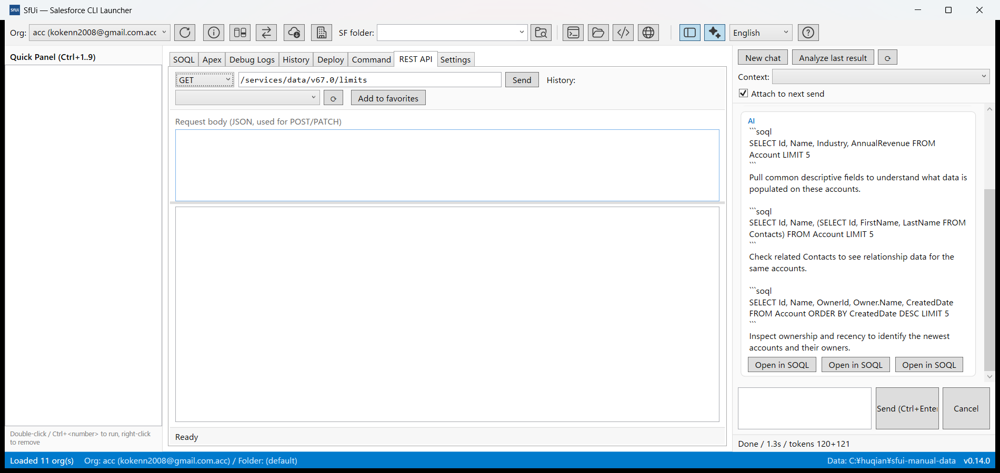

- 메서드(GET / POST / PATCH / DELETE 등) + 경로 + 본문을 지정해 REST API를 직접 호출합니다.
- 응답은 보기 좋게 정렬(JSON pretty)되어 표시되고 히스토리에 기록됩니다.

---

## 5. 히스토리

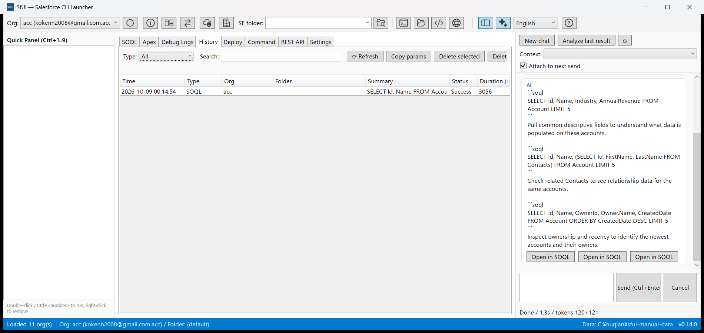

히스토리 탭에는 SOQL / Apex / 명령 / REST API / 배포 / 조직 작업 / 데이터 입출력이 자동 기록됩니다.

- **필터**: 종류 필터 + 전체 텍스트 검색
- **재실행**: 행을 더블 클릭하면 해당 작업이 대응 탭에 로드되어 다시 실행됩니다
- **파라미터 복사**: 선택 행의 SOQL / Apex / 명령 본문을 클립보드로 복사
- **삭제**: 선택 행 삭제(**Ctrl / Shift 클릭으로 여러 행을 선택해 일괄 삭제** 가능), 「모두 삭제」
- 히스토리 상한은 설정에서 변경할 수 있습니다(기본 유형별 2,000건). 큰 실행 결과는 `results/`에 별도 파일로 저장됩니다(기본 64KB 초과)

---

## 6. 조직 관리

상단 바 「조직 관리」로 엽니다. 3개의 탭이 있습니다.

### 6.1 조직 탭

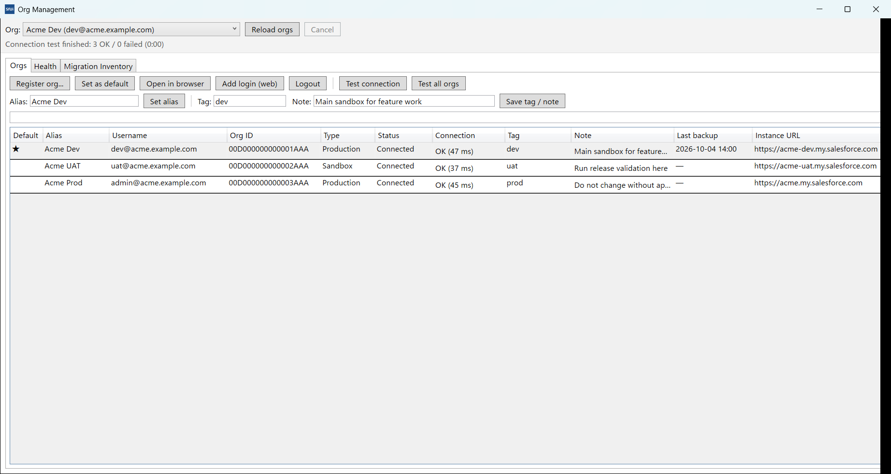

그리드에는 기본 표시(★), 별칭, 사용자 이름, Org ID, 유형, 상태, 연결 결과, 태그, 메모, 마지막 백업, 인스턴스 URL이 표시됩니다.

**도구 모음 작업**:

| 버튼 | 설명 | 여러 행 선택 시 |
|---|---|---|
| 조직 다시 로드 | 목록 최신화 | - |
| 기본으로 설정 | target-org 변경 | **「이 작업은 조직을 하나만 선택하세요」** 표시 |
| 브라우저에서 열기 | 조직을 브라우저로 열기 | **선택한 모든 조직**을 순서대로 엽니다 |
| 로그인 추가 | 브라우저 로그인(`sf org login web`) | - |
| 로그아웃 | `sf org logout` | **선택한 모든 조직에서 일괄 로그아웃**(건수 포함 확인) |
| 연결 테스트 | 읽기 전용 REST 확인 | **선택한 모든 조직**을 순서대로 테스트(진행률, 취소, OK/NG 요약) |
| 전체 조직 테스트 | 등록된 모든 조직 테스트 | - |
| 별칭 설정 | `sf alias set` | 1개만 선택 시 |
| 태그/메모 저장 | 로컬에만 저장(조직에 쓰지 않음) | 1개만 선택 시 |

- 다중 선택은 **Ctrl+클릭 / Shift+클릭**(범위)으로 합니다.
- 일괄 작업은 **순차 실행**되며 실행 중 「취소」로 중단할 수 있습니다.
- 신규 등록은 「조직 등록…」 패널에서(2.5 참조).

### 6.2 상태(Health) 탭

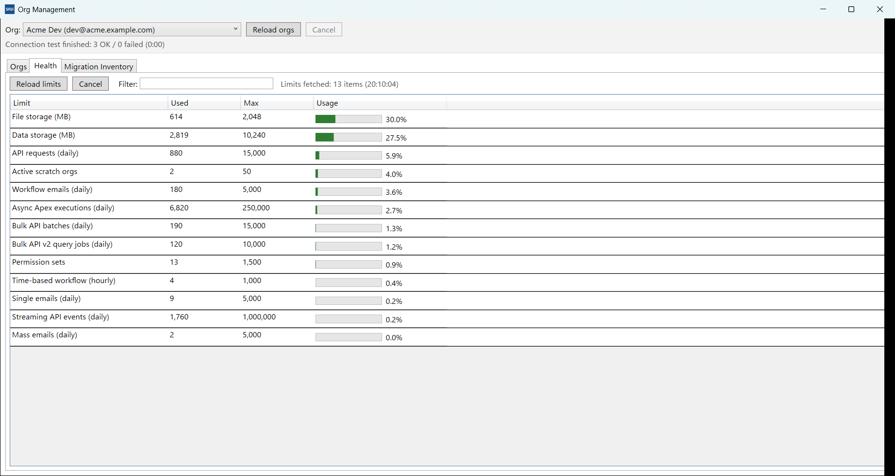

조직의 거버너 한도(API 요청 수, 스토리지 등)를 목록으로 표시합니다. 사용률 내림차순으로 정렬되며 사용률 바와 필터를 제공합니다.

### 6.3 마이그레이션 인벤토리 탭

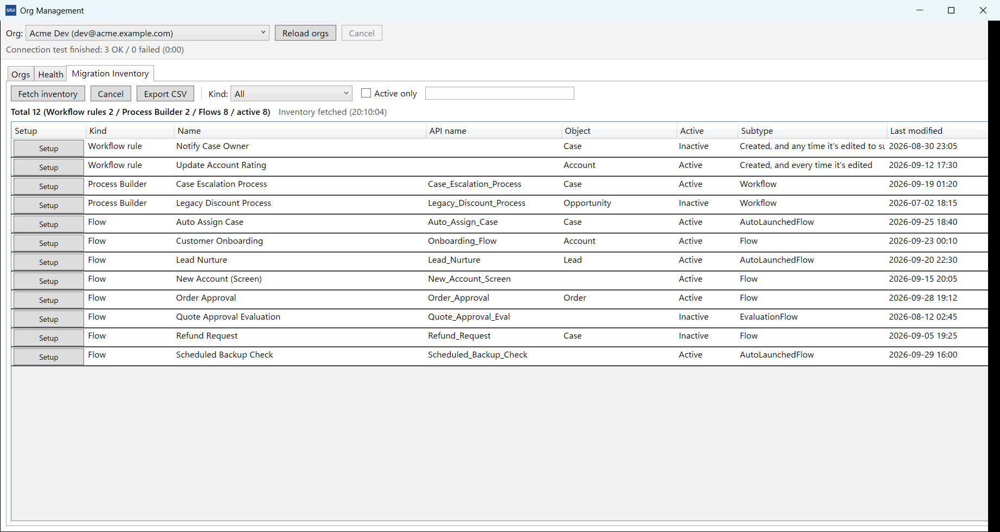

워크플로 규칙 / Process Builder / 플로우를 목록화합니다.

- 종류 필터, 「활성만」 표시, 이름 검색
- 요약(전체, 종류별, 활성 수)
- 행별 「Setup」 버튼으로 해당 컴포넌트의 Setup 페이지를 브라우저에서 엽니다
- 「CSV 출력」으로 목록을 저장할 수 있습니다

---

## 7. 조직 정보 (Org Info)

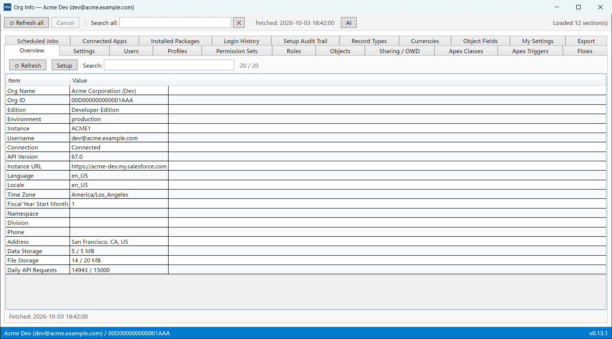

상단 바 「조직 정보」로 엽니다. 조직의 설정 정보를 20개 이상 섹션(개요 / 주요 설정 / 사용자 / 프로필 / 오브젝트 / 페이지 레이아웃 / 플로우 / 통화 / 로그인 기록 / 설정 변경 감사 등)으로 표시합니다.

- **전체 검색**: 모든 섹션에서 키워드로 행을 검색하고 해당 섹션으로 이동합니다.
- **링크**: 일부 행에는 Setup 또는 레코드 페이지로 가는 ↗ 링크가 있습니다.
- **섹션 새로 고침**: 섹션별 「다시 가져오기」로 최신화합니다(우선 로컬 캐시 표시).
- **내 설정**: 자주 쓰는 설정의 피커.
- **사용자 정의 탭**: 자주 보는 섹션을 자신만의 탭으로 묶을 수 있습니다.

### 7.1 오브젝트 필드 탭과 「사용 위치 검색」

- 오브젝트를 선택하면 필드 목록(라벨 / API 이름 / 유형 / 수식 등)이 표시됩니다.
- 필드 행을 선택하고 「사용 위치 검색」을 누르면 **그 필드가 어디에서 사용되는지**를 크로스 검색합니다.

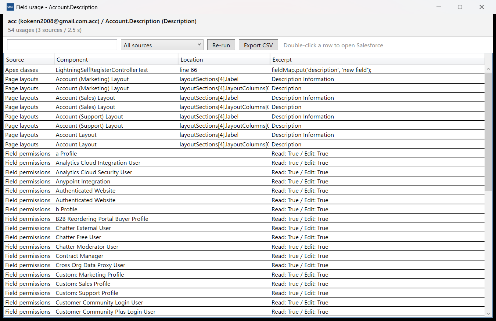

  - 검색 대상: Apex(클래스 / 트리거), 플로우, 검증 규칙, 페이지 레이아웃, 수식 필드, 필드 권한(읽기 / 편집)
  - 결과는 소스별로 표시되며 행을 더블 클릭하면 Salesforce에서 해당 컴포넌트를 엽니다
  - 일부 소스 수집에 실패하면 경고로 표시되고 나머지 결과는 그대로 표시됩니다

### 7.2 문서 내보내기

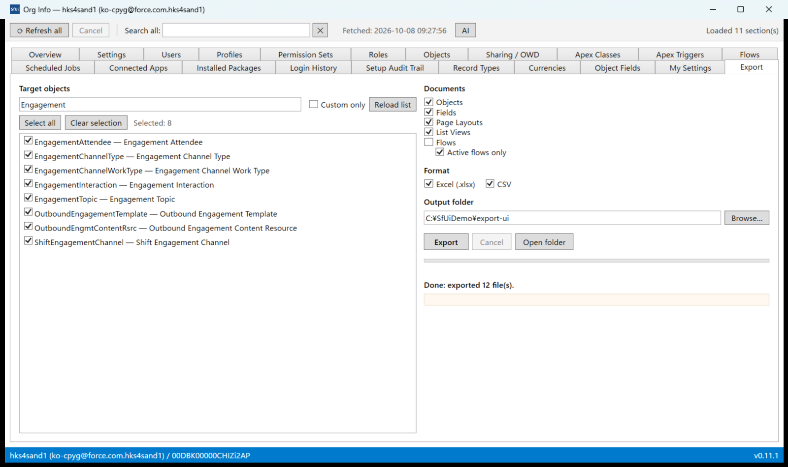

「내보내기」 탭에서는 조직의 정의 정보를 **Excel(여러 시트) + 시트별 CSV**로 출력할 수 있습니다.

- 대상: 오브젝트 정의 / 필드 정의 / 페이지 레이아웃 / 목록 뷰 / 플로우 문서
- 오브젝트 다중 선택 가능(필터, 사용자 정의만, 전체 선택)
- 진행률, 취소, 부분 실패 경고, 완료 후 「폴더 열기」 지원

---

## 8. 데이터 입출력

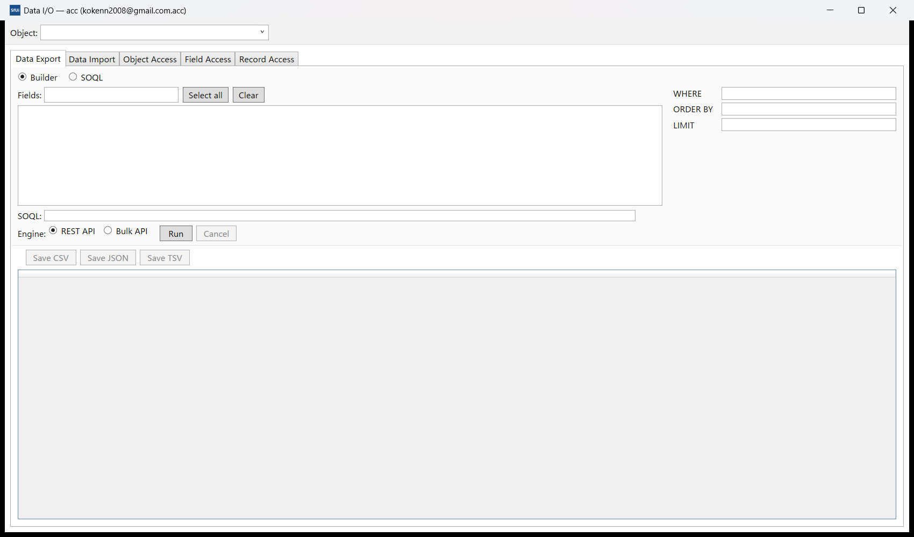

상단 바 「데이터 입출력」으로 엽니다. 오브젝트를 선택해 내보내기 / 가져오기 / 접근 권한 확인을 수행합니다.

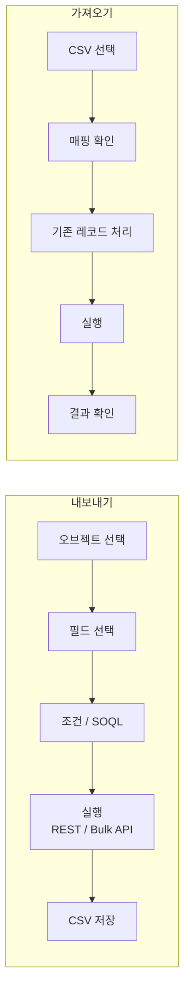
```mermaid
flowchart LR
    subgraph EXP[내보내기]
      E1[오브젝트 선택] --> E2[필드 선택] --> E3[조건 / SOQL] --> E4[실행<br/>REST / Bulk API] --> E5[CSV 저장]
    end
    subgraph IMP[가져오기]
      I1[CSV 선택] --> I2[매핑 확인] --> I3[기존 레코드 처리] --> I4[실행] --> I5[결과 확인]
    end
```

### 8.1 내보내기

1. 오브젝트를 선택합니다(필드 로드).
2. 출력할 필드를 선택합니다(전체 선택 / 검색).
3. 조건을 지정합니다(빌더로 조건・정렬・상한, 또는 SOQL 직접 입력).
4. 「실행」으로 가져옵니다. 결과는 그리드에 표시되고 CSV / JSON / TSV로 저장할 수 있습니다.
5. 엔진은 REST / Bulk API 중 선택합니다(대량 데이터는 Bulk 권장).

### 8.2 가져오기

1. CSV 파일을 선택합니다(UTF-8, BOM 없음 권장).
2. 매칭에 사용할 외부 ID 필드를 선택합니다(업데이트 / Upsert에 사용).
3. 열과 필드의 매핑을 확인합니다(자동 매핑 + 수동 조정).
4. 기존 레코드 처리 방식(새로 만들기만 / 덮어쓰기 / 건너뛰기 등)을 선택합니다.
5. 「실행」으로 가져옵니다. 성공 / 실패 / 건너뜀 건수와 소요 시간이 표시되고 실패 행 상세를 확인할 수 있습니다.

### 8.3 접근 권한(3개 탭)

- **오브젝트 접근**: 오브젝트 권한을 주체(프로필 / 권한 세트)별로 표시
- **필드 접근**: 필드 × 주체 매트릭스(읽기 / 편집). 매트릭스에서 직접 수정해 저장할 수 있습니다
- **레코드 접근**: 대상 사용자를 선택하고 레코드 단위 접근 권한(읽기 / 편집 / 삭제 등)을 페이징으로 확인합니다

---

## 9. 백업과 복원

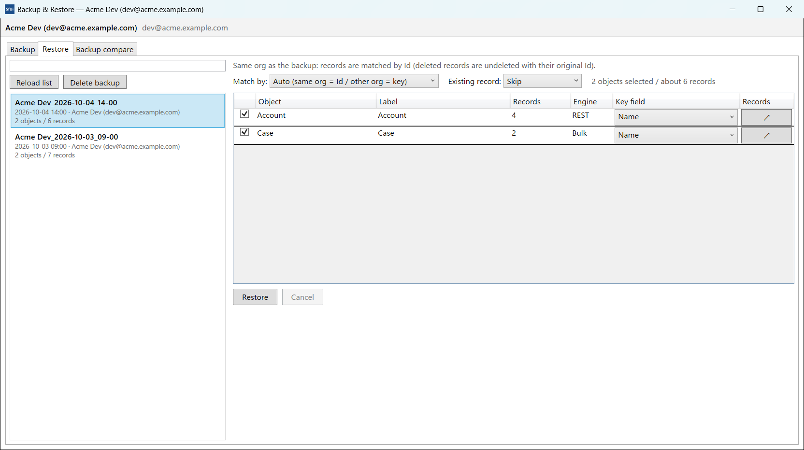

상단 바 「백업과 복원」으로 엽니다. 3개의 탭이 있습니다.

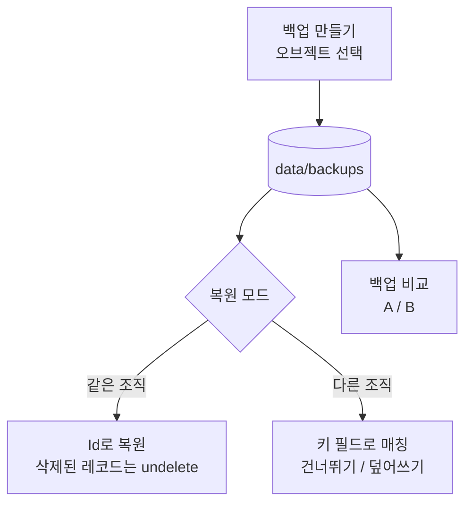
```mermaid
flowchart TD
    B1[백업 만들기<br/>오브젝트 선택] --> B2[(data/backups)]
    B2 --> R1{복원 모드}
    R1 -->|같은 조직| R2[Id로 복원<br/>삭제된 레코드는 undelete]
    R1 -->|다른 조직| R3[키 필드로 매칭<br/>건너뛰기 / 덮어쓰기]
    B2 --> C1[백업 비교<br/>A / B]
```

### 9.1 백업 탭

1. 백업할 오브젝트를 체크로 선택합니다(검색, 건수 표시 포함).
2. 라벨 / 설명을 확인합니다(조직명 + 일시로 자동 입력).
3. 「실행」으로 백업합니다. 오브젝트별 진행률과 결과가 표시됩니다.
4. 오브젝트당 상한(기본 2,000건) 이내입니다. 초과 시 대상을 좁히세요.

### 9.2 복원 탭

1. 왼쪽 목록에서 백업을 선택합니다(**여러 개를 선택해 「삭제」로 일괄 삭제**도 가능. 건수 포함 확인이 표시됩니다).
2. 복원할 오브젝트를 선택합니다(행별로 키 필드를 지정할 수 있습니다).
3. 매치 모드를 선택합니다:
   - **자동**: 같은 조직이면 Id, 다른 조직이면 키 필드로 매칭
   - **Id**: 삭제된 레코드는 SOAP undelete로 **원래 Id 그대로** 복원
   - **키 필드**: 지정 필드 값으로 매칭(기존은 건너뛰기 / 덮어쓰기 선택)
4. 「실행」으로 복원합니다. 오브젝트별 결과(처리 수 / 성공 / 실패)가 표시됩니다.

### 9.3 비교 탭

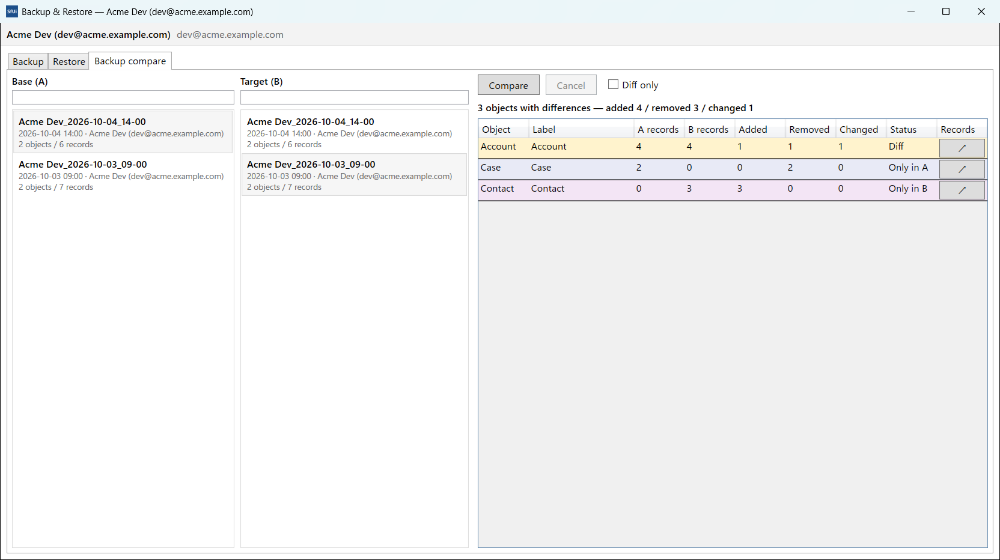

두 백업(A / B)을 선택해 비교합니다. 차이가 있는 오브젝트는 색상으로 구분(추가 / 삭제 / 변경 / 오류)되고 오브젝트별 레코드 차이를 확인할 수 있습니다. 기록 창에서는 레코드 내용 확인・검색・페이징・Salesforce 레코드 페이지 열기(↗)가 가능합니다.

---

## 10. 조직 비교

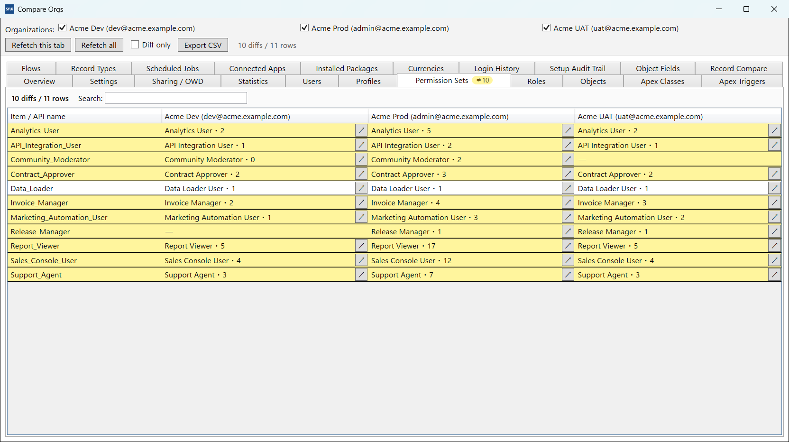

상단 바 「비교」로 엽니다. 최대 **8개 조직**을 나란히 비교합니다.

- 카테고리 탭(개요 / 조직 / 사용자 / 프로필 / 오브젝트 / … / **오브젝트 필드** / **레코드 비교**)
- 차이가 있는 행은 하이라이트되고 탭에는 차이 건수 배지가 표시됩니다
- 셀의 ↗로 해당 조직의 레코드 / Setup 페이지를 엽니다
- **오브젝트 필드**: 오브젝트를 추가하면 필드 단위 차이(유형, 라벨, 수식 등)를 비교할 수 있습니다
- **레코드 비교**: 오브젝트・매칭 키・비교 필드를 지정해 레코드 단위로 차이를 표시합니다(건수 상한 설정 가능)


- 행을 더블 클릭하면 「레코드 차이 상세」 창이 열려 필드별 값을 조직별로 확인할 수 있습니다
- 「모두 다시 가져오기」로 전체 데이터를 최신화할 수 있습니다

---

## 11. AI 어시스턴트

오른쪽 「AI」 패널에서 사용합니다(화면 예: [화면 기본](#3-화면-기본) 오른쪽).

### 11.1 설정

설정 탭의 「AI」에서 엔드포인트 / 모델 / API 키를 설정합니다.

- 기본은 DeepSeek(내장 체험 키 있음. **사용 제한이 있고 예고 없이 중지될 수 있습니다**. 계속 사용하려면 본인 키 권장)
- OpenAI / Anthropic / OpenAI 호환 커스텀 엔드포인트 지원
- API 키는 로컬 설정 파일에 난독화(`enc1:`)되어 저장됩니다. 환경 변수 `SFUI_AI_API_KEY`로도 지정할 수 있습니다

### 11.2 사용 방법

1. 대상 탭(SOQL / Apex / REST 등)을 열고 필요하면 조직을 선택합니다.
2. AI 패널에 요청을 입력하고 **Ctrl+Enter**로 전송합니다(예: 「기회 필드로 SOQL을 작성해 줘」).
3. 제안된 코드는 「적용」 버튼으로 해당 탭에 반영할 수 있습니다.
4. 실행은 항상 사용자가 직접 합니다(AI가 자동 실행하지 않습니다).

- 「실행 후 AI에게 질문」을 켜면 쿼리 실행 후 결과를 반영한 제안(예: 다음 SOQL 3개)을 자동으로 받습니다.
- 컨텍스트로 현재 탭・히스토리・즐겨찾기를 참조할 수 있습니다.
- UI 언어에 맞는 언어로 답변합니다.
- 인증 오류나 사용량 초과 시 상태 바에 메시지가 표시됩니다(본인 키를 설정하면 개선됩니다).

---

## 12. 퀵 패널과 즐겨찾기

- 각 탭의 「즐겨찾기에 추가」로 현재 쿼리 / 코드 / 명령 / REST 요청을 등록할 수 있습니다.
- **Ctrl+1..9**로 해당 즐겨찾기를 즉시 실행, 더블 클릭(또는 Enter)으로도 실행됩니다.
- 오른쪽 클릭으로 삭제할 수 있습니다(확인 있음).
- URL과 폴더도 즐겨찾기로 등록할 수 있습니다(브라우저 / 탐색기에서 열림).

---

## 13. 설정 레퍼런스

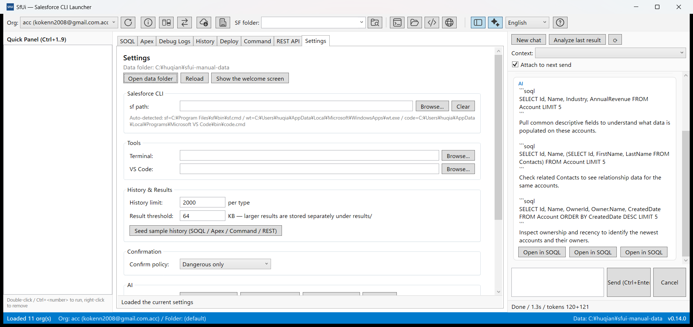

| 항목 | 설명 | 기본값 |
|---|---|---|
| sf 경로 | `sf` 실행 파일 전체 경로. 비우면 자동 감지 | 자동 |
| 터미널 | 터미널 실행 파일(예: Windows Terminal) | 자동 |
| VS Code | VS Code CLI(`code`) 경로 | 자동 |
| 히스토리 상한 | 유형별 보관 건수 | 2,000 |
| 결과 저장 임계값 | 이 크기를 넘는 결과는 `results/`에 별도 저장 | 64 KB |
| 확인 정책 | 위험 작업만(기본) / 항상 / 안 함 | 위험 작업만 |
| AI(엔드포인트 / 모델 / API 키) | AI 채팅 연결 설정 | DeepSeek |
| 데이터 폴더 열기 | 저장 폴더 열기 | - |
| 샘플 히스토리 추가 | 자주 쓰는 템플릿 추가(중복 건너뜀) | - |
| 환영 화면 표시 | 첫 안내를 다시 표시 | - |

- 저장 후 즉시 반영됩니다(sf 경로 등은 재시작 불필요).

---

## 14. 문제 해결 / FAQ

| 증상 | 대처 |
|---|---|
| 조직 목록이 비어 있음 | 터미널에서 `sf org login web`으로 로그인 후 상단 바 「조직 다시 로드」를 누릅니다 |
| sf를 찾을 수 없다고 표시됨 | Salesforce CLI를 설치하고 설정의 「sf 경로」를 지정하거나 「다시 확인」을 실행합니다 |
| 연결 테스트가 실패 | 세션 만료 가능성. 조직 관리의 「로그인 추가」로 다시 로그인하세요 |
| 배포 등이 느림 | 네트워크 / API 제한의 영향입니다. 잠시 후 다시 시도하거나 대상을 좁히세요 |
| MSIX가 설치되지 않음 | 첨부된 `.cer`을 먼저 「신뢰할 수 있는 사용자」에 설치하세요(2.1) |
| macOS에서 앱이 열리지 않음 | 첫 실행 Gatekeeper 확인. 오른쪽 클릭 → 「열기」(2.2) |
| AI 오류 | 키와 사용량을 확인하세요. 내장 체험 키는 중지될 수 있습니다(11.1) |
| 데이터를 다른 PC로 옮기고 싶음 | 데이터 폴더를 복사하거나 `--data-dir`로 공유 폴더를 지정합니다 |
| 그 밖의 문제 | 데이터 폴더의 `logs\app-<날짜>.log`를 확인해 GitHub Issues에 첨부하세요 |

---

## 15. 부록 (단축키, 데이터 위치, 프라이버시)

### 15.1 단축키

| 키 | 동작 |
|---|---|
| Ctrl+Enter | 실행(SOQL / Apex / AI 전송) |
| Enter | 실행(명령, 퀵 패널, 조직 정보 검색) |
| Ctrl+1..9 | 즐겨찾기 실행 |
| Ctrl+Space | SOQL / Apex 자동 완성 |
| 더블 클릭 | 히스토리 재실행 / 행 상세 |

### 15.2 데이터 위치(데이터 폴더 내)

| 파일 / 폴더 | 내용 |
|---|---|
| `settings.json` | 설정(API 키는 난독화) |
| `history\*.json` | 작업 히스토리(유형별) |
| `results\` | 큰 실행 결과 |
| `favorites.json` | 즐겨찾기 |
| `org-manage.json` | 조직 태그 / 메모 |
| `backups\` | 백업 데이터와 메타데이터 |
| `orginfo\` | 조직 정보 캐시 |
| `logs\` | 앱 실행 로그 |

### 15.3 프라이버시와 보안

- 모든 데이터는 로컬에 저장되며 텔레메트리를 보내지 않습니다(`sf` 실행 시 `SF_DISABLE_TELEMETRY` 설정).
- AI 채팅을 사용할 때만 입력 내용이 설정한 AI 서비스로 전송됩니다.
- API 키는 난독화되어 저장됩니다(암호화 아님). 공용 PC에서는 주의하세요.

### 15.4 링크

- GitHub: https://github.com/huqian2016/SfUi
- Issues(버그 신고): https://github.com/huqian2016/SfUi/issues
- 프라이버시 정책: https://github.com/huqian2016/SfUi/blob/main/PRIVACY.md
- 라이선스: MIT License (© HKS Tech K.K.)
- SfUi는 Salesforce, Inc.와 무관한 독립 도구입니다.
