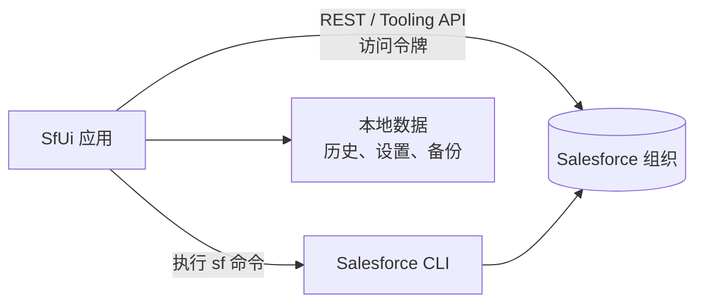
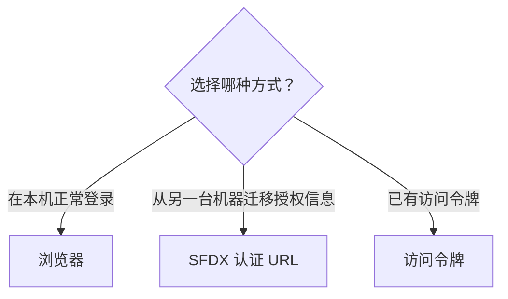
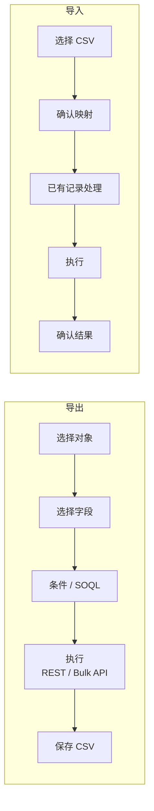
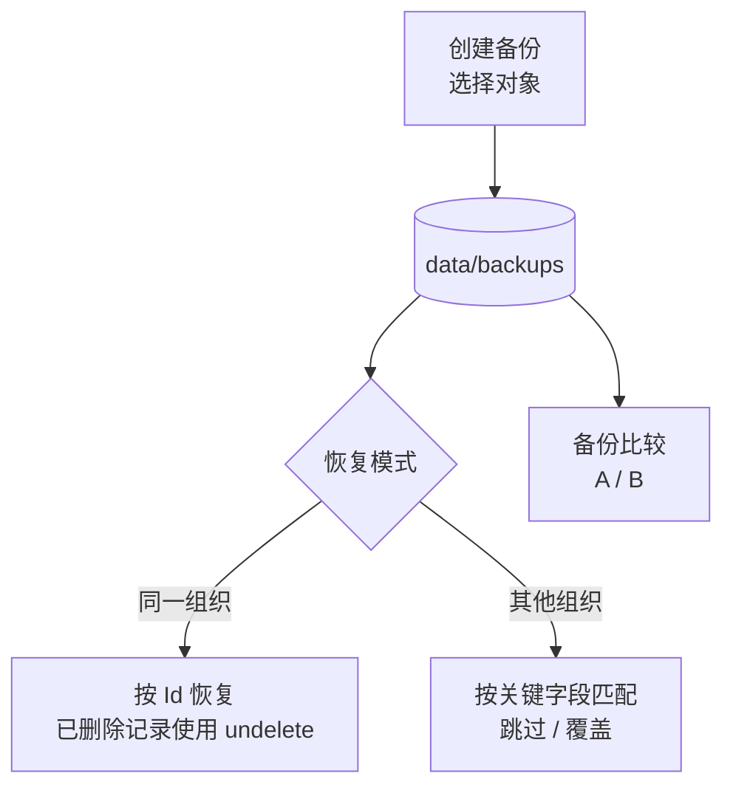

# SfUi 用户手册（简体中文）

适用版本: SfUi v0.14.0（Windows / macOS）  
最后更新: 2026-10-08 / 状态: 初稿  
本文件是「应用内置手册」与「GitHub 在线手册」的共用原稿（日本語 / English / 한국어 版: `ja.md` / `en.md` / `ko.md`）。  
**本手册中的截图显示的是英文界面，但功能与界面布局在各语言下相同。**

---

## 目录

1. [简介](#1-简介)
2. [安装与初始设置](#2-安装与初始设置)
3. [界面基础](#3-界面基础)
4. [查询、开发与执行](#4-查询开发与执行)
5. [历史记录](#5-历史记录)
6. [组织管理](#6-组织管理)
7. [组织信息（Org Info）](#7-组织信息org-info)
8. [数据导入导出](#8-数据导入导出)
9. [备份与恢复](#9-备份与恢复)
10. [组织比较](#10-组织比较)
11. [AI 助手](#11-ai-助手)
12. [快捷面板与收藏](#12-快捷面板与收藏)
13. [设置参考](#13-设置参考)
14. [疑难解答 / FAQ](#14-疑难解答--faq)
15. [附录（快捷键、数据位置、隐私）](#15-附录快捷键数据位置隐私)

---

## 1. 简介

### 1.1 SfUi 是什么

SfUi 是一个把 Salesforce CLI（`sf`）日常操作搬进 Windows / macOS 桌面 GUI 的工具。它使用已授权组织的访问令牌直接调用 REST / Tooling API，因此 SOQL 查询、备份等操作速度很快。



主要功能:

- **查询与开发**: SOQL（构建器 / 直接输入）、匿名 Apex、调试日志查看与分析
- **组织管理**: 组织列表、连通性测试、登录/注销、调控器限制、迁移盘点
- **组织信息**: 20 多个分区（用户、简档、对象、流等）的汇总显示、搜索与文档导出
- **数据导入导出**: 按对象的导出 / 导入（CSV、映射）与访问权限检查
- **备份与恢复**: 按对象备份、按 Id / 关键字段恢复、备份间比较
- **组织比较**: 最多 8 个组织并排比较（含对象字段与记录级比较）
- **AI 助手**: 生成并一键应用 SOQL / Apex 建议
- **效率提升**: 收藏（Ctrl+1..9）、历史重放、终端 / 资源管理器 / VS Code / 浏览器联动

所有数据都保存在本地（设置的数据文件夹），不会发送遥测。只有使用 AI 聊天时，输入内容才会发送到所配置的 AI 服务。

### 1.2 运行环境

| 项目 | 内容 |
|---|---|
| 操作系统 | Windows 10 1809 及以上 / Windows 11、macOS 11 及以上（Apple Silicon） |
| 必需 | 已安装 Salesforce CLI（`sf`），且至少有一个通过 `sf org login` 授权的组织 |
| 分发形式 | Microsoft Store（MSIX）/ 便携版 exe / macOS 应用 zip |
| 网络 | 操作组织时需要网络；浏览本手册与管理本地历史可离线进行 |

### 1.3 术语

- **组织（Org）**: 连接目标 Salesforce 环境，用别名或用户名指定。
- **target-org**: `sf` 命令的目标组织；与顶部栏的「组织」联动。
- **SF 文件夹**: `sf` 命令的工作目录（例如部署的项目）。
- **数据文件夹**: 历史、设置、备份的保存位置（可从设置界面打开）。

---

## 2. 安装与初始设置

### 2.1 安装（Windows）

1. **从 Microsoft Store**: 在商店中搜索「SfUi」并安装（自动更新）。
2. **从 MSIX 文件**: 从发布页面下载 `SfUi-<ver>-x64.msix` 与 `.cer`，然后
   1. 双击 `.cer` →「安装证书」→ 存储位置选「本地计算机」→ 放入「受信任的发布者/受信任人」（需要管理员权限）。
   2. 双击 `.msix` 完成安装。
3. **便携版**: 将 `SfUi.exe` 放到任意文件夹直接运行（无需安装）。

### 2.2 安装（macOS）

解压发布页面的 `SfUi-<ver>-osx-arm64.zip`，将 `SfUi.app` 移动到「应用程序」。若首次启动出现 Gatekeeper 警告，请在 Finder 中右键 `SfUi.app` →「打开」，或执行:

```
xattr -dr com.apple.quarantine /Applications/SfUi.app
```

### 2.3 首次启动（欢迎界面）

首次启动会显示欢迎界面。


- 切换界面语言（English / 日本語 / 简体中文 / 한국어）
- Salesforce CLI 检测结果。未找到时提供官方安装页面链接与 npm 安装命令（`npm install --global @salesforce/cli`）
- 主要功能介绍
- 「开始使用」进入主界面；「打开设置」跳到设置页
- 勾选「不再显示」后不再出现（可在设置中重新显示）

### 2.4 准备 Salesforce CLI（sf）

SfUi 通过调用 `sf` 命令获取组织信息并执行部署。

1. 安装 Salesforce CLI（官方安装程序或 npm）。
2. 在终端执行 `sf org login web`，用浏览器登录。
3. 启动 SfUi，顶部栏的组织列表会出现该组织。

若 `sf` 不在标准位置，可在设置页的「sf 路径」指定（留空则自动检测）。

### 2.5 注册组织（3 种方式）

在组织管理窗口的「注册组织…」面板中选择方式:



| 方式 | 用途 | 输入 |
|---|---|---|
| 浏览器 | 常规登录 | 实例 URL（可选；Sandbox 等需要） |
| SFDX 认证 URL | 从其他机器迁移授权信息 | `force://…` URL，或 `sf org display --verbose --json` 的输出 JSON |
| 访问令牌 | 用已有令牌连接 | 实例 URL（必填）+ 访问令牌 |

可指定别名（可选）与「设为默认组织」，然后点击「注册」。

### 2.6 数据保存位置

历史、设置、备份、日志都保存在本地数据文件夹。当前位置显示在设置页的「数据文件夹」，点击「打开数据文件夹」即可打开。也可以用 `--data-dir` 启动参数指定其他文件夹（便于多套配置切换）。

---

## 3. 界面基础


### 3.1 顶部栏

| 元素 | 说明 |
|---|---|
| 组织 | 操作对象的组织（`--target-org`）。「重新加载组织」刷新列表 |
| SF 文件夹 | 部署等操作的工作目录，可从历史选择或「浏览…」指定 |
| 语言 | 切换界面语言（即时生效） |
| 按钮 | 组织信息 / 比较 / 数据导入导出 / 备份与恢复 / 组织管理 / 终端 / 资源管理器 / VS Code / 浏览器 / Quick / AI / About |

终端、资源管理器、VS Code、浏览器按钮支持**右键选择类型**（例如终端 → Windows Terminal / PowerShell / 命令提示符 / WSL；浏览器 → 组织主页 / 设置 / 登录 / 输入 URL）。

### 3.2 选项卡

| 选项卡 | 内容 | 章节 |
|---|---|---|
| SOQL | 构建、执行、导出 SOQL | 4.1 |
| Apex | 运行匿名 Apex 并获取日志 | 4.2 |
| 调试日志 | 组织日志的列表、获取、保存与解析 | 4.3 |
| 历史 | 搜索、复制、删除、重放历史 | 5 |
| 部署 | 元数据部署 / 验证 | 4.4 |
| 命令 | 执行任意 `sf` 命令 | 4.5 |
| REST API | REST API 控制台 | 4.6 |
| 设置 | 各项设置 | 13 |

### 3.3 侧边面板（Quick / AI）

- **Quick**（左侧）: 收藏列表。**Ctrl+1..9** 立即执行第 1–9 项；双击也可执行。
- **AI**（右侧）: AI 聊天，可将当前选项卡、历史、收藏作为上下文（见第 11 章）。

### 3.4 子窗口

组织信息、比较、数据导入导出、备份与恢复、组织管理等子窗口均为**非模态**，可同时打开多个并与主窗口自由切换（也单独显示在任务栏）。关闭主窗口会关闭全部窗口。

### 3.5 常用快捷键

| 按键 | 动作 |
|---|---|
| Ctrl+Enter | 执行（SOQL / Apex / 发送 AI 消息） |
| Enter | 执行（命令选项卡、选中的收藏、组织信息搜索） |
| Ctrl+1..9 | 执行收藏 |
| Ctrl+Space | SOQL / Apex 代码补全 |
| 双击 | 历史重放 / 打开行详情（备份记录等） |

### 3.6 帮助（各窗口右上角）

点击每个窗口顶部栏右端的手册图标（📖），会用默认浏览器打开 GitHub 上对应当前界面语言的用户手册，并跳转到该窗口所属的章节。

| 窗口 | 打开的章节（简体中文界面） |
|---|---|
| 主窗口 | 3. 界面基础 |
| 欢迎界面 | 2. 安装与初始设置 |
| 组织信息 | 7. 组织信息（对象字段选项卡 → 7.1） |
| 组织比较 / 记录差异详情 | 10. 组织比较 |
| 数据导入导出 | 8. 数据导入导出 |
| 备份与恢复（记录 / 比较） | 9. 备份与恢复（9.2 / 9.3） |
| 组织管理 | 6. 组织管理 |
| 调试日志解析 | 4.3 调试日志与解析 |

用户手册提供 4 种语言（日本語 / English / 简体中文 / 한국어），切换界面语言时，帮助打开的页面也会随之切换。

---

## 4. 查询、开发与执行

### 4.1 执行 SOQL


1. 在顶部栏选择组织。
2. 在 SOQL 选项卡输入查询（Ctrl+Space 可补全）。
3. 按 **Ctrl+Enter**（或运行按钮）执行。结果显示在网格中，状态栏显示行数与耗时。
4. 优先使用 REST，必要时回退到 CLI。

- **构建器**: 用 GUI 组合对象、字段、条件、排序与 LIMIT 后执行。
- **CSV 导出**: 将结果网格保存为 CSV（UTF-8 带 BOM，可直接用 Excel 打开）。
- **历史**: 每次查询都会记录，可从历史下拉中调用。
- 勾选「Tooling API」可经 Tooling API 执行（元数据类对象需要）。


### 4.2 运行匿名 Apex


1. 在 Apex 选项卡输入代码（可插入模板）。
2. 按 **Ctrl+Enter** 执行，`System.debug` 输出会作为日志显示在右侧。
3. 执行结果（编译错误 / 输出 / 调试日志）会记录到历史。

- 支持日志保存 / 复制，以及重新载入以前的代码。

### 4.3 调试日志与解析


1. 在调试日志选项卡点击「获取」，列出组织的日志。
2. 选择某行，点击「获取」（查看内容）或「保存」（写入文件）。
3. 「打开 .log…」可载入本地日志文件。

对已获取或本地日志点击「解析」，会打开解析窗口。


- **概览**: 总耗时、事件数、SOQL 次数 / 行数、DML 次数 / 行数、Callout、异常数
- **树**: 嵌套执行结构（按方法的耗时与行数），展开慢节点定位原因
- **事件**: 全部事件列表（分类筛选、关键字搜索、选中查看详情）
- **限制**: 调控器限制使用情况（按使用率降序）
- **CSV 导出**: 将概览 / 限制 / 慢处理 / 事件导出为 CSV

最多显示 20,000 个事件（超出仅显示数量）。解析在本地完成，不消耗 API。

### 4.4 部署


- 选择 SF 文件夹（项目）、操作（部署 / 验证等）与测试级别后执行。
- 结果记录到历史，可从历史下拉中重放。

### 4.5 命令


- 直接输入任意 `sf` 命令并执行（Enter 或运行按钮）。
- 可查看标准输出 / 标准错误、加入收藏、从历史重放。
- 执行时会禁用 CLI 遥测（`SF_DISABLE_TELEMETRY`）。

### 4.6 REST API 控制台


- 选择方法（GET / POST / PATCH / DELETE 等）+ 路径 + 请求体，直接调用 REST API。
- 响应会格式化显示（JSON 美化）并记录到历史。

---

## 5. 历史记录


历史选项卡自动记录 SOQL / Apex / 命令 / REST API / 部署 / 组织操作 / 数据导入导出。

- **筛选**: 类型筛选 + 全文搜索
- **重放**: 双击某行，将其载入对应选项卡重新执行
- **复制参数**: 复制所选行的 SOQL / Apex / 命令正文
- **删除**: 删除所选行（**Ctrl / Shift 点击多选后可批量删除**），或「全部删除」
- 历史上限可配置（默认每类型 2,000 条）。较大的执行结果会单独保存在 `results/`（默认超过 64KB 时）

---

## 6. 组织管理

从顶部栏「组织管理」打开，共 3 个选项卡。

### 6.1 组织选项卡


网格显示默认标记（★）、别名、用户名、Org ID、类型、状态、连通结果、标签、备注、最后备份、实例 URL。

**工具栏操作**:

| 按钮 | 说明 | 多选时 |
|---|---|---|
| 重新加载组织 | 刷新列表 | - |
| 设为默认 | 更改 target-org | 显示**「此操作请只选择一个组织」** |
| 在浏览器中打开 | 打开组织 | **依次打开所有选中的组织** |
| 添加登录 | 浏览器登录（`sf org login web`） | - |
| 注销 | `sf org logout` | **批量注销所有选中的组织**（带数量的确认） |
| 连通性测试 | 只读 REST 检查 | **依次测试所有选中的组织**（进度、取消、OK/NG 汇总） |
| 测试全部组织 | 测试所有已注册组织 | - |
| 设置别名 | `sf alias set` | 仅限选择 1 个 |
| 保存标签/备注 | 仅保存在本地（不会写入组织） | 仅限选择 1 个 |

- 多选用 **Ctrl+点击 / Shift+点击**（范围）。
- 批量操作**顺序执行**，运行中可「取消」。
- 注册新组织使用「注册组织…」面板（见 2.5）。

### 6.2 健康选项卡


列出组织的调控器限制（API 请求、存储等），按使用率降序排列，带使用率进度条与筛选。

### 6.3 迁移盘点选项卡


汇总工作流规则 / Process Builder / 流。

- 类型筛选、「仅活动」、名称搜索
- 汇总（总数、按类型、活动数）
- 每行「Setup」按钮可在浏览器中打开组件的设置页面
- 「导出 CSV」保存列表

---

## 7. 组织信息（Org Info）


从顶部栏「组织信息」打开，以 20 多个分区（概览 / 主要设置 / 用户 / 简档 / 对象 / 页面布局 / 流 / 货币 / 登录历史 / 设置变更审计等）显示组织配置。

- **全局搜索**: 跨所有分区搜索并跳转到对应分区。
- **链接**: 部分行提供指向设置页或记录页的 ↗ 链接。
- **刷新分区**: 各分区可「重新获取」（优先显示本地缓存）。
- **我的设置**: 常用设置的拾取器。
- **自定义选项卡**: 将常用分区组合为自己的选项卡。

### 7.1 对象字段选项卡与「查找使用位置」

- 选择对象后显示字段列表（标签 / API 名 / 类型 / 公式等）。
- 选中字段行并点击「查找使用位置」，可跨组件搜索**该字段在哪里被使用**:


  - 搜索来源: Apex（类 / 触发器）、流、验证规则、页面布局、公式字段、字段权限（读取 / 编辑）
  - 结果按来源分组；双击行可在 Salesforce 中打开对应组件
  - 某个来源失败时显示警告，其他结果仍会显示

### 7.2 文档导出


「导出」选项卡可将组织定义输出为 **Excel（多工作表）+ 每表 CSV**。

- 对象: 对象定义 / 字段定义 / 页面布局 / 列表视图 / 流文档
- 可多选对象（筛选、仅自定义、全选）
- 支持进度、取消、部分失败警告，完成后可「打开文件夹」

---

## 8. 数据导入导出


从顶部栏「数据导入导出」打开。选择对象后进行导出 / 导入 / 访问检查。



### 8.1 导出

1. 选择对象（加载字段）。
2. 选择要输出的字段（全选 / 搜索）。
3. 指定条件（构建器设置条件、排序、上限，或直接输入 SOQL）。
4. 点击「执行」。结果显示在网格中，可保存为 CSV / JSON / TSV。
5. 引擎可选 REST / Bulk API（大数据量推荐 Bulk）。

### 8.2 导入

1. 选择 CSV 文件（UTF-8，推荐无 BOM）。
2. 选择用于匹配的外部 ID 字段（更新 / Upsert 使用）。
3. 确认列与字段的映射（自动映射 + 手动调整）。
4. 选择已有记录的处理方式（仅创建 / 覆盖 / 跳过等）。
5. 点击「执行」。显示成功 / 失败 / 跳过数量与耗时，并可查看失败行详情。

### 8.3 访问权限（3 个选项卡）

- **对象访问**: 按主体（简档 / 权限集）列出对象权限
- **字段访问**: 字段 × 主体矩阵（读取 / 编辑），可直接在矩阵中修改并保存
- **记录访问**: 选择用户后，按记录查看访问权限（读取 / 编辑 / 删除等），支持分页

---

## 9. 备份与恢复


从顶部栏「备份与恢复」打开，共 3 个选项卡。



### 9.1 备份选项卡

1. 勾选要备份的对象（带搜索与数量显示）。
2. 确认标签 / 说明（自动填入组织名 + 时间）。
3. 点击「执行」，显示每个对象的进度与结果。
4. 每个对象的获取上限（默认 2,000 条）以内；超出时请缩小范围。

### 9.2 恢复选项卡

1. 在左侧列表选择备份（可**多选后「删除」批量删除**，会显示带数量的确认）。
2. 选择要恢复的对象（可逐行指定关键字段）。
3. 选择匹配模式:
   - **自动**: 同一组织按 Id，其他组织按关键字段
   - **Id**: 已删除记录通过 SOAP undelete **保留原 Id** 恢复
   - **关键字段**: 按指定字段值匹配（已有记录可选跳过 / 覆盖）
4. 点击「执行」，显示按对象的结果（处理数 / 成功 / 失败）。

### 9.3 比较选项卡


选择两个备份（A / B）后执行比较。有差异的对象会以颜色区分（新增 / 删除 / 修改 / 错误），并可查看每个对象的记录差异。记录窗口支持查看内容、搜索、分页，以及打开 Salesforce 记录页（↗）。

---

## 10. 组织比较


从顶部栏「比较」打开，最多并排比较 **8 个组织**。

- 分类选项卡（概览 / 组织 / 用户 / 简档 / 对象 / … / **对象字段** / **记录比较**）
- 有差异的行会高亮，选项卡显示差异数量徽章
- 单元格的 ↗ 可打开对应组织的记录 / 设置页
- **对象字段**: 添加对象后比较字段级差异（类型、标签、公式等）
- **记录比较**: 指定对象、匹配键与比较字段，逐记录显示差异（数量上限可配置）


- 双击行打开「记录差异详情」窗口，按字段查看各组织的值
- 「全部重新获取」可刷新全部数据

---

## 11. AI 助手

使用右侧的「AI」面板（界面示例见 [界面基础](#3-界面基础)）。

### 11.1 设置

在设置选项卡的「AI」中配置端点 / 模型 / API 密钥。

- 默认使用 DeepSeek（带内置试用密钥，**有使用限制且可能随时停止**；长期使用建议配置自己的密钥）
- 支持 OpenAI / Anthropic / 任何 OpenAI 兼容端点
- API 密钥在本地以混淆形式（`enc1:`）保存，也可通过环境变量 `SFUI_AI_API_KEY` 提供

### 11.2 使用方法

1. 打开相关选项卡（SOQL / Apex / REST 等），必要时选择组织。
2. 在 AI 面板输入请求，按 **Ctrl+Enter** 发送（例如「根据商机字段写一条 SOQL」）。
3. 建议的代码可通过「应用」按钮写入对应选项卡。
4. 执行始终由你手动完成（AI 不会自动执行）。

- 启用「执行后询问 AI」后，查询执行完会自动获得基于结果的后续建议（例如 3 条候选 SOQL）。
- 上下文可引用当前选项卡、历史与收藏。
- 回答语言跟随界面语言。
- 认证或配额错误会显示在状态栏（配置自己的密钥通常可以解决）。

---

## 12. 快捷面板与收藏

- 各选项卡的「加入收藏」可登记当前查询 / 代码 / 命令 / REST 请求。
- **Ctrl+1..9** 立即执行对应收藏；双击（或 Enter）也可以执行。
- 右键可删除（带确认）。
- URL 和文件夹也可以收藏（分别在浏览器 / 资源管理器中打开）。

---

## 13. 设置参考


| 项目 | 说明 | 默认值 |
|---|---|---|
| sf 路径 | `sf` 可执行文件完整路径，留空自动检测 | 自动 |
| 终端 | 终端可执行文件（如 Windows Terminal） | 自动 |
| VS Code | VS Code CLI（`code`）路径 | 自动 |
| 历史上限 | 每种类型保留的条数 | 2,000 |
| 结果保存阈值 | 超过该大小的结果单独保存到 `results/` | 64 KB |
| 确认策略 | 仅危险操作（默认）/ 总是确认 / 不确认 | 仅危险操作 |
| AI（端点 / 模型 / API 密钥） | AI 聊天连接设置 | DeepSeek |
| 打开数据文件夹 | 打开存储目录 | - |
| 导入示例历史 | 添加常用模板（重复跳过） | - |
| 显示欢迎界面 | 再次显示首次引导 | - |

- 保存后立即生效（sf 路径等无需重启）。

---

## 14. 疑难解答 / FAQ

| 症状 | 处理方法 |
|---|---|
| 组织列表为空 | 在终端执行 `sf org login web` 登录后，点击顶部栏「重新加载组织」 |
| 提示找不到 sf | 安装 Salesforce CLI，并在设置中指定「sf 路径」，或点击「重新检查」 |
| 连通性测试失败 | 会话可能已过期，请在组织管理中点「添加登录」重新登录 |
| 部署等操作较慢 | 受网络 / API 限制影响，请稍后再试或缩小范围 |
| MSIX 无法安装 | 请先将附带的 `.cer` 安装到「受信任人」（2.1） |
| macOS 无法打开应用 | 首次 Gatekeeper 确认，右键 →「打开」（2.2） |
| AI 报错 | 检查密钥与配额；内置试用密钥可能停止服务（11.1） |
| 想把数据迁移到另一台电脑 | 复制数据文件夹，或用 `--data-dir` 指定共享文件夹 |
| 出现其他问题 | 查看数据文件夹中的 `logs\app-<日期>.log`，并附到 GitHub Issues |

---

## 15. 附录（快捷键、数据位置、隐私）

### 15.1 快捷键

| 按键 | 动作 |
|---|---|
| Ctrl+Enter | 执行（SOQL / Apex / 发送 AI 消息） |
| Enter | 执行（命令、快捷面板、组织信息搜索） |
| Ctrl+1..9 | 执行收藏 |
| Ctrl+Space | SOQL / Apex 补全 |
| 双击 | 历史重放 / 行详情 |

### 15.2 数据位置（数据文件夹内）

| 文件 / 文件夹 | 内容 |
|---|---|
| `settings.json` | 设置（API 密钥已混淆） |
| `history\*.json` | 操作历史（按类型） |
| `results\` | 较大的执行结果 |
| `favorites.json` | 收藏 |
| `org-manage.json` | 组织标签 / 备注 |
| `backups\` | 备份数据与元数据 |
| `orginfo\` | 组织信息缓存 |
| `logs\` | 应用运行日志 |

### 15.3 隐私与安全

- 所有数据保存在本地，不发送遥测（执行 `sf` 时会设置 `SF_DISABLE_TELEMETRY`）。
- 仅在使用 AI 聊天时，输入内容会发送到所配置的 AI 服务。
- API 密钥以混淆形式保存（并非加密），在共享电脑上请注意。

### 15.4 链接

- GitHub: https://github.com/huqian2016/SfUi
- Issues（问题反馈）: https://github.com/huqian2016/SfUi/issues
- 隐私政策: https://github.com/huqian2016/SfUi/blob/main/PRIVACY.md
- 许可证: MIT License（© HKS Tech K.K.）
- SfUi 是与 Salesforce, Inc. 无关的独立工具。
