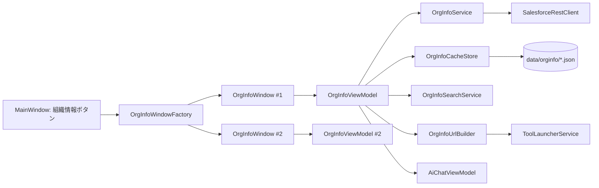

# 組織情報ウィンドウ（Org Info Window）設計案

最終更新: 2026-10-03 / ステータス: **Step 1-5 完了（v0.3.0）**

対象リポジトリ: `c:\huqian\vscode\SfUi`（WPF / .NET 9 / SfUi.Core + SfUi.App）

---

## 1. 目的とスコープ

### 1.1 確定事項（2026-10-03 ユーザー確認済み）

- 「全組織の検索・再取得」= **ウィンドウ内の全タブ横断**（複数組織を横断する検索は対象外・将来拡張）
- 「主な設定」タブ = **API で取得できる項目 + 取得できない設定はリンクのみ**
- オブジェクト項目 = **オブジェクト選択時に遅延取得 + キャッシュ**
- マイ設定タブ = **項目単位で選択・複数タブ可・組織別に保存**
- AI = **ウィンドウ単位の独立会話 + 表示中タブのデータ添付**
- 同一組織の再オープン = **常に新しいウィンドウ**（既存ウィンドウの再利用はしない）

メインウィンドウで選択中の Salesforce 組織について、**組織の設定・メタデータ・アクセス制御情報を 1 つの独立ウィンドウで一覧・検索・再取得できる**ようにする。管理者が「この組織はどう設定されているか」を素早く確認するための閲覧ツールとする。

### スコープ

- 閲覧のみ（値の変更・デプロイは行わない）。設定の変更は Salesforce の設定ページをブラウザーで開いて行う
- メインウィンドウの「組織情報」ボタンから、**非モーダル**の子ウィンドウを開く
- **複数ウィンドウ同時表示を許可**（同一組織・別組織を問わず、押すたびに新しいウィンドウ）
- 取得データはローカルにキャッシュし、**初回のみ自動取得**。以降は手動の再取得まで API を呼ばない

### 既存資産の再利用

| 既存 | 用途 |
|---|---|
| `SalesforceRestClient` | REST / Tooling SOQL、`nextRecordsUrl` ページング、401 再取得 |
| `OrgService` | 組織一覧・アクセストークン・instanceUrl / apiVersion |
| `ToolLauncherService.LaunchBrowser` | Setup ページを既定ブラウザーで開く |
| `AtomicJsonFile` | キャッシュの原子的書き込み・`.bak` 復旧 |
| `AiChatView` / `AiChatViewModel` | AI パネル（要: ウィンドウ単位インスタンス化） |
| `UiText` + `{loc:Tr}` | 日英 UI 文字列（キーは En/Ja 両方に追加） |

---

## 2. 要件との対応（受け入れ条件）

| # | 要件 | 設計での対応 |
|---|---|---|
| 1 | メインウィンドウにボタン、非モーダル、複数ウィンドウ可 | 上部バーに「組織情報」ボタン。`OrgInfoWindowFactory` が `Show()` で新規ウィンドウを生成（`ShowDialog` は使わない） |
| 2 | タブ: 基本情報 / 主な設定 / ユーザ / プロファイル / 権限セット / オブジェクト / OWD / オブジェクト項目 + 追加候補 | §4.2 のタブ構成（12 タブ案 + 候補） |
| 3 | 検索: 各タブ + 全体、項目も値も対象 | §4.3。タブ内フィルター + 全タブ横断検索（項目名・値の両方に部分一致） |
| 4 | 再取得: 各タブ / 全体、取得時刻表示 | §4.4。セクション単位の `fetchedAt` を保持・表示 |
| 5 | 初回のみ自動取得、以降・再オープンでは取得しない | §4.4 + §5.3 のキャッシュ。キャッシュなし時のみ自動取得 |
| 6 | カスタマイズタブ（関心項目を集約、再取得対応） | §4.5「マイ設定」タブ。項目カタログから選択・複数タブ・組織別保存 |
| 7 | 設定 URL をリンク表示 → ブラウザーで開く | §4.6 URL マッピング + `LaunchBrowser` |
| 8 | メイン同様の AI 活用 | §4.7。AI パネル + 表示中タブのデータ添付 |

> 「全組織の検索 / 全組織の再取得」は文脈から**「ウィンドウ全体（全タブ横断）」**と解釈した。複数組織を横断する機能ではない（§1.1 で確定）。

---

## 3. 画面設計

### 3.1 メインウィンドウへの追加

- 上部バーの組織コンボの右（更新ボタンの隣）に **「組織情報」ボタン**を追加
  - `SelectedOrg` が未選択のときは無効化
  - ツールチップ: 「選択中組織の情報を新しいウィンドウで開く」
  - 任意: 組織コンボの右クリックメニューにも「組織情報を開く」を追加
- 押下 → `OrgInfoWindowFactory.Open(SelectedOrg)` → 常に新しいウィンドウ
- キーボードショートカット（任意）: `Ctrl+Shift+O`

### 3.2 組織情報ウィンドウのレイアウト

```
┌─ 組織情報 — hks4sand1 (user@example.com) ──────────────────────────────┐
│ [⟳ すべて再取得] [🔍 全体検索: __________]  最終取得: 12:34:56  [AI]    │
│ ┌────────────┬────────────────────────────────────────────────────────┐ │
│ │ 概要       │ [このタブを検索: ______] [⟳ このタブを再取得]           │ │
│ │ 設定       │ ┌────────────────────────────────────────────────────┐ │ │
│ │ ユーザ     │ │ DataGrid（仮想化・ソート・コピー）                  │ │ │
│ │ プロファイル│ │                                                    │ │ │
│ │ 権限セット │ │                                                    │ │ │
│ │ ロール     │ └────────────────────────────────────────────────────┘ │ │
│ │ オブジェクト│ 取得: 2026-10-03 12:34:56 / 45 件                       │ │
│ │ OWD / 共有 │                                                        │ │
│ │ オブジェクト項目                                                     │ │
│ │ マイ設定   │                                                        │ │
│ └────────────┴────────────────────────────────────────────────────────┘ │
│ ステータス: ユーザ 45 件・取得 12:34:56                       v0.3.0     │
└────────────────────────────────────────────────────────────────────────┘
```

- タイトル: `組織情報 — <alias> (<username>)`。サンドボックスは `[Sandbox]` バッジ
- 上部ツールバー: すべて再取得 / 全体検索 / 最終取得時刻 / AI トグル
- 左にタブ（タブ数が多いため、縦タブまたは横スクロール可能な `TabControl`）
- 右サイドに AI パネル（メインと同じ `AiChatView` を再利用、幅 400、トグルで表示切替）
- 下にステータスバー（件数・取得時刻・エラー・キャンセル）

### 3.3 ウィンドウ動作

- `Window` を `Show()` で開く（非モーダル）。`Owner = MainWindow`、`WindowStartupLocation = CenterOwner`
- 同一組織・別組織を問わず複数同時表示可（要件 1）
- ウィンドウを閉じてもメインウィンドウは継続。アプリ終了時に全ウィンドウを閉じる
- ウィンドウのサイズ・位置は最後の値を記憶（`orgInfoWindow` 設定、任意）

---

## 4. 機能設計

### 4.1 タブ共通の振る舞い

- 各タブ = 1 セクション。`OrgInfoSectionViewModel` が以下を持つ
  - `Columns`（列定義: key + 表示名）/ `Rows`（行データ）/ `FilteredRows`
  - `FetchedAt`（取得時刻）/ `IsStale`（既定なし。表示のみ）
  - `FilterText`（タブ内検索）/ `RefreshCommand`（このタブを再取得）
  - `IsLoading` / `ErrorText` / `IsPermissionLimited`
- 取得に失敗しても他のタブは表示継続（セクション独立）
- 一覧は `DataGrid`（読み取り専用、仮想化、列ソート、セルコピー、右クリック「コピー」「ブラウザーで開く」）

### 4.2 タブ構成（案）

必須（要件 2）と追加候補を分けて示す。

| # | タブ | 主な列・内容 | 取得元 |
|---|---|---|---|
| 1 | 概要 | 組織名 / 種別（Edition）/ サンドボックス / インスタンス / 組織 ID / ユーザー名 / API バージョン / 言語 / ロケール / タイムゾーン / 会計年度開始月 / 名前空間 / 会社住所・電話 / API 使用量・データ/ファイルストレージ | REST `Organization` + `/limits` + `sf org display` |
| 2 | 主な設定 | API で取得できる組織設定（Preferences 系）、および取得できない主要設定へのリンク行（値 = 「リンクのみ」） | REST `Organization` + リンク |
| 3 | ユーザ | 名前 / ユーザー名 / メール / 有効 / プロファイル / ロール / ユーザータイプ / 最終ログイン / 作成日 | REST `User`（ページング） |
| 4 | プロファイル | 名前 / ユーザータイプ / 説明 / 作成日 / ユーザー数（クライアント集計） | REST `Profile` |
| 5 | 権限セット | ラベル / API 名 / 説明 / 割当ユーザー数 / 作成日 / プロファイル由来除外 | REST `PermissionSet` + `PermissionSetAssignment` 集計 |
| 6 | ロール | 名前 / 開発者名 / 親ロール / 説明 | REST `UserRole` |
| 7 | オブジェクト | API 名 / ラベル / キープレフィックス / 標準・カスタム / カスタム設定 / OWD（内部・外部）/ 名前空間 | Tooling `EntityDefinition` |
| 8 | OWD / 共有 | 組織の既定アクセス（取引先・取引先責任者・商談・リード・ケース・価格表・予定・キャンペーン等）+ オブジェクト別 OWD 一覧 + 共有設定へのリンク | REST `Organization` + Tooling `EntityDefinition` |
| 9 | オブジェクト項目 | 選択オブジェクトの項目: API 名 / ラベル / データ型 / カスタム / 参照先 / 必須・null 可 / 索引 / 数式 / 履歴トラッキング | Tooling `FieldDefinition`（遅延取得） |
| 10 | マイ設定 | ユーザーが選んだ設定項目の集約（§4.5） | キャッシュから生成 |
| 11 | 追加候補 A: 自動化 | Apex クラス / Apex トリガ / フロー / 承認プロセス | REST + Tooling |
| 12 | 追加候補 B: 運用 | スケジュール済みジョブ / 非同期 Apex ジョブ / 接続アプリ / インストール済みパッケージ | REST + Tooling |
| 13 | 追加候補 C: 監査 | ログイン履歴（直近 N 件）/ 設定変更履歴（Setup Audit Trail） | REST |
| 14 | 追加候補 D: その他 | レコードタイプ / 通貨 / 会計期間 / 組織全体のメールアドレス | REST |

追加候補は実装フェーズで優先順位を決定（§9-Q7）。

### 4.3 検索

- **タブ内検索**: タブの検索ボックスでそのタブの行を絞り込み
  - 対象 = **列名（項目）とセル値の両方**。例: `LastLogin` で最終ログイン列がヒット、`2026-09` で値がヒット
  - 大文字小文字を無視した部分一致。スペース区切りは AND 条件
  - デバウンス 200ms。`ICollectionView.Filter` または絞り込みコレクションで実装
- **全体検索**: ツールバーの検索ボックス → 検索結果ビュー（オーバーレイまたは専用ペイン）
  - 結果 1 行 = タブ / レコード要約 / 該当項目 / 該当値 / 取得時刻
  - ダブルクリックで該当タブへジャンプし、行を選択・ハイライト
  - 対象は**取得済みデータのみ**（未取得セクションは「未取得」と表示）
  - 結果上限 1,000 件（超過は「最初の 1,000 件を表示」）。検索はバックグラウンドで実行
- 検索ヒット箇所は黄色ハイライト（値セル）

### 4.4 再取得と取得時刻

- **初回のみ自動取得（要件 5）**
  - ウィンドウを開いたとき、その組織のキャッシュが**存在しない場合のみ**既定セクションを自動取得
  - 既定取得対象: 概要 / 設定 / ユーザ / プロファイル / 権限セット / ロール / オブジェクト / OWD（§4.2 の 1〜8）
  - オブジェクト項目（9）は重いため自動取得対象外（§1.1 確定）。選択時に遅延取得
  - 進捗表示 + キャンセル可。取得できたセクションから順次表示
- **2 回目以降**
  - キャッシュを読み込んで表示するのみ。自動では API を呼ばない
  - ウィンドウを閉じて再度開いても同様（キャッシュはファイル永続）
- **手動再取得**
  - タブごと: 「このタブを再取得」→ そのセクションのみ API 呼び出し → キャッシュ更新 → `fetchedAt` 更新
  - 全体: 「すべて再取得」→ 取得済みセクションをまとめて再取得（未取得セクションは取得しない。設定で「未取得も含めて全部」を選べるようにする案）
  - 失敗時: エラーバナー表示。直前のキャッシュ表示は維持し、`fetchedAt` は更新しない
- **取得時刻の表示**
  - タブ下部とステータスバーに `取得: yyyy-MM-dd HH:mm:ss` を表示
  - キャッシュが古い場合（既定 7 日超）はオレンジ色で注意表示（自動再取得はしない）
- **複数ウィンドウ間の整合**
  - キャッシュ更新時に `SectionUpdated` イベントを発火し、同じ組織を表示中の他ウィンドウへ反映（再取得はしない）

### 4.5 マイ設定タブ（カスタマイズ、要件 6）

- **項目カタログ**から選択して、関心のある設定項目だけを 1 つのタブに集約
  - カタログ例: 組織名 / Edition / インスタンス / タイムゾーン / 言語 / API バージョン / 有効ユーザー数 / プロファイル数 / 権限セット数 / カスタムオブジェクト数 / OWD 既定値（取引先・商談…）/ 主要設定へのリンク …（概要・設定・統計セクションのスカラー項目）
  - ピッカー UI: 左 = 利用可能項目（検索付きツリー）、右 = 選択済み（並べ替え可）
- **複数のカスタムタブ**を作成可能（タブ名を編集可）。例:「セキュリティ」「統合」「リリース管理」
- 表示列: 項目 / 値 / 取得元 / 取得時刻。値のコピー、リンク項目はクリックで Setup を開く
- **再取得**: カスタムタブの再取得で、参照元セクション + 統計を再取得して値を更新
- 保存先: `data/orginfo/preferences.json`（組織別。全組織共通テンプレートは将来拡張）
- 統計項目（ユーザー数など）はキャッシュから算出し、参照元の再取得時に更新

### 4.6 設定 URL リンク（要件 7）

- 値または専用の「リンク」列をクリック → `ToolLauncherService.LaunchBrowser(url)`
- URL は組織の `instanceUrl` を基に組み立て:
  `https://<domain>.lightning.force.com/lightning/setup/...`
- 代表的なマッピング（**パスは実装時に実機で検証し、リージョン/バージョン差を吸収する**）:

| 対象 | Setup パス例 |
|---|---|
| Setup ホーム | `/lightning/setup/SetupOneHome/home` |
| 会社情報 | `/lightning/setup/CompanyProfileInfo/home` |
| ユーザー一覧 / 詳細 | `/lightning/setup/ManageUsers/home` / `.../ManageUsers/page?address=/{userId}` |
| プロファイル一覧 / 詳細 | `/lightning/setup/Profiles/home` / `.../Profiles/page?address=/{profileId}` |
| 権限セット | `/lightning/setup/PermSets/home` |
| ロール | `/lightning/setup/Roles/home` |
| 共有設定（OWD） | `/lightning/setup/SecuritySharing/home` |
| オブジェクトマネージャー | `/lightning/setup/ObjectManager/home` |
| オブジェクト詳細 / 項目 | `/lightning/setup/ObjectManager/{api}/Details/view` / `.../FieldsAndRelationships/view` |
| Apex クラス / トリガ | `/lightning/setup/ApexClasses/home` / `/lightning/setup/ApexTriggers/home` |
| フロー | `/lightning/setup/Flows/home` |
| スケジュール済みジョブ | `/lightning/setup/ScheduledJobs/home` |
| 接続アプリ | `/lightning/setup/ConnectedApplication/home` |
| ログイン履歴 | `/lightning/setup/LoginHistory/home` |
| 設定変更履歴 | `/lightning/setup/SecurityAuditTrail/home` |
| インストール済みパッケージ | `/lightning/setup/ImportedPackage/home` |
| リソース使用状況 | `/lightning/setup/CompanyResourceUsage/home` |
| セッション設定 / パスワードポリシー / ログイン IP | `/lightning/setup/SessionSettings/home` / `.../PasswordPolicies/home` / `.../NetworkAccess/home` |

- ブラウザーで未ログインの場合は Salesforce のログイン画面が表示される（アプリ側で制御しない）
- 管理者権限がない場合、Setup 側でアクセス拒否表示になる（アプリ側は関知しない）

### 4.7 AI 連携（要件 8)

- 組織情報ウィンドウ右サイドに AI パネル（メインと同じ `AiChatView` を再利用）
- **ウィンドウ単位で独立した会話**（メインウィンドウの会話とは分離。§1.1 で確定）
- コンテキスト連携:
  - 「表示中タブのデータを添付」ボタン → 現在タブの行データ（ヘッダー + 最大 12,000 文字）をシステム/ユーザーメッセージに添付
  - クイックプロンプト例: 「このタブの内容を要約して」「注意すべき設定を指摘して」「未使用の権限セット候補を探す」「この OWD 設定のリスクを説明して」
- システムプロンプトに組織名・インスタンス・サンドボックス区分・現在タブ名を自動付与
- 将来拡張（今回スコープ外）: AI が生成した SOQL をメインウィンドウの SOQL タブへ送る「メインへ送る」ボタン

---

## 5. 技術設計

### 5.1 コンポーネント構成



### 5.2 追加・変更ファイル一覧

**SfUi.Core（新規）**

| ファイル | 役割 |
|---|---|
| `Models/OrgInfoSection.cs` | セクション定義（Id / タイトルキー / 列 / 行 / fetchedAt / 状態） |
| `Models/OrgInfoModels.cs` | 各セクションの行レコード（ユーザー・プロファイル・権限セット・オブジェクト・項目など） |
| `Services/OrgInfoService.cs` | セクション単位の取得（REST / Tooling / 集計 / ページング / キャンセル） |
| `Services/OrgInfoQueryBuilder.cs` | SOQL 文字列の組み立て（単体テスト対象） |
| `Services/OrgInfoSearchService.cs` | タブ内・全体検索のマッチ処理（項目名 + 値） |
| `Services/OrgInfoUrlBuilder.cs` | Setup URL 生成（instanceUrl + パス） |
| `Storage/OrgInfoCacheStore.cs` | キャッシュ JSON の読み書き、更新イベント、設定（マイ設定定義） |
| `Models/OrgInfoCache.cs` | キャッシュの JSON スキーマ |

**SfUi.Core（変更）**

| ファイル | 変更 |
|---|---|
| `SfUiServiceCollectionExtensions.cs` | `OrgInfoService` / `OrgInfoCacheStore` / `OrgInfoSearchService` / `OrgInfoUrlBuilder` を登録 |
| `Localization/UiText.En.cs` / `UiText.Ja.cs` | タブ名・列名・メッセージのキー追加（両方に同一キー） |

**SfUi.App（新規）**

| ファイル | 役割 |
|---|---|
| `Views/OrgInfoWindow.xaml(.cs)` | 組織情報ウィンドウ本体（タブ + 検索 + AI） |
| `ViewModels/OrgInfoViewModel.cs` | ウィンドウ単位 VM（Transient）。セクション一覧・全体検索・全体再取得 |
| `ViewModels/OrgInfoSectionViewModel.cs` | セクション（タブ）単位 VM |
| `ViewModels/OrgInfoCustomTabViewModel.cs` | マイ設定タブ |
| `Services/OrgInfoWindowFactory.cs` | 新しいウィンドウを生成して `Show()` |

**SfUi.App（変更）**

| ファイル | 変更 |
|---|---|
| `MainWindow.xaml` | 「組織情報」ボタン追加（組織コンボ横） |
| `ViewModels/MainViewModel.cs` | `OpenOrgInfoCommand` 追加 + ファクトリ注入 |
| `App.xaml.cs` | `OrgInfoWindow` / `OrgInfoViewModel` / `AiChatViewModel`（組織情報用）を Transient 登録 |

**tests（新規）**: §7 参照

### 5.3 キャッシュとデータモデル

```
data/orginfo/
├─ <orgKey>.json        … セクション本文 + fetchedAt + 組織メタ
└─ preferences.json     … マイ設定タブ定義（組織別）
```

- `orgKey` = OrgId（`sf org list` / `sf org display` から取得）を優先。不明時は username をサニタイズ
- 保存形式（例・抜粋）:

```json
{
  "schemaVersion": 1,
  "org": {
    "orgId": "00D...",
    "username": "user@example.com",
    "alias": "hks4sand1",
    "instanceUrl": "https://xxx.my.salesforce.com",
    "isSandbox": true
  },
  "sections": {
    "overview": {
      "fetchedAt": "2026-10-03T12:34:56+09:00",
      "durationMs": 820,
      "columns": [
        { "key": "item", "label": "項目" },
        { "key": "value", "label": "値" }
      ],
      "rows": [
        { "id": "name", "summary": "組織名", "cells": { "item": "組織名", "value": "HKS サンドボックス" } },
        { "id": "instance", "summary": "インスタンス", "cells": { "item": "インスタンス", "value": "AP99" } }
      ]
    },
    "users": { "fetchedAt": "...", "columns": [ "..." ], "rows": [ "..." ] },
    "fields:Account": { "fetchedAt": "...", "columns": [ "..." ], "rows": [ "..." ] }
  }
}
```

- セクションはすべて「列定義 + 行」の汎用テーブル形式 → 検索・コピー・エクスポートを共通実装にする
- スキーマ変更時: `schemaVersion` 不一致のセクションは「未取得」扱いとし、手動再取得を促す（自動では取らない）

### 5.4 取得クエリ一覧（実装時に describe で存在確認し調整）

| セクション | API | クエリ（例） | 備考 |
|---|---|---|---|
| 概要 | REST | `SELECT Id, Name, Division, OrganizationType, InstanceName, IsSandbox, LanguageLocaleKey, DefaultLocaleSidKey, TimeZoneSidKey, FiscalYearStartMonth, UsesStartDateAsFiscalYearName, NamespacePrefix, Phone, Street, City, State, PostalCode, Country FROM Organization` | 1 行のみ |
| 概要（利用状況） | REST | `GET /services/data/vXX/limits` | API / ストレージ |
| 概要（接続情報） | CLI | `sf org display --target-org <org> --json` | apiVersion / orgId / instanceUrl。**アクセストークンは表示しない** |
| 主な設定 | REST | `Organization` の取得可能設定 + リンク行 | API で取れない設定はリンクのみ |
| ユーザ | REST | `SELECT Id, Name, Username, Email, IsActive, Profile.Name, UserRole.Name, UserType, LastLoginDate, CreatedDate FROM User ORDER BY IsActive DESC, Name` | 全件ページング |
| プロファイル | REST | `SELECT Id, Name, UserType, Description, CreatedDate FROM Profile ORDER BY Name` | 人数はクライアント集計 |
| 権限セット | REST | `SELECT Id, Name, Label, IsOwnedByProfile, ProfileId, Description, CreatedDate FROM PermissionSet WHERE IsOwnedByProfile = false ORDER BY Label` | 割当数は `PermissionSetAssignment` を `GROUP BY PermissionSetId` で集計し突合 |
| ロール | REST | `SELECT Id, Name, DeveloperName, ParentRoleId, RollupDescription FROM UserRole ORDER BY Name` | |
| オブジェクト | Tooling | `SELECT QualifiedApiName, Label, PluralLabel, KeyPrefix, IsCustomizable, IsCustomSetting, NamespacePrefix, InternalSharingModel, ExternalSharingModel FROM EntityDefinition WHERE IsCustomizable = true ORDER BY QualifiedApiName` | 標準 + カスタム。OWD は v38+ |
| OWD | REST + Tooling | `Organization` の `Default*Access` + `EntityDefinition` の `InternalSharingModel` / `ExternalSharingModel` | 組織既定 + オブジェクト別 |
| オブジェクト項目 | Tooling | `SELECT Id, QualifiedApiName, Label, DataType, IsCustom, IsNillable, IsIndexed, IsCalculated, IsFieldHistoryTracked, Description, Length, Precision, Scale, RelationshipName FROM FieldDefinition WHERE EntityDefinition.QualifiedApiName = '{api}' ORDER BY Label` | 遅延取得。`FullName` / `Metadata` は単一レコードのみ可のため使わない |
| 統計（内部） | 計算 | ユーザー数 / 有効ユーザー数 / プロファイル数 / 権限セット数 / オブジェクト数 / カスタム数 / Apex 数 | キャッシュから算出 |
| 候補: Apex | REST | `SELECT Id, Name, ApiVersion, Status, IsValid, LengthWithoutComments, LastModifiedDate FROM ApexClass ORDER BY Name` / `ApexTrigger` 同様 | |
| 候補: フロー | REST | `SELECT Id, Label, ApiName, ProcessType, IsActive FROM FlowDefinitionView ORDER BY Label` | v50+ |
| 候補: ジョブ | REST | `SELECT Id, CronJobDetail.Name, CronJobDetail.JobType, NextFireTime, State, TimesTriggered FROM CronTrigger WHERE State != 'DELETED' ORDER BY NextFireTime` | |
| 候補: 接続アプリ | REST | `SELECT Id, Name FROM ConnectedApplication ORDER BY Name` | |
| 候補: パッケージ | Tooling | `SELECT Id, SubscriberPackageId, SubscriberPackage.Name, SubscriberPackage.NamespacePrefix, SubscriberPackageVersionId FROM InstalledSubscriberPackage` | |
| 候補: 監査 | REST | `LoginHistory` 直近 200 件 / `SetupAuditTrail` 直近 200 件 | |
| 候補: レコードタイプ | REST | `SELECT Id, Name, DeveloperName, SobjectType, IsActive FROM RecordType WHERE IsActive = true ORDER BY SobjectType, Name` | |

- ページング: `SalesforceRestClient.QueryAsync` → `GetPageAsync(nextRecordsUrl)` で全件（上限行数は設定可能に。既定 10,000 行/セクション）
- 実行制御: セクション独立・並列度 3 まで・`CancellationToken` 対応
- API 消費: 初回フル取得で約 12〜15 クエリ + ページング。以降は手動再取得まで 0

### 5.5 複数ウィンドウ管理

- `OrgInfoWindowFactory`（App / Singleton）
  - `Open(OrgInfo org)`: DI から `OrgInfoWindow` を新規解決 → VM に組織を設定 → `owner = MainWindow` → `Show()`
  - ウィンドウ参照は保持しない（閉じたら GC 対象）。衝突はキャッシュ共有のみで解決
- DI 変更（`App.xaml.cs`）:
  - `AddTransient<OrgInfoWindow>()` / `AddTransient<OrgInfoViewModel>()` / `AddTransient<OrgInfoSectionViewModel>()` ほか
  - `AiChatViewModel` は現在 Singleton。組織情報用は `AddTransient<AiChatViewModel>()` にして、メインは従来どおり 1 インスタンス注入（メイン側の挙動は変えない）
- メインウィンドウの「組織情報」ボタンは `MainViewModel.OpenOrgInfoCommand` にバインド

### 5.6 エラー処理・権限

- セクション単位で try/catch。`SalesforceApiException` の `errorCode` / メッセージをタブ内に表示
- 権限不足（`INSUFFICIENT_ACCESS` / 403）: そのタブを「権限不足のため表示できません（Setup を開く）」表示にし、リンクは有効
- 401: `SalesforceRestClient` が自動でトークン再取得（既存挙動）
- オフライン等の失敗: キャッシュ表示を維持し、エラーバナー + 「再試行」

### 5.7 ローカライズ

- すべての UI 文字列を `UiText` に追加（En / Ja 両方。キー同一性は `LocalizationUsageTests` / `UiTextTests` が検証）
- 動的な列名は `UiText.T` で言語切替に追従。言語コンボはメインウィンドウの設定を共用

---

## 6. 実装ステップ（案）

| Step | 内容 | 成果物 |
|---|---|---|
| 1 | Core 基盤: モデル / キャッシュ / クエリビルダー / URL ビルダー / 概要・ユーザ・プロファイル・権限セット・ロール・オブジェクト・OWD 取得 + 単体テスト | Core サービス + テスト |
| 2 | ウィンドウ: ボタン・ファクトリ・タブシェル・取得時刻・タブ再取得・全体再取得・複数ウィンドウ・タブ内検索 | `OrgInfoWindow` 一式 |
| 3 | オブジェクト項目（遅延 + キャッシュ）+ 全体検索 + リンククリック + 権限/エラー表示 | 検索・リンク |
| 4 | マイ設定タブ + 追加候補タブ + AI パネル連携 | カスタム・AI |
| 5 | 仕上げ: i18n・スモーク（`--smoke --smoke-orginfo <org>`）・PLAN/README 更新・バージョン 0.3.0 化 | リリース準備 |

各 Step 後に `dotnet build` / `dotnet test` を実行（開始時 145 件 → 完了時 242 件）。

### 実装状況

- ✅ **Step 1 完了（2026-10-03）**: Core 基盤を実装
  - 追加: `Models/OrgInfoSection.cs` / `Models/OrgInfoModels.cs`（セクションカタログ・列・項目・OWD 対象・トークン）/ `Models/OrgInfoCache.cs` / `Storage/OrgInfoCacheStore.cs` / `Services/OrgInfoQueryBuilder.cs` / `Services/OrgInfoUrlBuilder.cs` / `Services/OrgInfoService.cs`（概要・ユーザ・プロファイル・権限セット・ロール・オブジェクト・OWD の取得 + 全ページング + パース）
  - 変更: `SfUiServiceCollectionExtensions.cs`（DI 登録）、`UiText.En/Ja`（タブ・列・項目・OWD 対象・値トークンのキー 69 件）
  - テスト: 42 件追加（クエリ組み立て 8 / URL 6 / キャッシュ 8 / カタログ・ラベル 7 / パース 12 / DI 1）→ **全 187 件成功**
  - 実組織検証（hks4sand1）: 概要・OWD 既定値・ユーザ・プロファイル集計・権限セット集計・割当集計・ロールの REST クエリと、Tooling の EntityDefinition（OWD 含む）がすべて成功
  - 備考: 「主な設定」タブ（API 取得分 + リンク行）は Step 4 で実装済み（設計 §4.2 #2）

- ✅ **Step 2 完了（2026-10-03）**: 組織情報ウィンドウ UI を実装
  - 追加: `Views/OrgInfoWindow.xaml(.cs)` / `Views/OrgInfoSectionView.xaml(.cs)` / `ViewModels/OrgInfoViewModel.cs` / `ViewModels/OrgInfoSectionViewModel.cs` / `ViewModels/OrgInfoRowView.cs` / `Services/OrgInfoWindowFactory.cs`
  - 変更: `MainWindow.xaml`（組織コンボ横に「組織情報」ボタン。組織選択時のみ有効）/ `MainViewModel.cs`（`OpenOrgInfoCommand` + `HasSelectedOrg`）/ `App.xaml.cs`（Factory を Singleton、Window/VM を Transient 登録）/ `UiText.En/Ja`（UI キー 21 件 + 値トークン 2 件）
  - 機能: 非モーダル・複数同時ウィンドウ（同一組織も押すたびに新規）、7 タブ（概要/ユーザ/プロファイル/権限セット/ロール/オブジェクト/OWD）、初回のみ自動取得（キャッシュなし時のみ。以降・再オープンでは取得しない）、タブ単位/全体の手動再取得、取得時刻表示、タブ内検索（列名 + 値を対象、200ms デバウンス）、言語切替追従、複数ウィンドウ間のキャッシュ更新反映
  - E2E 検証（実アプリ + UI Automation）: 初回自動取得で 7 セクション保存 → 2 ウィンドウ同時表示 → 全閉→再オープンでキャッシュ未更新（再取得なし）を確認。タブ切替と検索（13 件 → 2 件へ絞り込み）も確認
  - 備考: 「すべて再取得」は取得済みセクションのみ対象（全部未取得のときは全部）。全タブ横断検索・リンククリック・オブジェクト項目は Step 3
  - 不具合修正: タブの初期選択が未設定で内容が空表示 → `Initialize` で先頭セクションを選択。タブの UI Automation 名が型名になる → `OrgInfoSectionViewModel.ToString()` でタイトルを返すよう改善

- ✅ **Step 3 完了（2026-10-03）**: オブジェクト項目（遅延取得）・全タブ横断検索・リンククリック・権限エラー表示を実装
  - 追加: `Services/OrgInfoDisplay.cs`（表示変換を Core に集約しグリッドと検索で共用）/ `Services/OrgInfoSearchService.cs`（全タブ横断検索、上限 1,000 件）/ `ViewModels/IOrgInfoTab.cs` / `ViewModels/OrgInfoFieldsViewModel.cs` / `Views/OrgInfoFieldsView.xaml(.cs)`
  - Core: `OrgInfoSections.FieldsColumns` / `OrgInfoQueryBuilder.BuildFieldDefinitionQuery`（WHERE EntityDefinition.QualifiedApiName 必須）/ `OrgInfoService.FetchFieldsAsync` + `ParseFieldRows`（ReferenceTo は `{ referenceTo: [] }` 形式を結合）/ `OrgInfoUrlBuilder.ForSection` / `ObjectFieldsOrNull`
  - UI: 「オブジェクト項目」タブ（Objects セクションから候補を生成し、選択時に遅延取得 + キャッシュ）/ ウィンドウツールバーの全体検索（デバウンス 300ms、結果 = セクション/レコード/項目/値、ダブルクリック・Enter・↗ ボタンで該当タブ・行へジャンプ）/ セクションの Setup ボタン（対応 Setup ページをブラウザーで開く）/ ユーザー・プロファイル・オブジェクト行の ↗ リンク列（クリックで詳細ページ）/ 権限不足（403 / INSUFFICIENT_ACCESS）は専用メッセージ
  - テスト: 16 件追加 → **全 203 件成功**（表示変換 4 / 検索 7 / クエリ・パース・URL・DI 等）
  - E2E 検証（実アプリ + UI Automation）: オブジェクト 297 件から Account を選択 → 63 項目を取得し `fields:Account` をキャッシュ / 検索「System Administrator」で 3 件ヒット → ↗ で Users タブへジャンプ / 行リンク 13 件と Setup ボタン表示を確認
  - 知見: Tooling `FieldDefinition` に `IsCustom` 列は無い（API 名の `__` で判定）/ `ReferenceTo` は `{ referenceTo: [...] }` のネスト形式 / WPF ComboBox の TextSearch は DisplayMemberPath を見ないため `TextSearch.TextPath` が必要

- ✅ **Step 4 完了（2026-10-03）**: 主な設定タブ・追加候補タブ（自動化/運用/監査/その他）・マイ設定（カスタムタブ）・AI 連携を実装
  - 追加（Core）: `Models/OrgInfoCatalog.cs`（マイ設定の項目カタログ + 統計 + 値解決）/ `Models/OrgInfoPreferences.cs` / `Storage/OrgInfoPreferencesStore.cs`（`data/orginfo/preferences.json`・組織別・不明/重複項目の除去・`PreferencesUpdated` イベント）/ `Services/OrgInfoAttachment.cs`（AI 添付テキスト、上限 12,000 文字）
  - 設定タブ: `settings` セクション（既定取得対象に追加）。値行 = Organization の `Preferences*` 等 13 項目（describe で存在確認済み。真偽値はトークン化、他は raw）、リンク行 = 会社情報/セッション設定/パスワードポリシー/ログイン IP 範囲/リソース使用状況/ログイン履歴/設定変更履歴の 7 行（値 = 「リンクのみ」トークン + ↗）
  - 追加候補（10 セクション・手動取得）: Apex クラス / Apex トリガ / フロー（FlowDefinitionView）/ スケジュール済みジョブ（CronTrigger）/ 接続アプリ / インストール済みパッケージ（Tooling + バージョン個別照会）/ ログイン履歴（直近 200 件、ユーザー名はユーザ一覧キャッシュから解決）/ 設定変更履歴（直近 200 件）/ レコードタイプ / 通貨
  - マイ設定: 「マイ設定」管理タブ（カスタムタブの作成・名前変更・削除・保存）+ カスタムタブ（カタログから選択した項目の 項目/値/取得元/取得時刻 表示、↗ リンク、参照元セクションのみ再取得、AI 添付対応）。カタログ = 概要 20 + 設定 20 + OWD 8 + 統計 7 = 55 項目。複数タブ・並べ替え・検索付きピッカー・組織別保存（複数ウィンドウは `PreferencesUpdated` で同期）
  - AI 連携: ウィンドウ右サイドの AI パネル（AI トグルで開閉）。`AiChatViewModel` を Transient 化（メインは従来 1 インスタンス、組織情報はウィンドウごとに独立会話）。「表示中タブのデータを添付」（TSV・12,000 文字上限）・クイックプロンプト 4 種・システムプロンプトに 組織名/組織ID/種別/インスタンス/表示中タブ を自動付与
  - テスト: 39 件追加 → **全 242 件成功**（クエリ 7 / パース 14 / カタログ 7 / 設定ストア 4 / 添付 3 / 表示・カタログ検証 4）
  - E2E 検証（実アプリ + UI Automation、スクリプト `C:\huqian\sfui-orginfo-step4-verify.ps1`）: 設定 20 行取得 / Apex クラス 29 行 / ログイン履歴 26 行 / マイ設定でタブ作成→項目 2 件選択→保存（preferences.json 検証）→カスタムタブ 2 行表示 / AI パネルでタブデータ添付（197 文字）+ クイックプロンプト入力 / 多通貨無効組織で通貨タブが専用メッセージ / ウィンドウを閉じて再オープンしてもカスタムタブと値が復元（自動再取得なし）
  - 知見: `CurrencyType` は多通貨が無効な組織では sObject 自体が未サポート（INVALID_TYPE）→ 専用メッセージに変換 / Tooling `SubscriberPackageVersion` は `Id = '...'` の単一形式のみ許可（`IN` 不可・上限 20 件）/ `SetupAuditTrail.CreatedBy` は null になり得る / ログイン履歴のユーザー名は users セクションキャッシュで解決 / UIA の ListBox 項目名はデータ型の ToString になるため record に ToString を実装

- ✅ **Step 5 完了（2026-10-03）**: 仕上げ（v0.3.0）
  - スモーク: `--smoke --smoke-orginfo <alias>` を追加（初回は概要・ユーザーを取得 / 2 回目以降は API を呼ばずキャッシュを使用 / `--smoke-orginfo-refresh` で手動再取得し fetchedAt 更新を検証）。検証スクリプト = `C:\huqian\sfui-orginfo-smoke-check.ps1`（実組織 acc: run1「API 呼び出し = 2 セクション」→ run2「0 セクション（キャッシュのみ）」→ run3「updated=True」、すべて exit=0）
  - i18n: 新規キーは En/Ja 両方に追加済み（`UiTextTests.EnglishAndJapanese_HaveSameKeys` / `LocalizationUsageTests`（XAML・C# の使用キー走査）/ `OrgInfoSectionsTests`・`OrgInfoCatalogTests` のキー存在検証で自動カバー）。日本語表示は実機確認済み（新規キー欠落なし）
  - ドキュメント: PLAN.md（Phase 10 を追加・ステータスを Phase 0-10 / v0.3.0 に更新・開発メモにスモーク手順）/ README.md（EN/JA に組織情報ウィンドウの説明・テスト件数を 242 に更新）
  - バージョン: **0.3.0**（`SfUi.App.csproj` = 0.3.0 / `packaging/AppxManifest.xml` = 0.3.0.0。MinVersion 10.0.17763.0 は据え置き）
  - VS Code タスク: `run (smoke orginfo)` を追加

---

## 7. テスト計画

**単体（SfUi.Tests）**

- `OrgInfoQueryBuilder`: セクションごとの SOQL 文字列（エスケープ含む）
- レスポンス パース: Organization / User / Profile / PermissionSet / EntityDefinition / FieldDefinition のサンプル JSON → 行モデル
- `OrgInfoCacheStore`: 保存 → 読み込み round-trip、`fetchedAt`、スキーマ不一致の扱い、`.bak` 復旧
- `OrgInfoSearchService`: 項目名ヒット / 値ヒット / 大文字小文字無視 / 複数語 AND / 結果上限
- `OrgInfoUrlBuilder`: instanceUrl + パス（末尾スラッシュ・サンドボックス・特殊文字）
- マイ設定定義の保存・読み込み（項目選択・並べ替え・複数タブ）

**結合・スモーク**

- `--smoke --smoke-orginfo <org>`: 概要 → ユーザーの取得、2 回目の起動で **API が呼ばれない**（ログで確認）→ 再取得で `fetchedAt` 更新
- 権限の異なるユーザー（管理者 / 標準ユーザー）でセクションの失敗が隔離されること

**手動**

- 複数ウィンドウ同時表示（同一組織・別組織）、片方の再取得が他方に反映される
- リンククリックで各 Setup ページが開く（主要 10 リンク）
- 大量ユーザー / 大量オブジェクトでの表示性能（仮想化・検索）

---

## 8. リスク・制約

| リスク | 対応 |
|---|---|
| API で取得できない設定（セッション設定・パスワードポリシー・ログイン IP 範囲など）がある | 「リンクのみ」行として表示。値を取りたい場合は sf メタデータ取得（重い）を別オプションに |
| Setup URL はリリース/リージョンで変わり得る | 実装時に主要リンクを実機検証。失敗時は Setup ホームへフォールバック |
| 大量データ（全項目を一括取得すると数万行） | オブジェクト項目は遅延取得 + キャッシュ。セクション行数上限を設定可能に |
| API 使用量の増加 | キャッシュ + 手動再取得のみ。初回取得は並列度 3・必要最小限 |
| Tooling API の対応差（API バージョン < 38 など） | `EntityDefinition` の OWD 列が null の場合は「取得不可」表示 |
| 権限による欠落 | セクション独立のエラー表示 + リンク誘導 |
| ウィンドウ数増加によるメモリ | VM は閉じたら破棄。キャッシュはファイル共有・メモリ共有は最小限 |

---

## 9. 未確定事項（要回答）

| # | 質問 | 状態 |
|---|---|---|
| Q1 | 「全組織の検索 / 再取得」の解釈 | ✅ 全タブ横断で確定（§1.1） |
| Q2 | 「主な設定」タブの範囲 | ✅ API 取得分 + リンクのみで確定 |
| Q3 | オブジェクト項目の取得方式 | ✅ 選択時遅延取得 + キャッシュで確定 |
| Q4 | マイ設定タブの仕様 | ✅ 項目単位・複数タブ・組織別保存で確定 |
| Q5 | AI 連携の方式 | ✅ 独立会話 + タブデータ添付で確定 |
| Q6 | 同一組織の再オープン | ✅ 常に新規ウィンドウで確定 |
| Q7 | 追加候補タブ（Apex / ジョブ / 接続アプリ / 監査 / パッケージ / レコードタイプ / 通貨）の優先順位 | ✅ 全部（自動化・運用・監査・その他）で確定（Step 4 で実装。承認プロセス・非同期 Apex ジョブは重いため対象外） |
| Q8 | 検索は入力中リアルタイムか、Enter 実行か。結果上限 1,000 件で良いか | 未回答（推奨: デバウンス付きリアルタイム + 上限 1,000） |
| Q9 | 将来、OWD や項目の編集（書き込み）まで対応するか | 未回答（推奨: 今回は閲覧のみ、将来スコープ） |
| Q10 | ウィンドウのサイズ・位置・AI パネル表示状態を記憶するか | 未回答（推奨: 記憶する（`orgInfoWindow` 設定）） |

---

## 10. 参考（Salesforce API）

- Tooling `EntityDefinition`: `InternalSharingModel` / `ExternalSharingModel` は v38 以降。`IsCustomSetting` / `IsCustomizable` / `QualifiedApiName` / `Label` / `KeyPrefix` など
- Tooling `FieldDefinition`: クエリには `WHERE EntityDefinition.QualifiedApiName = '<object>'` が必須。`DataType` / `IsCalculated` / `IsIndexed` / `IsFieldHistoryTracked` / `Description` などが取得可能。`FullName` / `Metadata` は単一レコードのみ
- REST `Organization`: `DefaultAccountAccess` / `DefaultContactAccess` / `DefaultOpportunityAccess` / `DefaultLeadAccess` / `DefaultCaseAccess` / `DefaultPricebookAccess` / `DefaultCalendarAccess` / `DefaultCampaignAccess` / `DefaultTerritory*` などの OWD 既定値、`OrganizationType` / `InstanceName` / `IsSandbox` / `LanguageLocaleKey` / `TimeZoneSidKey` / `FiscalYearStartMonth` など
- 検証元: Salesforce Developer Documentation（Tooling API / Object Reference、Winter '27 / API v68 系）

> 注: 上表のクエリは設計時点の代表例。実装時に各組織で `describe` を実行し、フィールドの存在・権限・API バージョンを確認して確定する。
